Raw Interest Rate Analysis
========================================================

Load Library
--------------------------------------------------------


Processing
--------------------------------------------------------
Download the data, read the data in and save as an RDA file


```r
getwd()
```

```
## [1] "/Users/Carlos/Dropbox/Courses/Data Analysis/Exercices/Data Analysis/Data Analysis 1/code/InterestRateAnalysis"
```

```r
#
# download.file('https://spark-public.s3.amazonaws.com/dataanalysis/loansData.csv',
# destfile='../../data/loansData.csv', method = 'curl')
dateDownloaded <- date()
dateDownloaded
```

```
## [1] "Sat Feb 16 22:34:51 2013"
```

```r
loans <- read.csv("../../data/loansData.csv", stringsAsFactors = FALSE)
```

Munging Data
-------------------------------------------------------------

```r
# Convert Interest Rate to numeric
loans$Interest.Rate <- as.numeric(gsub("%", "", loans$Interest.Rate))
# Convert Loan Lenght to numeric
loans$Loan.Length <- as.numeric(gsub("months", "", loans$Loan.Length))
# Factor Loan Purpose
loans$Loan.Purpose <- as.factor(loans$Loan.Purpose)
# Convert Debt to Income Ratio to numeric
loans$Debt.To.Income.Ratio <- as.numeric(gsub("%", "", loans$Debt.To.Income.Ratio))
# Factor State
loans$State <- as.factor(loans$State)
# Factor Home Ownership
loans$Home.Ownership <- as.factor(loans$Home.Ownership)
# Factor FICO Range
loans$FICO.Range <- as.factor(loans$FICO.Range)
# Factor Employment Lenght
loans$Employment.Length <- as.factor(loans$Employment.Length)
save(loans, dateDownloaded, file = "../../data/loansData.rda")
loans640_724 <- loans[loans$FICO.Range %in% levels(loans$FICO.Range)[1:17], 
    ]
```

### Look at the data set

```r
head(loans640_724)
```

```
##       Amount.Requested Amount.Funded.By.Investors Interest.Rate
## 99592            19200                      19200         12.12
## 80059            35000                      35000         21.98
## 15825            10000                       9975          9.99
## 33182            12000                      12000         11.71
## 62403             6000                       6000         15.31
## 48808            10000                      10000          7.90
##       Loan.Length       Loan.Purpose Debt.To.Income.Ratio State
## 99592          36 debt_consolidation                28.36    TX
## 80059          60 debt_consolidation                23.81    CA
## 15825          36 debt_consolidation                14.30    KS
## 33182          36        credit_card                18.78    NJ
## 62403          36              other                20.05    CT
## 48808          36 debt_consolidation                26.09    MA
##       Home.Ownership Monthly.Income FICO.Range Open.CREDIT.Lines
## 99592       MORTGAGE           4583    715-719                12
## 80059       MORTGAGE          11500    690-694                14
## 15825       MORTGAGE           3833    695-699                10
## 33182           RENT           3195    695-699                11
## 62403            OWN           4892    670-674                17
## 48808           RENT           2917    720-724                10
##       Revolving.CREDIT.Balance Inquiries.in.the.Last.6.Months
## 99592                    11140                              1
## 80059                    21977                              1
## 15825                     9346                              0
## 33182                    14469                              0
## 62403                    10391                              2
## 48808                    15957                              0
##       Employment.Length
## 99592           2 years
## 80059           2 years
## 15825           5 years
## 33182           9 years
## 62403           3 years
## 48808         10+ years
```

```r
summary(loans)
```

```
##  Amount.Requested Amount.Funded.By.Investors Interest.Rate  
##  Min.   : 1000    Min.   :    0              Min.   : 5.42  
##  1st Qu.: 6000    1st Qu.: 6000              1st Qu.:10.16  
##  Median :10000    Median :10000              Median :13.11  
##  Mean   :12406    Mean   :12002              Mean   :13.07  
##  3rd Qu.:17000    3rd Qu.:16000              3rd Qu.:15.80  
##  Max.   :35000    Max.   :35000              Max.   :24.89  
##                                                             
##   Loan.Length               Loan.Purpose  Debt.To.Income.Ratio
##  Min.   :36.0   debt_consolidation:1307   Min.   : 0.00       
##  1st Qu.:36.0   credit_card       : 444   1st Qu.: 9.75       
##  Median :36.0   other             : 201   Median :15.32       
##  Mean   :41.3   home_improvement  : 152   Mean   :15.38       
##  3rd Qu.:36.0   major_purchase    : 101   3rd Qu.:20.67       
##  Max.   :60.0   small_business    :  87   Max.   :34.91       
##                 (Other)           : 208                       
##      State       Home.Ownership Monthly.Income     FICO.Range  
##  CA     : 433   MORTGAGE:1148   Min.   :   588   670-674: 171  
##  NY     : 255   NONE    :   1   1st Qu.:  3500   675-679: 166  
##  TX     : 174   OTHER   :   5   Median :  5000   680-684: 157  
##  FL     : 169   OWN     : 200   Mean   :  5689   695-699: 153  
##  IL     : 101   RENT    :1146   3rd Qu.:  6800   665-669: 145  
##  GA     :  98                   Max.   :102750   690-694: 140  
##  (Other):1270                   NA's   :1        (Other):1568  
##  Open.CREDIT.Lines Revolving.CREDIT.Balance Inquiries.in.the.Last.6.Months
##  Min.   : 2.0      Min.   :     0           Min.   :0.000                 
##  1st Qu.: 7.0      1st Qu.:  5586           1st Qu.:0.000                 
##  Median : 9.0      Median : 10962           Median :0.000                 
##  Mean   :10.1      Mean   : 15245           Mean   :0.906                 
##  3rd Qu.:13.0      3rd Qu.: 18889           3rd Qu.:1.000                 
##  Max.   :38.0      Max.   :270800           Max.   :9.000                 
##  NA's   :2         NA's   :2                NA's   :2                     
##  Employment.Length
##  10+ years:653    
##  < 1 year :250    
##  2 years  :244    
##  3 years  :235    
##  5 years  :202    
##  4 years  :192    
##  (Other)  :724
```

```r
sapply(loans[1, ], class)
```

```
##               Amount.Requested     Amount.Funded.By.Investors 
##                      "integer"                      "numeric" 
##                  Interest.Rate                    Loan.Length 
##                      "numeric"                      "numeric" 
##                   Loan.Purpose           Debt.To.Income.Ratio 
##                       "factor"                      "numeric" 
##                          State                 Home.Ownership 
##                       "factor"                       "factor" 
##                 Monthly.Income                     FICO.Range 
##                      "numeric"                       "factor" 
##              Open.CREDIT.Lines       Revolving.CREDIT.Balance 
##                      "integer"                      "integer" 
## Inquiries.in.the.Last.6.Months              Employment.Length 
##                      "integer"                       "factor"
```


### Find out about missing values

```r
sum(is.na(loans))
```

```
## [1] 7
```


Exploratory Analysis
---------------------------------------------------------------
### Make some univariate plots/summaries

```r
hist(loans640_724$Amount.Requested, main = "Histogram of Amount Requested", 
    xlab = "Amont Requested")
```

 

```r
quantile(loans640_724$Amount.Requested)
```

```
##    0%   25%   50%   75%  100% 
##  1000  6000 10000 16000 35000
```

```r

hist(loans640_724$Amount.Funded.By.Investors, main = "Histogram of Amount Funded By Investors", 
    xlab = "Amont Funded By Investors")
```

 

```r
quantile(loans640_724$Amount.Funded.By.Investors)
```

```
##       0%      25%      50%      75%     100% 
##    -0.01  6000.00 10000.00 16000.00 35000.00
```

```r

hist(loans640_724$Interest.Rate, main = "Histogram of Interest Rate", xlab = "Interest Rate (%)")
```

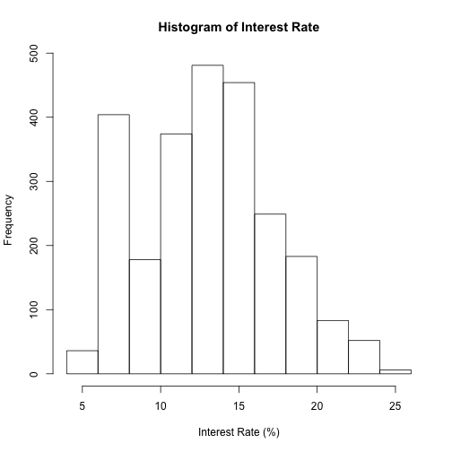 

```r
quantile(loans640_724$Interest.Rate)
```

```
##    0%   25%   50%   75%  100% 
##  6.00 12.12 14.27 17.27 24.89
```

```r

hist(loans640_724$Loan.Length, main = "Histogram of Loan Lenght", xlab = "Loan Lenght (months)")
```

 

```r
quantile(loans640_724$Loan.Length)
```

```
##   0%  25%  50%  75% 100% 
##   36   36   36   36   60
```

```r

hist(loans640_724$Debt.To.Income.Ratio, main = "Histogram of Debt to Income Ratio", 
    xlab = "Debt to Income Ratio (%)")
```

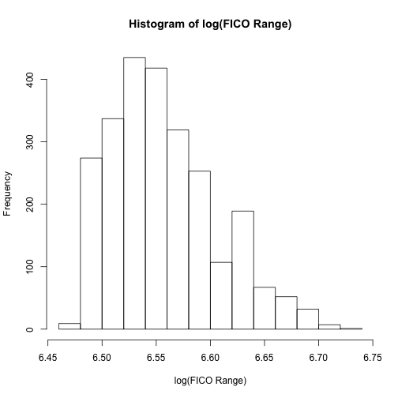 

```r
quantile(loans640_724$Debt.To.Income.Ratio)
```

```
##    0%   25%   50%   75%  100% 
##  0.00 10.96 16.15 21.34 34.91
```

```r

hist(loans640_724$Monthly.Income, main = "Histogram of Monthly Income", xlab = "Monthly Income ($)")
```

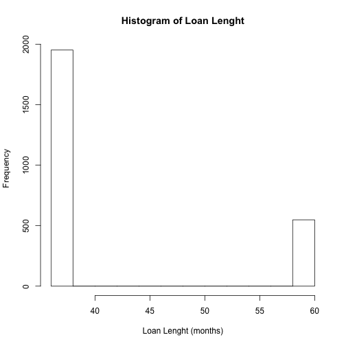 

```r
quantile(loans640_724$Monthly.Income, na.rm = TRUE)
```

```
##      0%     25%     50%     75%    100% 
##   588.5  3353.3  4833.3  6666.7 39583.3
```

```r

hist(log(loans640_724$Monthly.Income), main = "Histogram of log(Monthly Income)", 
    xlab = "Monthly Income (log($))")
```

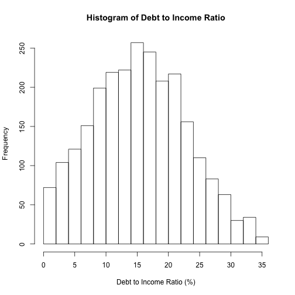 

```r
quantile(log(loans640_724$Monthly.Income), na.rm = TRUE)
```

```
##     0%    25%    50%    75%   100% 
##  6.378  8.118  8.483  8.805 10.586
```

```r

hist(loans640_724$Open.CREDIT.Lines, main = "Histogram of Number of Credit Lines", 
    xlab = "Number of Credit Lines")
```

 

```r
quantile(loans640_724$Open.CREDIT.Lines, na.rm = TRUE)
```

```
##   0%  25%  50%  75% 100% 
##    2    7   10   13   36
```

```r

hist(loans640_724$Revolving.CREDIT.Balance, main = "Histogram of Revolving Credit Balance", 
    xlab = "Revolving Credit Balance ($)")
```

 

```r
quantile(loans640_724$Revolving.CREDIT.Balance, na.rm = TRUE)
```

```
##     0%    25%    50%    75%   100% 
##      0   6522  11388  19332 245886
```

```r

hist(log(loans640_724$Revolving.CREDIT.Balance), main = "Histogram of log(Revolving Credit Balance)", 
    xlab = "Revolving Credit Balance (log($)")
```

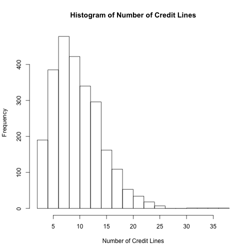 

```r
quantile(log(loans640_724$Revolving.CREDIT.Balance), na.rm = TRUE)
```

```
##     0%    25%    50%    75%   100% 
##   -Inf  8.783  9.340  9.870 12.413
```

```r

hist(loans640_724$Inquiries.in.the.Last.6.Months, main = "Histogram of Number Inquiries in the last 6 months", 
    xlab = "Number of Inquiries in the last 6 months")
```

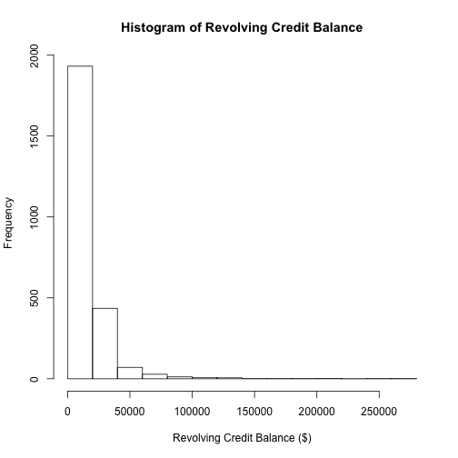 

```r
quantile(loans640_724$Inquiries.in.the.Last.6.Months, na.rm = TRUE)
```

```
##   0%  25%  50%  75% 100% 
##  0.0  0.0  1.0  1.5  9.0
```


### Make some univariate tables

```r
summary(loans640_724$Loan.Purpose)
```

```
##                car        credit_card debt_consolidation 
##                 23                350                997 
##        educational   home_improvement              house 
##                  7                 72                 13 
##     major_purchase            medical             moving 
##                 48                 16                 22 
##              other   renewable_energy     small_business 
##                150                  1                 52 
##           vacation            wedding 
##                 12                 29
```

```r

summary(loans640_724$State)
```

```
##  AK  AL  AR  AZ  CA  CO  CT  DC  DE  FL  GA  HI  IA  IL  IN  KS  KY  LA 
##   8  26  11  28 320  45  37   9   6 120  62  11   1  64   2  15  16  18 
##  MA  MD  MI  MN  MO  MS  MT  NC  NH  NJ  NM  NV  NY  OH  OK  OR  PA  RI 
##  52  41  41  30  23   1   4  47   8  66  10  25 181  43  15  21  69  10 
##  SC  SD  TX  UT  VA  VT  WA  WI  WV  WY 
##  21   2 125  14  61   5  42  21  11   4
```

```r

summary(loans640_724$Home.Ownership)
```

```
## MORTGAGE     NONE    OTHER      OWN     RENT 
##      757        0        5      136      894
```

```r

summary(loans640_724$FICO.Range)
```

```
## 640-644 645-649 650-654 655-659 660-664 665-669 670-674 675-679 680-684 
##       5       3       1       4     125     145     171     166     157 
## 685-689 690-694 695-699 700-704 705-709 710-714 715-719 720-724 725-729 
##     138     140     153     131     134     112      93     114       0 
## 730-734 735-739 740-744 745-749 750-754 755-759 760-764 765-769 770-774 
##       0       0       0       0       0       0       0       0       0 
## 775-779 780-784 785-789 790-794 795-799 800-804 805-809 810-814 815-819 
##       0       0       0       0       0       0       0       0       0 
## 820-824 830-834 
##       0       0
```

```r

summary(loans640_724$Employment.Length)
```

```
##  < 1 year    1 year 10+ years   2 years   3 years   4 years   5 years 
##       181       123       464       172       167       144       146 
##   6 years   7 years   8 years   9 years       n/a 
##       116        94        76        51        58
```

### Plot Interest Rate vs Amount Requested (FICO Colored)

```r
par(mar = c(4, 4, 2, 0.5), col = palette(heat.colors(48)))
layout(matrix(c(1, 2, 3, 3), 2, 2, byrow = F), widths = c(3, 1))
plot(loans640_724$Amount.Requested, loans640_724$Interest.Rate, pch = 19, col = loans640_724$FICO.Range, 
    ylab = "Interest Rate (%)", xlab = "Amount Request ($)", main = "Interest Rate vs Amount Requested (FICO Colored)", 
    cex = 0.7)
lmIRAR <- lm(loans640_724$Interest.Rate ~ loans640_724$Amount.Requested)
lines(loans640_724$Amount.Requested, lmIRAR$fitted, col = "Black", lwd = 3)
plot(loans640_724$Amount.Requested, lmIRAR$residuals, col = loans640_724$FICO.Range, 
    pch = 19, ylab = "lm No adjust Residuals", xlab = "Amount Request ($)", 
    main = "Residuals Interest Rate ~ Amount Request (FICO Colored)", cex = 0.7)
plot.new()
legend("center", "groups", legend = sort(unique(loans640_724$FICO.Range)), col = sort(unique(loans640_724$FICO.Range)), 
    cex = 0.7, pch = 19, title = "FICO Score", ncol = 1)
summary(lmIRAR)
```

```
## 
## Call:
## lm(formula = loans640_724$Interest.Rate ~ loans640_724$Amount.Requested)
## 
## Residuals:
##    Min     1Q Median     3Q    Max 
## -10.26  -2.24  -0.11   2.19  10.70 
## 
## Coefficients:
##                               Estimate Std. Error t value Pr(>|t|)    
## (Intercept)                   1.20e+01   1.42e-01    84.6   <2e-16 ***
## loans640_724$Amount.Requested 2.13e-04   9.91e-06    21.5   <2e-16 ***
## ---
## Signif. codes:  0 '***' 0.001 '**' 0.01 '*' 0.05 '.' 0.1 ' ' 1 
## 
## Residual standard error: 3.2 on 1790 degrees of freedom
## Multiple R-squared: 0.205,	Adjusted R-squared: 0.204 
## F-statistic:  461 on 1 and 1790 DF,  p-value: <2e-16
```

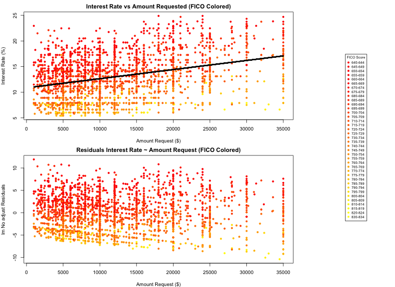 

### Plot Interest Rate vs Amount Funded By Investors (FICO Colored)

```r
par(mar = c(4, 4, 2, 0.5), col = palette(heat.colors(48)))
layout(matrix(c(1, 1, 2, 2), 2, 2, byrow = F), widths = c(3, 1))
plot(loans640_724$Amount.Funded.By.Investors, loans640_724$Interest.Rate, pch = 19, 
    col = loans640_724$FICO.Range, ylab = "Interest Rate (%)", xlab = "Amount Funded By Investors ($)", 
    main = "Interest Rate vs Amount Funded By Investors (FICO Colored)")
lmIRAFBI <- lm(loans640_724$Interest.Rate ~ loans640_724$Amount.Funded.By.Investors)
lines(loans640_724$Amount.Funded.By.Investors, lmIRAFBI$fitted, col = "black", 
    lwd = 3)
plot.new()
legend("center", "groups", legend = sort(unique(loans640_724$FICO.Range)), col = sort(unique(loans640_724$FICO.Range)), 
    cex = 0.7, pch = 19, title = "FICO Score", ncol = 1)
summary(lmIRAFBI)
```

```
## 
## Call:
## lm(formula = loans640_724$Interest.Rate ~ loans640_724$Amount.Funded.By.Investors)
## 
## Residuals:
##     Min      1Q  Median      3Q     Max 
## -10.342  -2.223  -0.102   2.190  10.638 
## 
## Coefficients:
##                                         Estimate Std. Error t value
## (Intercept)                             1.21e+01   1.39e-01    87.1
## loans640_724$Amount.Funded.By.Investors 2.14e-04   9.86e-06    21.7
##                                         Pr(>|t|)    
## (Intercept)                               <2e-16 ***
## loans640_724$Amount.Funded.By.Investors   <2e-16 ***
## ---
## Signif. codes:  0 '***' 0.001 '**' 0.01 '*' 0.05 '.' 0.1 ' ' 1 
## 
## Residual standard error: 3.19 on 1790 degrees of freedom
## Multiple R-squared: 0.208,	Adjusted R-squared: 0.207 
## F-statistic:  469 on 1 and 1790 DF,  p-value: <2e-16
```

 

### Plot Interest Rate vs Loan Lenght

```r
boxplot(loans640_724$Interest.Rate ~ loans640_724$Loan.Length, ylab = "Interest Rate(%)", 
    xlab = "Loan Lenght (months)", main = "Plot Interest Rate vs Loan Lenght")
```

 

```r
lmIRLL <- lm(loans640_724$Interest.Rate ~ loans640_724$Loan.Length)
summary(lmIRLL)
```

```
## 
## Call:
## lm(formula = loans640_724$Interest.Rate ~ loans640_724$Loan.Length)
## 
## Residuals:
##     Min      1Q  Median      3Q     Max 
## -12.196  -1.922   0.038   1.714  11.258 
## 
## Coefficients:
##                          Estimate Std. Error t value Pr(>|t|)    
## (Intercept)               6.78473    0.30887    22.0   <2e-16 ***
## loans640_724$Loan.Length  0.19020    0.00729    26.1   <2e-16 ***
## ---
## Signif. codes:  0 '***' 0.001 '**' 0.01 '*' 0.05 '.' 0.1 ' ' 1 
## 
## Residual standard error: 3.05 on 1790 degrees of freedom
## Multiple R-squared: 0.276,	Adjusted R-squared: 0.275 
## F-statistic:  682 on 1 and 1790 DF,  p-value: <2e-16
```

### Plot Interest Rate vs Loan Purpose

```r
boxplot(loans640_724$Interest.Rate ~ loans640_724$Loan.Purpose, ylab = "Interest Rate(%)", 
    main = "Plot Interest Rate vs Loan Porpose", las = 3, cex.axis = 0.6)
```

 

```r
lmIRLP <- lm(loans640_724$Interest.Rate ~ loans640_724$Loan.Purpose)
summary(lmIRLP)
```

```
## 
## Call:
## lm(formula = loans640_724$Interest.Rate ~ loans640_724$Loan.Purpose)
## 
## Residuals:
##    Min     1Q Median     3Q    Max 
## -8.339 -2.487 -0.519  2.365 10.498 
## 
## Coefficients:
##                                             Estimate Std. Error t value
## (Intercept)                                 14.55261    0.74432   19.55
## loans640_724$Loan.Purposecredit_card        -0.35089    0.76838   -0.46
## loans640_724$Loan.Purposedebt_consolidation  0.35237    0.75285    0.47
## loans640_724$Loan.Purposeeducational        -0.51261    1.54088   -0.33
## loans640_724$Loan.Purposehome_improvement   -0.21344    0.85498   -0.25
## loans640_724$Loan.Purposehouse               1.24585    1.23862    1.01
## loans640_724$Loan.Purposemajor_purchase     -1.88115    0.90525   -2.08
## loans640_724$Loan.Purposemedical             0.92614    1.16206    0.80
## loans640_724$Loan.Purposemoving              0.58194    1.06452    0.55
## loans640_724$Loan.Purposeother              -0.04381    0.79935   -0.05
## loans640_724$Loan.Purposerenewable_energy   -0.22261    3.64639   -0.06
## loans640_724$Loan.Purposesmall_business     -0.00145    0.89390    0.00
## loans640_724$Loan.Purposevacation            0.07989    1.27116    0.06
## loans640_724$Loan.Purposewedding            -0.93330    0.99669   -0.94
##                                             Pr(>|t|)    
## (Intercept)                                   <2e-16 ***
## loans640_724$Loan.Purposecredit_card           0.648    
## loans640_724$Loan.Purposedebt_consolidation    0.640    
## loans640_724$Loan.Purposeeducational           0.739    
## loans640_724$Loan.Purposehome_improvement      0.803    
## loans640_724$Loan.Purposehouse                 0.315    
## loans640_724$Loan.Purposemajor_purchase        0.038 *  
## loans640_724$Loan.Purposemedical               0.426    
## loans640_724$Loan.Purposemoving                0.585    
## loans640_724$Loan.Purposeother                 0.956    
## loans640_724$Loan.Purposerenewable_energy      0.951    
## loans640_724$Loan.Purposesmall_business        0.999    
## loans640_724$Loan.Purposevacation              0.950    
## loans640_724$Loan.Purposewedding               0.349    
## ---
## Signif. codes:  0 '***' 0.001 '**' 0.01 '*' 0.05 '.' 0.1 ' ' 1 
## 
## Residual standard error: 3.57 on 1778 degrees of freedom
## Multiple R-squared: 0.0173,	Adjusted R-squared: 0.0101 
## F-statistic: 2.41 on 13 and 1778 DF,  p-value: 0.00318
```

### Plot Interest Rate vs Debt to income ratio (FICO Colored)

```r
par(mar = c(4, 4, 2, 0.5), col = palette(heat.colors(48)))
layout(matrix(c(1, 1, 2, 2), 2, 2, byrow = F), widths = c(3, 1))
plot(loans640_724$Debt.To.Income.Ratio, loans640_724$Interest.Rate, pch = 19, 
    col = loans640_724$FICO.Range, ylab = "Interest Rate (%)", xlab = "Debt to income ratio (%)", 
    main = "Interest Rate vs Debt to income ratio (FICO Colored)")
lmIRDIR <- lm(loans640_724$Interest.Rate ~ loans640_724$Debt.To.Income.Ratio)
lines(loans640_724$Debt.To.Income.Ratio, lmIRDIR$fitted, col = "black", lwd = 3)
plot.new()
legend("center", "groups", legend = sort(unique(loans640_724$FICO.Range)), col = sort(unique(loans640_724$FICO.Range)), 
    cex = 0.7, pch = 19, title = "FICO Score", ncol = 1)
summary(lmIRDIR)
```

```
## 
## Call:
## lm(formula = loans640_724$Interest.Rate ~ loans640_724$Debt.To.Income.Ratio)
## 
## Residuals:
##    Min     1Q Median     3Q    Max 
## -8.665 -2.524 -0.419  2.451 10.314 
## 
## Coefficients:
##                                   Estimate Std. Error t value Pr(>|t|)    
## (Intercept)                        14.1404     0.2056   68.78   <2e-16 ***
## loans640_724$Debt.To.Income.Ratio   0.0297     0.0115    2.59   0.0097 ** 
## ---
## Signif. codes:  0 '***' 0.001 '**' 0.01 '*' 0.05 '.' 0.1 ' ' 1 
## 
## Residual standard error: 3.58 on 1790 degrees of freedom
## Multiple R-squared: 0.00373,	Adjusted R-squared: 0.00317 
## F-statistic:  6.7 on 1 and 1790 DF,  p-value: 0.00974
```

 

### Plot Interest Rate vs State


```r
boxplot(loans640_724$Interest.Rate ~ loans640_724$State, xlab = "State", ylab = "Interest Rate(%)", 
    main = "Plot Interest Rate vs State", las = 3, cex.axis = 0.6)
```

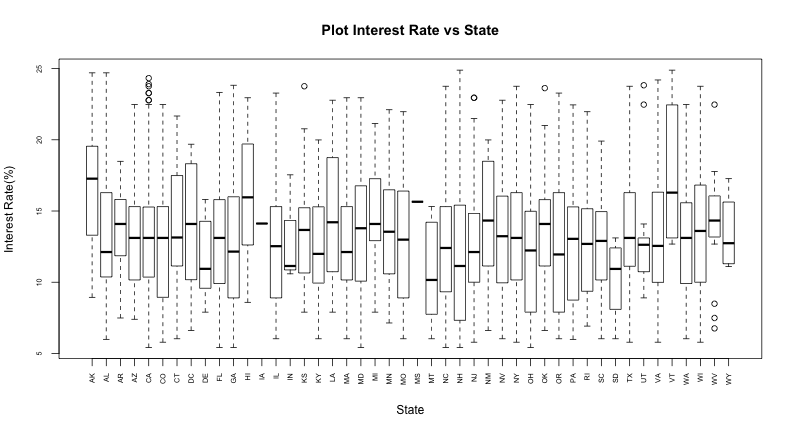 

```r
lmIRST <- lm(loans640_724$Interest.Rate ~ loans640_724$State)
summary(lmIRST)
```

```
## 
## Call:
## lm(formula = loans640_724$Interest.Rate ~ loans640_724$State)
## 
## Residuals:
##    Min     1Q Median     3Q    Max 
## -8.534 -2.407 -0.289  2.286 10.205 
## 
## Coefficients:
##                      Estimate Std. Error t value Pr(>|t|)    
## (Intercept)            18.823      1.267   14.85  < 2e-16 ***
## loans640_724$StateAL   -3.766      1.449   -2.60  0.00944 ** 
## loans640_724$StateAR   -4.586      1.666   -2.75  0.00596 ** 
## loans640_724$StateAZ   -4.089      1.437   -2.85  0.00449 ** 
## loans640_724$StateCA   -4.558      1.283   -3.55  0.00039 ***
## loans640_724$StateCO   -4.463      1.375   -3.24  0.00120 ** 
## loans640_724$StateCT   -3.731      1.398   -2.67  0.00768 ** 
## loans640_724$StateDC   -3.943      1.742   -2.26  0.02374 *  
## loans640_724$StateDE   -6.299      1.936   -3.25  0.00116 ** 
## loans640_724$StateFL   -4.289      1.309   -3.28  0.00107 ** 
## loans640_724$StateGA   -4.545      1.347   -3.37  0.00076 ***
## loans640_724$StateHI   -2.166      1.666   -1.30  0.19363    
## loans640_724$StateIA   -4.702      3.802   -1.24  0.21634    
## loans640_724$StateIL   -4.375      1.344   -3.25  0.00116 ** 
## loans640_724$StateIN   -4.757      2.834   -1.68  0.09339 .  
## loans640_724$StateKS   -4.001      1.569   -2.55  0.01089 *  
## loans640_724$StateKY   -4.629      1.552   -2.98  0.00290 ** 
## loans640_724$StateLA   -3.180      1.523   -2.09  0.03699 *  
## loans640_724$StateMA   -4.711      1.361   -3.46  0.00055 ***
## loans640_724$StateMD   -2.906      1.386   -2.10  0.03608 *  
## loans640_724$StateMI   -4.155      1.386   -3.00  0.00275 ** 
## loans640_724$StateMN   -3.880      1.426   -2.72  0.00660 ** 
## loans640_724$StateMO   -4.350      1.471   -2.96  0.00316 ** 
## loans640_724$StateMS   -3.172      3.802   -0.83  0.40418    
## loans640_724$StateMT   -5.350      2.195   -2.44  0.01490 *  
## loans640_724$StateNC   -4.825      1.371   -3.52  0.00044 ***
## loans640_724$StateNH   -3.125      1.792   -1.74  0.08143 .  
## loans640_724$StateNJ   -4.328      1.342   -3.23  0.00128 ** 
## loans640_724$StateNM   -2.824      1.700   -1.66  0.09688 .  
## loans640_724$StateNV   -3.905      1.456   -2.68  0.00739 ** 
## loans640_724$StateNY   -4.119      1.295   -3.18  0.00149 ** 
## loans640_724$StateOH   -3.890      1.380   -2.82  0.00489 ** 
## loans640_724$StateOK   -3.284      1.569   -2.09  0.03651 *  
## loans640_724$StateOR   -4.244      1.489   -2.85  0.00443 ** 
## loans640_724$StatePA   -4.611      1.339   -3.44  0.00059 ***
## loans640_724$StateRI   -3.548      1.700   -2.09  0.03705 *  
## loans640_724$StateSC   -4.627      1.489   -3.11  0.00192 ** 
## loans640_724$StateSD   -7.188      2.834   -2.54  0.01129 *  
## loans640_724$StateTX   -3.837      1.307   -2.93  0.00338 ** 
## loans640_724$StateUT   -5.198      1.589   -3.27  0.00109 ** 
## loans640_724$StateVA   -4.167      1.348   -3.09  0.00202 ** 
## loans640_724$StateVT   -0.939      2.044   -0.46  0.64613    
## loans640_724$StateWA   -4.352      1.383   -3.15  0.00168 ** 
## loans640_724$StateWI   -3.844      1.489   -2.58  0.00993 ** 
## loans640_724$StateWV   -2.803      1.666   -1.68  0.09255 .  
## loans640_724$StateWY   -5.358      2.195   -2.44  0.01476 *  
## ---
## Signif. codes:  0 '***' 0.001 '**' 0.01 '*' 0.05 '.' 0.1 ' ' 1 
## 
## Residual standard error: 3.58 on 1746 degrees of freedom
## Multiple R-squared: 0.0268,	Adjusted R-squared: 0.00171 
## F-statistic: 1.07 on 45 and 1746 DF,  p-value: 0.352
```

### Plot Interest Rate vs Home Ownership

```r
boxplot(loans640_724$Interest.Rate ~ loans640_724$Home.Ownership, xlab = "Home Ownership", 
    ylab = "Interest Rate(%)", main = "Plot Interest Rate vs Home Ownership", 
    las = 3, cex.axis = 0.6)
```

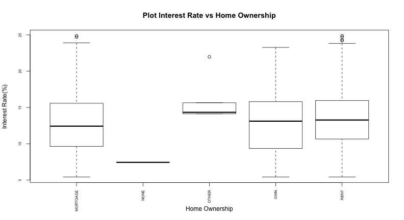 

```r
lmIRHO <- lm(loans640_724$Interest.Rate ~ loans640_724$Home.Ownership)
summary(lmIRHO)
```

```
## 
## Call:
## lm(formula = loans640_724$Interest.Rate ~ loans640_724$Home.Ownership)
## 
## Residuals:
##    Min     1Q Median     3Q    Max 
## -8.633 -2.513 -0.458  2.520 10.309 
## 
## Coefficients:
##                                  Estimate Std. Error t value Pr(>|t|)    
## (Intercept)                       14.6326     0.1305  112.16   <2e-16 ***
## loans640_724$Home.OwnershipOTHER   1.4054     1.6106    0.87     0.38    
## loans640_724$Home.OwnershipOWN     0.1930     0.3343    0.58     0.56    
## loans640_724$Home.OwnershipRENT   -0.0521     0.1773   -0.29     0.77    
## ---
## Signif. codes:  0 '***' 0.001 '**' 0.01 '*' 0.05 '.' 0.1 ' ' 1 
## 
## Residual standard error: 3.59 on 1788 degrees of freedom
## Multiple R-squared: 0.000749,	Adjusted R-squared: -0.000927 
## F-statistic: 0.447 on 3 and 1788 DF,  p-value: 0.72
```

### Plot Interest Rate vs log(Monthly Income) (FICO Colored)

```r
par(mar = c(4, 4, 2, 0.5), col = palette(heat.colors(48)))
layout(matrix(c(1, 1, 2, 2), 2, 2, byrow = F), widths = c(3, 1))
plot(log(loans640_724$Monthly.Income), loans640_724$Interest.Rate, pch = 19, 
    col = loans640_724$FICO.Range, ylab = "Interest Rate (%)", xlab = "log(Monthly Income ($))", 
    main = "Interest Rate vs log(Monthly Income) (FICO Colored)")
lmIRMI <- lm(loans640_724$Interest.Rate ~ log(loans640_724$Monthly.Income))
lines(log(loans[!is.na(loans640_724$Monthly.Income), "Monthly.Income"]), lmIRMI$fitted, 
    col = "black", lwd = 3)
```

```
## Error: 'x' and 'y' lengths differ
```

```r
plot.new()
legend("center", "groups", legend = sort(unique(loans640_724$FICO.Range)), col = sort(unique(loans640_724$FICO.Range)), 
    cex = 0.7, pch = 19, title = "FICO Score", ncol = 1)
summary(lmIRMI)
```

```
## 
## Call:
## lm(formula = loans640_724$Interest.Rate ~ log(loans640_724$Monthly.Income))
## 
## Residuals:
##    Min     1Q Median     3Q    Max 
## -9.751 -2.515 -0.312  2.440 10.448 
## 
## Coefficients:
##                                  Estimate Std. Error t value Pr(>|t|)    
## (Intercept)                         5.856      1.401    4.18  3.1e-05 ***
## log(loans640_724$Monthly.Income)    1.035      0.165    6.27  4.5e-10 ***
## ---
## Signif. codes:  0 '***' 0.001 '**' 0.01 '*' 0.05 '.' 0.1 ' ' 1 
## 
## Residual standard error: 3.55 on 1790 degrees of freedom
## Multiple R-squared: 0.0215,	Adjusted R-squared: 0.0209 
## F-statistic: 39.3 on 1 and 1790 DF,  p-value: 4.52e-10
```

 

### Plot Interest Rate vs FICO Range

```r
boxplot(loans640_724$Interest.Rate ~ loans640_724$FICO.Range, xlab = "FICO Range", 
    ylab = "Interest Rate(%)", main = "Plot Interest Rate vs FICO Range", las = 3, 
    cex.axis = 0.6)
```

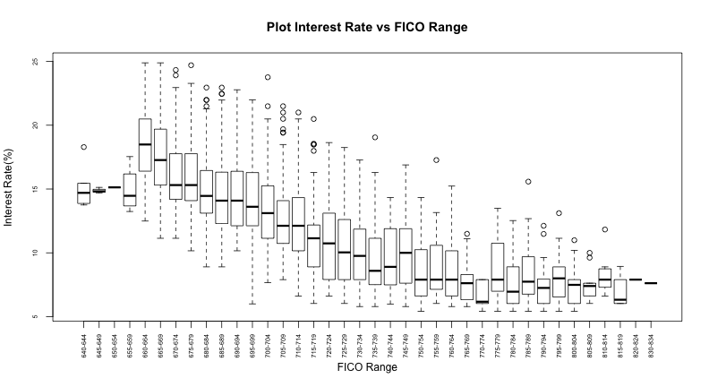 

```r
lmIRFR <- lm(loans640_724$Interest.Rate ~ loans640_724$FICO.Range)
summary(lmIRFR)
```

```
## 
## Call:
## lm(formula = loans640_724$Interest.Rate ~ loans640_724$FICO.Range)
## 
## Residuals:
##    Min     1Q Median     3Q    Max 
## -8.147 -2.136 -0.448  1.689 10.403 
## 
## Coefficients:
##                                Estimate Std. Error t value Pr(>|t|)    
## (Intercept)                     15.2120     1.3178   11.54   <2e-16 ***
## loans640_724$FICO.Range645-649  -0.3287     2.1519   -0.15   0.8786    
## loans640_724$FICO.Range650-654  -0.0820     3.2279   -0.03   0.9797    
## loans640_724$FICO.Range655-659  -0.2820     1.9767   -0.14   0.8866    
## loans640_724$FICO.Range660-664   3.2805     1.3439    2.44   0.0147 *  
## loans640_724$FICO.Range665-669   2.2361     1.3403    1.67   0.0954 .  
## loans640_724$FICO.Range670-674   1.0365     1.3369    0.78   0.4383    
## loans640_724$FICO.Range675-679   0.6427     1.3375    0.48   0.6309    
## loans640_724$FICO.Range680-684  -0.0853     1.3386   -0.06   0.9492    
## loans640_724$FICO.Range685-689  -0.5571     1.3414   -0.42   0.6779    
## loans640_724$FICO.Range690-694  -0.4799     1.3411   -0.36   0.7205    
## loans640_724$FICO.Range695-699  -1.0651     1.3391   -0.80   0.4265    
## loans640_724$FICO.Range700-704  -1.8551     1.3427   -1.38   0.1673    
## loans640_724$FICO.Range705-709  -2.5521     1.3421   -1.90   0.0574 .  
## loans640_724$FICO.Range710-714  -2.7789     1.3469   -2.06   0.0392 *  
## loans640_724$FICO.Range715-719  -4.0301     1.3527   -2.98   0.0029 ** 
## loans640_724$FICO.Range720-724  -4.1762     1.3464   -3.10   0.0020 ** 
## ---
## Signif. codes:  0 '***' 0.001 '**' 0.01 '*' 0.05 '.' 0.1 ' ' 1 
## 
## Residual standard error: 2.95 on 1775 degrees of freedom
## Multiple R-squared: 0.332,	Adjusted R-squared: 0.325 
## F-statistic:   55 on 16 and 1775 DF,  p-value: <2e-16
```

### Plot Interest Rate vs Open Credit Lines

```r
boxplot(loans640_724$Interest.Rate ~ loans640_724$Open.CREDIT.Lines, xlab = "Open Credit Lines", 
    ylab = "Interest Rate(%)", main = "Plot Interest Rate vs Open Credit Lines", 
    las = 3, cex.axis = 0.6)
```

 

```r
lmIROC <- lm(loans640_724$Interest.Rate ~ loans640_724$Open.CREDIT.Lines)
summary(lmIROC)
```

```
## 
## Call:
## lm(formula = loans640_724$Interest.Rate ~ loans640_724$Open.CREDIT.Lines)
## 
## Residuals:
##    Min     1Q Median     3Q    Max 
## -8.606 -2.489 -0.341  2.476 10.281 
## 
## Coefficients:
##                                Estimate Std. Error t value Pr(>|t|)    
## (Intercept)                     13.9921     0.2128   65.75   <2e-16 ***
## loans640_724$Open.CREDIT.Lines   0.0617     0.0190    3.25   0.0012 ** 
## ---
## Signif. codes:  0 '***' 0.001 '**' 0.01 '*' 0.05 '.' 0.1 ' ' 1 
## 
## Residual standard error: 3.58 on 1789 degrees of freedom
##   (1 observation deleted due to missingness)
## Multiple R-squared: 0.00588,	Adjusted R-squared: 0.00533 
## F-statistic: 10.6 on 1 and 1789 DF,  p-value: 0.00116
```

### Plot Interest Rate vs log(Revolving Credit Balance) (FICO Colored)

```r
par(mar = c(4, 4, 2, 0.5), col = palette(heat.colors(48)))
layout(matrix(c(1, 1, 2, 2), 2, 2, byrow = F), widths = c(3, 1))
plot(log(loans640_724$Revolving.CREDIT.Balance + 1), loans640_724$Interest.Rate, 
    pch = 19, col = loans640_724$FICO.Range, ylab = "Interest Rate (%)", xlab = "log(Revolving Credit Balance($))", 
    main = "Interest Rate vs log(Revolving Credit Balance) (FICO Colored)")
lmIRRCB <- lm(loans640_724$Interest.Rate ~ log(loans640_724$Revolving.CREDIT.Balance + 
    1))
lines(log(loans[!is.na(loans640_724$Revolving.CREDIT.Balance), "Revolving.CREDIT.Balance"] + 
    1), lmIRRCB$fitted, col = "black", lwd = 3)
```

```
## Error: 'x' and 'y' lengths differ
```

```r
plot.new()
legend("center", "groups", legend = sort(unique(loans640_724$FICO.Range)), col = sort(unique(loans640_724$FICO.Range)), 
    cex = 0.7, pch = 19, title = "FICO Score", ncol = 1)
summary(lmIRRCB)
```

```
## 
## Call:
## lm(formula = loans640_724$Interest.Rate ~ log(loans640_724$Revolving.CREDIT.Balance + 
##     1))
## 
## Residuals:
##    Min     1Q Median     3Q    Max 
## -8.795 -2.547 -0.416  2.530 10.315 
## 
## Coefficients:
##                                                Estimate Std. Error t value
## (Intercept)                                     12.9486     0.6320   20.49
## log(loans640_724$Revolving.CREDIT.Balance + 1)   0.1826     0.0681    2.68
##                                                Pr(>|t|)    
## (Intercept)                                      <2e-16 ***
## log(loans640_724$Revolving.CREDIT.Balance + 1)   0.0074 ** 
## ---
## Signif. codes:  0 '***' 0.001 '**' 0.01 '*' 0.05 '.' 0.1 ' ' 1 
## 
## Residual standard error: 3.58 on 1789 degrees of freedom
##   (1 observation deleted due to missingness)
## Multiple R-squared: 0.004,	Adjusted R-squared: 0.00344 
## F-statistic: 7.19 on 1 and 1789 DF,  p-value: 0.00741
```

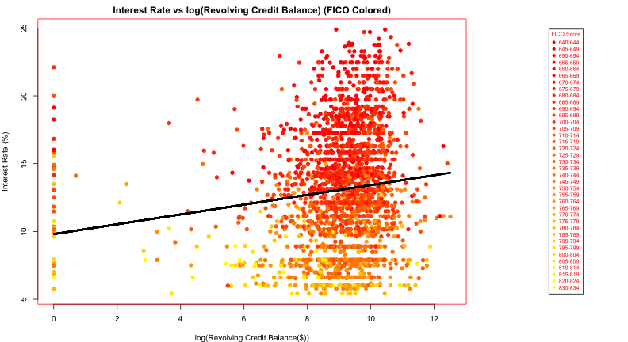 

### Plot Interest Rate vs Inquiries in the last 6 months

```r
boxplot(loans640_724$Interest.Rate ~ loans640_724$Inquiries.in.the.Last.6.Months, 
    xlab = "Number of Inquiries in the last 6 months", ylab = "Interest Rate(%)", 
    main = "Plot Interest Rate vs Open Credit Lines", las = 3, cex.axis = 0.6)
```

 

```r
lmIRIL6M <- lm(loans640_724$Interest.Rate ~ loans640_724$Inquiries.in.the.Last.6.Months)
summary(lmIRIL6M)
```

```
## 
## Call:
## lm(formula = loans640_724$Interest.Rate ~ loans640_724$Inquiries.in.the.Last.6.Months)
## 
## Residuals:
##    Min     1Q Median     3Q    Max 
## -8.196 -2.351 -0.322  2.183 10.134 
## 
## Coefficients:
##                                             Estimate Std. Error t value
## (Intercept)                                  14.1956     0.1046  135.65
## loans640_724$Inquiries.in.the.Last.6.Months   0.4565     0.0664    6.88
##                                             Pr(>|t|)    
## (Intercept)                                  < 2e-16 ***
## loans640_724$Inquiries.in.the.Last.6.Months  8.4e-12 ***
## ---
## Signif. codes:  0 '***' 0.001 '**' 0.01 '*' 0.05 '.' 0.1 ' ' 1 
## 
## Residual standard error: 3.54 on 1789 degrees of freedom
##   (1 observation deleted due to missingness)
## Multiple R-squared: 0.0258,	Adjusted R-squared: 0.0252 
## F-statistic: 47.3 on 1 and 1789 DF,  p-value: 8.43e-12
```

### Plot Interest Rate vs Employment Length

```r
boxplot(loans640_724$Interest.Rate ~ loans640_724$Employment.Length, xlab = "Employment Length", 
    ylab = "Interest Rate(%)", main = "Plot Interest Rate vs Employment Length", 
    las = 3, cex.axis = 0.6)
```

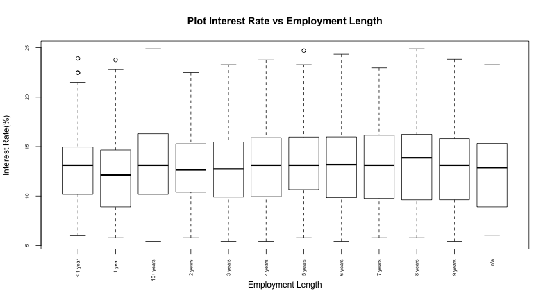 

```r
lmIREL <- lm(loans640_724$Interest.Rate ~ loans640_724$Employment.Length)
summary(lmIREL)
```

```
## 
## Call:
## lm(formula = loans640_724$Interest.Rate ~ loans640_724$Employment.Length)
## 
## Residuals:
##    Min     1Q Median     3Q    Max 
## -8.685 -2.542 -0.382  2.296 10.104 
## 
## Coefficients:
##                                         Estimate Std. Error t value
## (Intercept)                              14.1986     0.2659   53.39
## loans640_724$Employment.Length1 year     -0.1842     0.4181   -0.44
## loans640_724$Employment.Length10+ years   0.8335     0.3135    2.66
## loans640_724$Employment.Length2 years    -0.1162     0.3810   -0.31
## loans640_724$Employment.Length3 years     0.0537     0.3839    0.14
## loans640_724$Employment.Length4 years     0.4700     0.3995    1.18
## loans640_724$Employment.Length5 years     0.7614     0.3980    1.91
## loans640_724$Employment.Length6 years     0.8381     0.4255    1.97
## loans640_724$Employment.Length7 years     0.5163     0.4548    1.14
## loans640_724$Employment.Length8 years     0.5878     0.4890    1.20
## loans640_724$Employment.Length9 years     0.5473     0.5672    0.96
## loans640_724$Employment.Lengthn/a         0.2466     0.5398    0.46
##                                         Pr(>|t|)    
## (Intercept)                               <2e-16 ***
## loans640_724$Employment.Length1 year      0.6596    
## loans640_724$Employment.Length10+ years   0.0079 ** 
## loans640_724$Employment.Length2 years     0.7603    
## loans640_724$Employment.Length3 years     0.8887    
## loans640_724$Employment.Length4 years     0.2396    
## loans640_724$Employment.Length5 years     0.0559 .  
## loans640_724$Employment.Length6 years     0.0490 *  
## loans640_724$Employment.Length7 years     0.2565    
## loans640_724$Employment.Length8 years     0.2296    
## loans640_724$Employment.Length9 years     0.3347    
## loans640_724$Employment.Lengthn/a         0.6478    
## ---
## Signif. codes:  0 '***' 0.001 '**' 0.01 '*' 0.05 '.' 0.1 ' ' 1 
## 
## Residual standard error: 3.58 on 1780 degrees of freedom
## Multiple R-squared: 0.0118,	Adjusted R-squared: 0.00565 
## F-statistic: 1.93 on 11 and 1780 DF,  p-value: 0.0322
```


