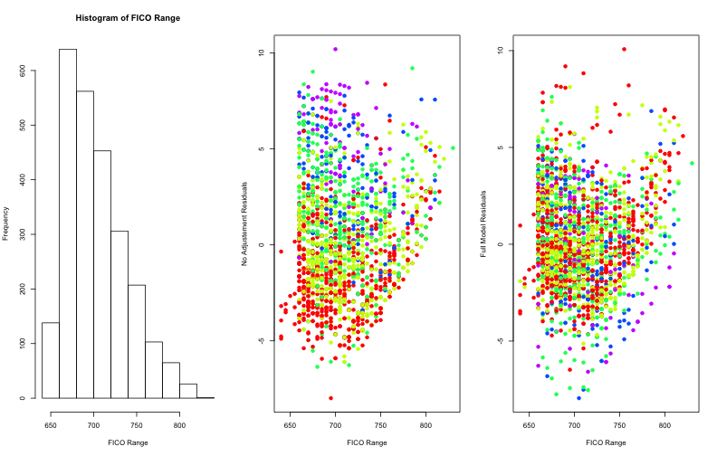

Final figure
========================================================

Left Panel A histogram of the FICO Range of the loans.

Middle Panel A lot of the residuals from a linear model relating FICO Range, colored by Amount Funded By Investors groups. 

Right Panel. A lot of the residuals from a linear model relating Interest Rate to FICO Range adjusted for 5-level factor variables for Amount Funded By Investor and Amount Requested. The residuals are colored by Amount Funded By Investor. Some of the patterns observed in the original residuals have been eliminated.

 

