Raw Interest Rate Analysis
========================================================

Load Library
--------------------------------------------------------


Processing
--------------------------------------------------------
Download the data, read the data in and save as an RDA file


```r
getwd()
```

```
## [1] "/Users/Carlos/Dropbox/Courses/Data Analysis/Exercices/Data Analysis/Data Analysis 1/code/InterestRateAnalysis/finalcode"
```

```r
#
# download.file('https://spark-public.s3.amazonaws.com/dataanalysis/loansData.csv',
# destfile='../../data/loansData.csv', method = 'curl')
dateDownloaded <- date()
dateDownloaded
```

```
## [1] "Mon Feb 18 00:09:33 2013"
```

```r
loans <- read.csv("../../../data/loansData.csv", stringsAsFactors = FALSE)
```

Munging Data
-------------------------------------------------------------

```r
# Convert Interest Rate to numeric
loans$Interest.Rate <- as.numeric(gsub("%", "", loans$Interest.Rate))
# Convert Loan Lenght to numeric
loans$Loan.Length <- as.numeric(gsub("months", "", loans$Loan.Length))
# Factor Loan Purpose
loans$Loan.Purpose <- as.factor(loans$Loan.Purpose)
# Convert Debt to Income Ratio to numeric
loans$Debt.To.Income.Ratio <- as.numeric(gsub("%", "", loans$Debt.To.Income.Ratio))
# Factor State
loans$State <- as.factor(loans$State)
# Factor Home Ownership
loans$Home.Ownership <- as.factor(loans$Home.Ownership)
# Factor FICO Range
loans$FICO.Range.L <- as.numeric(substr(loans$FICO.Range, 1, 3))
loans$FICO.Range <- as.factor(loans$FICO.Range)
# Factor Employment Lenght
loans$Employment.Length <- as.factor(loans$Employment.Length)
save(loans, dateDownloaded, file = "../../data/loansData.rda")
```

```
## Warning: cannot open compressed file '../../data/loansData.rda', probable
## reason 'No such file or directory'
```

```
## Error: no se puede abrir la conexión
```

### Look at the data set

```r
head(loans)
```

```
##       Amount.Requested Amount.Funded.By.Investors Interest.Rate
## 81174            20000                      20000          8.90
## 99592            19200                      19200         12.12
## 80059            35000                      35000         21.98
## 15825            10000                       9975          9.99
## 33182            12000                      12000         11.71
## 62403             6000                       6000         15.31
##       Loan.Length       Loan.Purpose Debt.To.Income.Ratio State
## 81174          36 debt_consolidation                14.90    SC
## 99592          36 debt_consolidation                28.36    TX
## 80059          60 debt_consolidation                23.81    CA
## 15825          36 debt_consolidation                14.30    KS
## 33182          36        credit_card                18.78    NJ
## 62403          36              other                20.05    CT
##       Home.Ownership Monthly.Income FICO.Range Open.CREDIT.Lines
## 81174       MORTGAGE           6542    735-739                14
## 99592       MORTGAGE           4583    715-719                12
## 80059       MORTGAGE          11500    690-694                14
## 15825       MORTGAGE           3833    695-699                10
## 33182           RENT           3195    695-699                11
## 62403            OWN           4892    670-674                17
##       Revolving.CREDIT.Balance Inquiries.in.the.Last.6.Months
## 81174                    14272                              2
## 99592                    11140                              1
## 80059                    21977                              1
## 15825                     9346                              0
## 33182                    14469                              0
## 62403                    10391                              2
##       Employment.Length FICO.Range.L
## 81174          < 1 year          735
## 99592           2 years          715
## 80059           2 years          690
## 15825           5 years          695
## 33182           9 years          695
## 62403           3 years          670
```

```r
summary(loans)
```

```
##  Amount.Requested Amount.Funded.By.Investors Interest.Rate  
##  Min.   : 1000    Min.   :    0              Min.   : 5.42  
##  1st Qu.: 6000    1st Qu.: 6000              1st Qu.:10.16  
##  Median :10000    Median :10000              Median :13.11  
##  Mean   :12406    Mean   :12002              Mean   :13.07  
##  3rd Qu.:17000    3rd Qu.:16000              3rd Qu.:15.80  
##  Max.   :35000    Max.   :35000              Max.   :24.89  
##                                                             
##   Loan.Length               Loan.Purpose  Debt.To.Income.Ratio
##  Min.   :36.0   debt_consolidation:1307   Min.   : 0.00       
##  1st Qu.:36.0   credit_card       : 444   1st Qu.: 9.75       
##  Median :36.0   other             : 201   Median :15.32       
##  Mean   :41.3   home_improvement  : 152   Mean   :15.38       
##  3rd Qu.:36.0   major_purchase    : 101   3rd Qu.:20.67       
##  Max.   :60.0   small_business    :  87   Max.   :34.91       
##                 (Other)           : 208                       
##      State       Home.Ownership Monthly.Income     FICO.Range  
##  CA     : 433   MORTGAGE:1148   Min.   :   588   670-674: 171  
##  NY     : 255   NONE    :   1   1st Qu.:  3500   675-679: 166  
##  TX     : 174   OTHER   :   5   Median :  5000   680-684: 157  
##  FL     : 169   OWN     : 200   Mean   :  5689   695-699: 153  
##  IL     : 101   RENT    :1146   3rd Qu.:  6800   665-669: 145  
##  GA     :  98                   Max.   :102750   690-694: 140  
##  (Other):1270                   NA's   :1        (Other):1568  
##  Open.CREDIT.Lines Revolving.CREDIT.Balance Inquiries.in.the.Last.6.Months
##  Min.   : 2.0      Min.   :     0           Min.   :0.000                 
##  1st Qu.: 7.0      1st Qu.:  5586           1st Qu.:0.000                 
##  Median : 9.0      Median : 10962           Median :0.000                 
##  Mean   :10.1      Mean   : 15245           Mean   :0.906                 
##  3rd Qu.:13.0      3rd Qu.: 18889           3rd Qu.:1.000                 
##  Max.   :38.0      Max.   :270800           Max.   :9.000                 
##  NA's   :2         NA's   :2                NA's   :2                     
##  Employment.Length  FICO.Range.L
##  10+ years:653     Min.   :640  
##  < 1 year :250     1st Qu.:680  
##  2 years  :244     Median :700  
##  3 years  :235     Mean   :706  
##  5 years  :202     3rd Qu.:725  
##  4 years  :192     Max.   :830  
##  (Other)  :724
```

```r
sapply(loans[1, ], class)
```

```
##               Amount.Requested     Amount.Funded.By.Investors 
##                      "integer"                      "numeric" 
##                  Interest.Rate                    Loan.Length 
##                      "numeric"                      "numeric" 
##                   Loan.Purpose           Debt.To.Income.Ratio 
##                       "factor"                      "numeric" 
##                          State                 Home.Ownership 
##                       "factor"                       "factor" 
##                 Monthly.Income                     FICO.Range 
##                      "numeric"                       "factor" 
##              Open.CREDIT.Lines       Revolving.CREDIT.Balance 
##                      "integer"                      "integer" 
## Inquiries.in.the.Last.6.Months              Employment.Length 
##                      "integer"                       "factor" 
##                   FICO.Range.L 
##                      "numeric"
```


### Find out about missing values

```r
sum(is.na(loans))
```

```
## [1] 7
```


Exploratory Analysis
---------------------------------------------------------------
### Make some univariate plots/summaries

```r
hist(loans$Amount.Requested, main = "Histogram of Amount Requested", xlab = "Amont Requested")
```

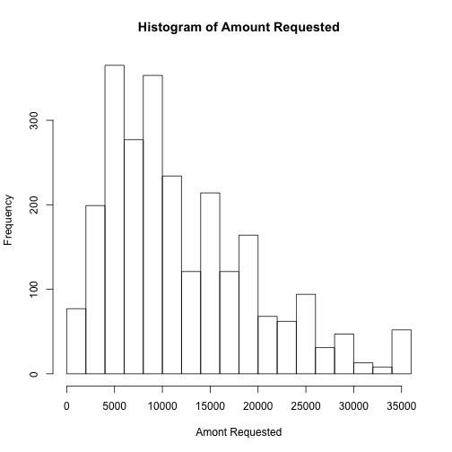 

```r
quantile(loans$Amount.Requested)
```

```
##    0%   25%   50%   75%  100% 
##  1000  6000 10000 17000 35000
```

```r

hist(loans$Amount.Funded.By.Investors, main = "Histogram of Amount Funded By Investors", 
    xlab = "Amont Funded By Investors")
```

 

```r
quantile(loans$Amount.Funded.By.Investors)
```

```
##       0%      25%      50%      75%     100% 
##    -0.01  6000.00 10000.00 16000.00 35000.00
```

```r

hist(loans$Interest.Rate, main = "Histogram of Interest Rate", xlab = "Interest Rate (%)")
```

 

```r
quantile(loans$Interest.Rate)
```

```
##    0%   25%   50%   75%  100% 
##  5.42 10.16 13.11 15.80 24.89
```

```r

hist(loans$FICO.Range.L, main = "Histogram of FICO Range", xlab = "FICO Range")
```

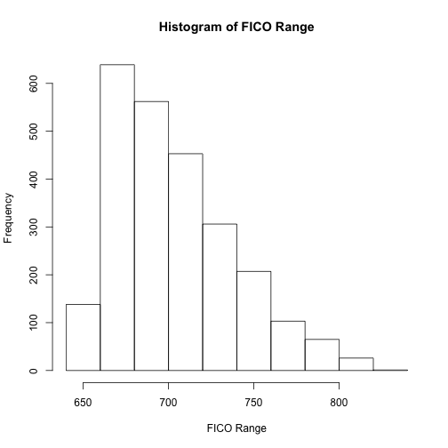 

```r
quantile(loans$FICO.Range.L)
```

```
##   0%  25%  50%  75% 100% 
##  640  680  700  725  830
```

```r

hist(log(loans$FICO.Range.L), main = "Histogram of log(FICO Range)", xlab = "log(FICO Range)")
```

 

```r
quantile(log(loans$FICO.Range.L))
```

```
##    0%   25%   50%   75%  100% 
## 6.461 6.522 6.551 6.586 6.721
```

```r

hist(loans$Loan.Length, main = "Histogram of Loan Lenght", xlab = "Loan Lenght (months)")
```

 

```r
quantile(loans$Loan.Length)
```

```
##   0%  25%  50%  75% 100% 
##   36   36   36   36   60
```

```r

hist(loans$Debt.To.Income.Ratio, main = "Histogram of Debt to Income Ratio", 
    xlab = "Debt to Income Ratio (%)")
```

 

```r
quantile(loans$Debt.To.Income.Ratio)
```

```
##     0%    25%    50%    75%   100% 
##  0.000  9.748 15.320 20.672 34.910
```

```r

hist(loans$Monthly.Income, main = "Histogram of Monthly Income", xlab = "Monthly Income ($)")
```

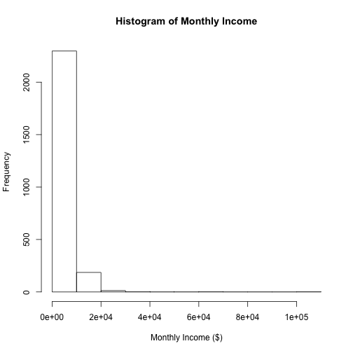 

```r
quantile(loans$Monthly.Income, na.rm = TRUE)
```

```
##       0%      25%      50%      75%     100% 
##    588.5   3500.0   5000.0   6800.0 102750.0
```

```r

hist(log(loans$Monthly.Income), main = "Histogram of log(Monthly Income)", xlab = "Monthly Income (log($))")
```

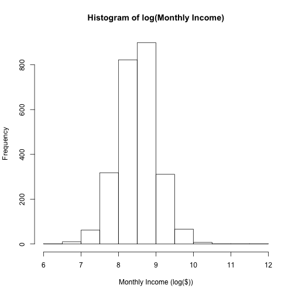 

```r
quantile(log(loans$Monthly.Income), na.rm = TRUE)
```

```
##     0%    25%    50%    75%   100% 
##  6.378  8.161  8.517  8.825 11.540
```

```r

hist(loans$Open.CREDIT.Lines, main = "Histogram of Number of Credit Lines", 
    xlab = "Number of Credit Lines")
```

 

```r
quantile(loans$Open.CREDIT.Lines, na.rm = TRUE)
```

```
##   0%  25%  50%  75% 100% 
##    2    7    9   13   38
```

```r

hist(loans$Revolving.CREDIT.Balance, main = "Histogram of Revolving Credit Balance", 
    xlab = "Revolving Credit Balance ($)")
```

 

```r
quantile(loans$Revolving.CREDIT.Balance, na.rm = TRUE)
```

```
##     0%    25%    50%    75%   100% 
##      0   5586  10962  18889 270800
```

```r

hist(log(loans$Revolving.CREDIT.Balance), main = "Histogram of log(Revolving Credit Balance)", 
    xlab = "Revolving Credit Balance (log($)")
```

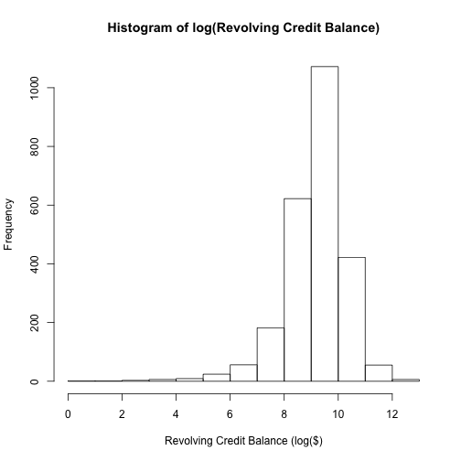 

```r
quantile(log(loans$Revolving.CREDIT.Balance), na.rm = TRUE)
```

```
##     0%    25%    50%    75%   100% 
##   -Inf  8.628  9.302  9.846 12.509
```

```r

hist(loans$Inquiries.in.the.Last.6.Months, main = "Histogram of Number Inquiries in the last 6 months", 
    xlab = "Number of Inquiries in the last 6 months")
```

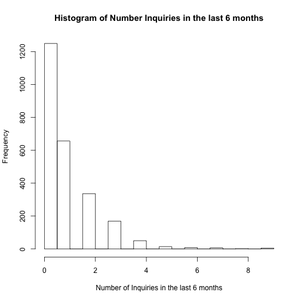 

```r
quantile(loans$Inquiries.in.the.Last.6.Months, na.rm = TRUE)
```

```
##   0%  25%  50%  75% 100% 
##    0    0    0    1    9
```


### Make some univariate tables

```r
summary(loans$Loan.Purpose)
```

```
##                car        credit_card debt_consolidation 
##                 50                444               1307 
##        educational   home_improvement              house 
##                 15                152                 20 
##     major_purchase            medical             moving 
##                101                 30                 29 
##              other   renewable_energy     small_business 
##                201                  4                 87 
##           vacation            wedding 
##                 21                 39
```

```r

summary(loans$State)
```

```
##  AK  AL  AR  AZ  CA  CO  CT  DC  DE  FL  GA  HI  IA  IL  IN  KS  KY  LA 
##  11  38  13  46 433  61  50  11   8 169  98  12   1 101   3  21  23  22 
##  MA  MD  MI  MN  MO  MS  MT  NC  NH  NJ  NM  NV  NY  OH  OK  OR  PA  RI 
##  73  68  45  38  33   1   7  64  15  94  13  32 255  71  21  30  96  15 
##  SC  SD  TX  UT  VA  VT  WA  WI  WV  WY 
##  28   4 174  16  78   5  58  26  15   4
```

```r

summary(loans$Home.Ownership)
```

```
## MORTGAGE     NONE    OTHER      OWN     RENT 
##     1148        1        5      200     1146
```

```r

summary(loans$FICO.Range)
```

```
## 640-644 645-649 650-654 655-659 660-664 665-669 670-674 675-679 680-684 
##       5       3       1       4     125     145     171     166     157 
## 685-689 690-694 695-699 700-704 705-709 710-714 715-719 720-724 725-729 
##     138     140     153     131     134     112      93     114      94 
## 730-734 735-739 740-744 745-749 750-754 755-759 760-764 765-769 770-774 
##      94      65      53      54      61      46      46      36      17 
## 775-779 780-784 785-789 790-794 795-799 800-804 805-809 810-814 815-819 
##      22      28      19      20      13      13      11       8       6 
## 820-824 830-834 
##       1       1
```

```r

summary(loans$Employment.Length)
```

```
##  < 1 year    1 year 10+ years   2 years   3 years   4 years   5 years 
##       250       177       653       244       235       192       202 
##   6 years   7 years   8 years   9 years       n/a 
##       163       127       108        72        77
```

### Plot Interest Rate vs Amount Requested (FICO Colored)

```r
par(mar = c(4, 4, 2, 0.5), col = palette(heat.colors(48)))
layout(matrix(c(1, 2, 3, 3), 2, 2, byrow = F), widths = c(3, 1))
plot(loans$Amount.Requested, loans$Interest.Rate, pch = 19, col = loans$FICO.Range, 
    ylab = "Interest Rate (%)", xlab = "Amount Request ($)", main = "Interest Rate vs Amount Requested (FICO Colored)", 
    cex = 0.7)
lmIRAR <- lm(loans$Interest.Rate ~ loans$Amount.Requested)
lines(loans$Amount.Requested, lmIRAR$fitted, col = "Black", lwd = 3)
plot(loans$Amount.Requested, lmIRAR$residuals, col = loans$FICO.Range, pch = 19, 
    ylab = "lm No adjust Residuals", xlab = "Amount Request ($)", main = "Residuals Interest Rate ~ Amount Request (FICO Colored)", 
    cex = 0.7)
plot.new()
legend("center", "groups", legend = sort(unique(loans$FICO.Range)), col = sort(unique(loans$FICO.Range)), 
    cex = 0.7, pch = 19, title = "FICO Score", ncol = 1)
summary(lmIRAR)
```

```
## 
## Call:
## lm(formula = loans$Interest.Rate ~ loans$Amount.Requested)
## 
## Residuals:
##     Min      1Q  Median      3Q     Max 
## -10.380  -3.009   0.022   2.717  11.913 
## 
## Coefficients:
##                        Estimate Std. Error t value Pr(>|t|)    
## (Intercept)            1.09e+01   1.48e-01    73.3   <2e-16 ***
## loans$Amount.Requested 1.78e-04   1.01e-05    17.6   <2e-16 ***
## ---
## Signif. codes:  0 '***' 0.001 '**' 0.01 '*' 0.05 '.' 0.1 ' ' 1 
## 
## Residual standard error: 3.94 on 2498 degrees of freedom
## Multiple R-squared: 0.11,	Adjusted R-squared: 0.11 
## F-statistic:  310 on 1 and 2498 DF,  p-value: <2e-16
```

 

### Plot Interest Rate vs Amount Funded By Investors (FICO Colored)

```r
par(mar = c(4, 4, 2, 0.5), col = palette(heat.colors(48)))
layout(matrix(c(1, 1, 2, 2), 2, 2, byrow = F), widths = c(3, 1))
plot(loans$Amount.Funded.By.Investors, loans$Interest.Rate, pch = 19, col = loans$FICO.Range, 
    ylab = "Interest Rate (%)", xlab = "Amount Funded By Investors ($)", main = "Interest Rate vs Amount Funded By Investors (FICO Colored)")
lmIRAFBI <- lm(loans$Interest.Rate ~ loans$Amount.Funded.By.Investors)
lines(loans$Amount.Funded.By.Investors, lmIRAFBI$fitted, col = "black", lwd = 3)
plot.new()
legend("center", "groups", legend = sort(unique(loans$FICO.Range)), col = sort(unique(loans$FICO.Range)), 
    cex = 0.7, pch = 19, title = "FICO Score", ncol = 1)
summary(lmIRAFBI)
```

```
## 
## Call:
## lm(formula = loans$Interest.Rate ~ loans$Amount.Funded.By.Investors)
## 
## Residuals:
##    Min     1Q Median     3Q    Max 
## -10.53  -3.02   0.04   2.73  11.88 
## 
## Coefficients:
##                                  Estimate Std. Error t value Pr(>|t|)    
## (Intercept)                      1.09e+01   1.45e-01    75.0   <2e-16 ***
## loans$Amount.Funded.By.Investors 1.82e-04   1.02e-05    17.9   <2e-16 ***
## ---
## Signif. codes:  0 '***' 0.001 '**' 0.01 '*' 0.05 '.' 0.1 ' ' 1 
## 
## Residual standard error: 3.93 on 2498 degrees of freedom
## Multiple R-squared: 0.114,	Adjusted R-squared: 0.113 
## F-statistic:  321 on 1 and 2498 DF,  p-value: <2e-16
```

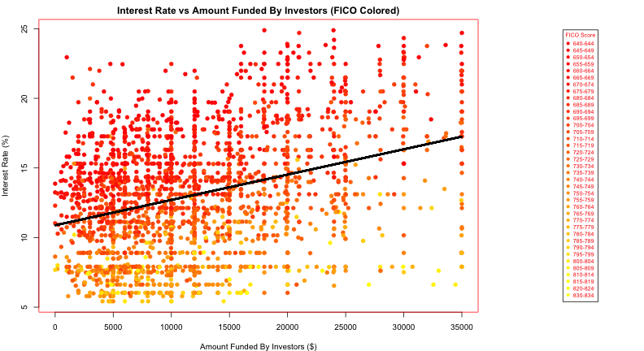 

### Plot Interest Rate vs Loan Lenght

```r
boxplot(loans$Interest.Rate ~ loans$Loan.Length, ylab = "Interest Rate(%)", 
    xlab = "Loan Lenght (months)", main = "Plot Interest Rate vs Loan Lenght")
```

 

```r
lmIRLL <- lm(loans$Interest.Rate ~ loans$Loan.Length)
summary(lmIRLL)
```

```
## 
## Call:
## lm(formula = loans$Interest.Rate ~ loans$Loan.Length)
## 
## Residuals:
##     Min      1Q  Median      3Q     Max 
## -10.617  -3.229  -0.009   2.521  12.761 
## 
## Coefficients:
##                   Estimate Std. Error t value Pr(>|t|)    
## (Intercept)        5.71181    0.32360    17.6   <2e-16 ***
## loans$Loan.Length  0.17826    0.00763    23.4   <2e-16 ***
## ---
## Signif. codes:  0 '***' 0.001 '**' 0.01 '*' 0.05 '.' 0.1 ' ' 1 
## 
## Residual standard error: 3.79 on 2498 degrees of freedom
## Multiple R-squared: 0.18,	Adjusted R-squared: 0.179 
## F-statistic:  547 on 1 and 2498 DF,  p-value: <2e-16
```

### Plot Interest Rate vs Loan Purpose

```r
boxplot(loans$Interest.Rate ~ loans$Loan.Purpose, ylab = "Interest Rate(%)", 
    main = "Plot Interest Rate vs Loan Porpose", las = 3, cex.axis = 0.6)
```

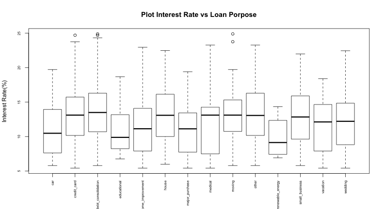 

```r
lmIRLP <- lm(loans$Interest.Rate ~ loans$Loan.Purpose)
summary(lmIRLP)
```

```
## 
## Call:
## lm(formula = loans$Interest.Rate ~ loans$Loan.Purpose)
## 
## Residuals:
##    Min     1Q Median     3Q    Max 
## -7.831 -3.047 -0.097  2.703 11.656 
## 
## Coefficients:
##                                      Estimate Std. Error t value Pr(>|t|)
## (Intercept)                            11.113      0.581   19.12  < 2e-16
## loans$Loan.Purposecredit_card           1.931      0.613    3.15   0.0017
## loans$Loan.Purposedebt_consolidation    2.474      0.592    4.18  3.1e-05
## loans$Loan.Purposeeducational          -0.106      1.210   -0.09   0.9304
## loans$Loan.Purposehome_improvement      0.481      0.670    0.72   0.4727
## loans$Loan.Purposehouse                 2.335      1.087    2.15   0.0319
## loans$Loan.Purposemajor_purchase       -0.315      0.711   -0.44   0.6575
## loans$Loan.Purposemedical               0.537      0.949    0.57   0.5719
## loans$Loan.Purposemoving                2.508      0.959    2.61   0.0090
## loans$Loan.Purposeother                 2.047      0.650    3.15   0.0016
## loans$Loan.Purposerenewable_energy     -1.235      2.136   -0.58   0.5630
## loans$Loan.Purposesmall_business        1.726      0.729    2.37   0.0180
## loans$Loan.Purposevacation              0.853      1.069    0.80   0.4248
## loans$Loan.Purposewedding               1.138      0.878    1.30   0.1952
##                                         
## (Intercept)                          ***
## loans$Loan.Purposecredit_card        ** 
## loans$Loan.Purposedebt_consolidation ***
## loans$Loan.Purposeeducational           
## loans$Loan.Purposehome_improvement      
## loans$Loan.Purposehouse              *  
## loans$Loan.Purposemajor_purchase        
## loans$Loan.Purposemedical               
## loans$Loan.Purposemoving             ** 
## loans$Loan.Purposeother              ** 
## loans$Loan.Purposerenewable_energy      
## loans$Loan.Purposesmall_business     *  
## loans$Loan.Purposevacation              
## loans$Loan.Purposewedding               
## ---
## Signif. codes:  0 '***' 0.001 '**' 0.01 '*' 0.05 '.' 0.1 ' ' 1 
## 
## Residual standard error: 4.11 on 2486 degrees of freedom
## Multiple R-squared: 0.0373,	Adjusted R-squared: 0.0323 
## F-statistic: 7.41 on 13 and 2486 DF,  p-value: 1.7e-14
```

### Plot Interest Rate vs Debt to income ratio (FICO Colored)

```r
par(mar = c(4, 4, 2, 0.5), col = palette(heat.colors(48)))
layout(matrix(c(1, 1, 2, 2), 2, 2, byrow = F), widths = c(3, 1))
plot(loans$Debt.To.Income.Ratio, loans$Interest.Rate, pch = 19, col = loans$FICO.Range, 
    ylab = "Interest Rate (%)", xlab = "Debt to income ratio (%)", main = "Interest Rate vs Debt to income ratio (FICO Colored)")
lmIRDIR <- lm(loans$Interest.Rate ~ loans$Debt.To.Income.Ratio)
lines(loans$Debt.To.Income.Ratio, lmIRDIR$fitted, col = "black", lwd = 3)
plot.new()
legend("center", "groups", legend = sort(unique(loans$FICO.Range)), col = sort(unique(loans$FICO.Range)), 
    cex = 0.7, pch = 19, title = "FICO Score", ncol = 1)
summary(lmIRDIR)
```

```
## 
## Call:
## lm(formula = loans$Interest.Rate ~ loans$Debt.To.Income.Ratio)
## 
## Residuals:
##    Min     1Q Median     3Q    Max 
## -8.801 -3.018 -0.115  2.604 12.319 
## 
## Coefficients:
##                            Estimate Std. Error t value Pr(>|t|)    
## (Intercept)                 11.5842     0.1877   61.71   <2e-16 ***
## loans$Debt.To.Income.Ratio   0.0964     0.0110    8.79   <2e-16 ***
## ---
## Signif. codes:  0 '***' 0.001 '**' 0.01 '*' 0.05 '.' 0.1 ' ' 1 
## 
## Residual standard error: 4.12 on 2498 degrees of freedom
## Multiple R-squared: 0.03,	Adjusted R-squared: 0.0296 
## F-statistic: 77.3 on 1 and 2498 DF,  p-value: <2e-16
```

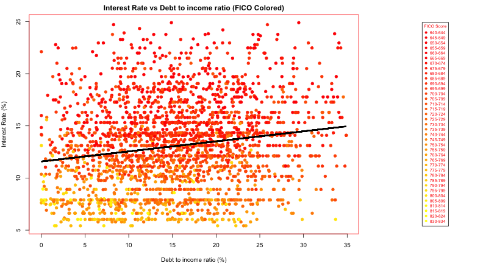 

### Plot Interest Rate vs State


```r
boxplot(loans$Interest.Rate ~ loans$State, xlab = "State", ylab = "Interest Rate(%)", 
    main = "Plot Interest Rate vs State", las = 3, cex.axis = 0.6)
```

 

```r
lmIRST <- lm(loans$Interest.Rate ~ loans$State)
summary(lmIRST)
```

```
## 
## Call:
## lm(formula = loans$Interest.Rate ~ loans$State)
## 
## Residuals:
##    Min     1Q Median     3Q    Max 
## -8.092 -2.942 -0.064  2.714 12.719 
## 
## Coefficients:
##               Estimate Std. Error t value Pr(>|t|)    
## (Intercept)     16.595      1.257   13.20   <2e-16 ***
## loans$StateAL   -3.450      1.428   -2.42   0.0158 *  
## loans$StateAR   -3.365      1.709   -1.97   0.0490 *  
## loans$StateAZ   -3.444      1.400   -2.46   0.0139 *  
## loans$StateCA   -3.639      1.273   -2.86   0.0043 ** 
## loans$StateCO   -3.675      1.366   -2.69   0.0072 ** 
## loans$StateCT   -2.874      1.389   -2.07   0.0387 *  
## loans$StateDC   -2.853      1.778   -1.60   0.1088    
## loans$StateDE   -4.933      1.938   -2.55   0.0110 *  
## loans$StateFL   -3.630      1.298   -2.80   0.0052 ** 
## loans$StateGA   -4.050      1.326   -3.05   0.0023 ** 
## loans$StateHI   -0.610      1.741   -0.35   0.7259    
## loans$StateIA   -2.475      4.356   -0.57   0.5700    
## loans$StateIL   -3.978      1.324   -3.00   0.0027 ** 
## loans$StateIN   -3.505      2.716   -1.29   0.1971    
## loans$StateKS   -2.877      1.552   -1.85   0.0639 .  
## loans$StateKY   -4.212      1.529   -2.75   0.0059 ** 
## loans$StateLA   -1.674      1.540   -1.09   0.2771    
## loans$StateMA   -3.982      1.349   -2.95   0.0032 ** 
## loans$StateMD   -3.316      1.355   -2.45   0.0145 *  
## loans$StateMI   -2.219      1.403   -1.58   0.1138    
## loans$StateMN   -2.973      1.428   -2.08   0.0375 *  
## loans$StateMO   -3.811      1.452   -2.62   0.0087 ** 
## loans$StateMS   -0.945      4.356   -0.22   0.8284    
## loans$StateMT   -5.820      2.016   -2.89   0.0039 ** 
## loans$StateNC   -3.954      1.361   -2.90   0.0037 ** 
## loans$StateNH   -4.423      1.656   -2.67   0.0076 ** 
## loans$StateNJ   -3.816      1.329   -2.87   0.0041 ** 
## loans$StateNM   -2.269      1.709   -1.33   0.1843    
## loans$StateNV   -3.082      1.458   -2.11   0.0346 *  
## loans$StateNY   -3.492      1.284   -2.72   0.0066 ** 
## loans$StateOH   -4.335      1.351   -3.21   0.0014 ** 
## loans$StateOK   -2.814      1.552   -1.81   0.0700 .  
## loans$StateOR   -3.938      1.470   -2.68   0.0074 ** 
## loans$StatePA   -4.056      1.328   -3.06   0.0023 ** 
## loans$StateRI   -3.581      1.656   -2.16   0.0306 *  
## loans$StateSC   -3.804      1.484   -2.56   0.0104 *  
## loans$StateSD   -6.342      2.435   -2.60   0.0093 ** 
## loans$StateTX   -3.213      1.297   -2.48   0.0133 *  
## loans$StateUT   -3.420      1.634   -2.09   0.0364 *  
## loans$StateVA   -3.257      1.343   -2.42   0.0154 *  
## loans$StateVT    1.289      2.249    0.57   0.5665    
## loans$StateWA   -3.617      1.372   -2.64   0.0084 ** 
## loans$StateWI   -2.713      1.500   -1.81   0.0707 .  
## loans$StateWV   -2.486      1.656   -1.50   0.1333    
## loans$StateWY   -3.130      2.435   -1.29   0.1988    
## ---
## Signif. codes:  0 '***' 0.001 '**' 0.01 '*' 0.05 '.' 0.1 ' ' 1 
## 
## Residual standard error: 4.17 on 2454 degrees of freedom
## Multiple R-squared: 0.0216,	Adjusted R-squared: 0.00366 
## F-statistic:  1.2 on 45 and 2454 DF,  p-value: 0.167
```

### Plot Interest Rate vs Home Ownership

```r
boxplot(loans$Interest.Rate ~ loans$Home.Ownership, xlab = "Home Ownership", 
    ylab = "Interest Rate(%)", main = "Plot Interest Rate vs Home Ownership", 
    las = 3, cex.axis = 0.6)
```

 

```r
lmIRHO <- lm(loans$Interest.Rate ~ loans$Home.Ownership)
summary(lmIRHO)
```

```
## 
## Call:
## lm(formula = loans$Interest.Rate ~ loans$Home.Ownership)
## 
## Residuals:
##    Min     1Q Median     3Q    Max 
## -7.994 -2.981 -0.214  2.569 12.149 
## 
## Coefficients:
##                           Estimate Std. Error t value Pr(>|t|)    
## (Intercept)                 12.741      0.123  103.64  < 2e-16 ***
## loans$Home.OwnershipNONE    -5.311      4.167   -1.27  0.20259    
## loans$Home.OwnershipOTHER    3.297      1.867    1.77  0.07750 .  
## loans$Home.OwnershipOWN      0.165      0.319    0.52  0.60540    
## loans$Home.OwnershipRENT     0.672      0.174    3.87  0.00011 ***
## ---
## Signif. codes:  0 '***' 0.001 '**' 0.01 '*' 0.05 '.' 0.1 ' ' 1 
## 
## Residual standard error: 4.17 on 2495 degrees of freedom
## Multiple R-squared: 0.00781,	Adjusted R-squared: 0.00622 
## F-statistic: 4.91 on 4 and 2495 DF,  p-value: 0.000608
```

### Plot Interest Rate vs log(Monthly Income) (FICO Colored)

```r
par(mar = c(4, 4, 2, 0.5), col = palette(heat.colors(48)))
layout(matrix(c(1, 1, 2, 2), 2, 2, byrow = F), widths = c(3, 1))
plot(log(loans$Monthly.Income), loans$Interest.Rate, pch = 19, col = loans$FICO.Range, 
    ylab = "Interest Rate (%)", xlab = "log(Monthly Income ($))", main = "Interest Rate vs log(Monthly Income) (FICO Colored)")
lmIRMI <- lm(loans$Interest.Rate ~ log(loans$Monthly.Income))
lines(log(loans[!is.na(loans$Monthly.Income), "Monthly.Income"]), lmIRMI$fitted, 
    col = "black", lwd = 3)
plot.new()
legend("center", "groups", legend = sort(unique(loans$FICO.Range)), col = sort(unique(loans$FICO.Range)), 
    cex = 0.7, pch = 19, title = "FICO Score", ncol = 1)
summary(lmIRMI)
```

```
## 
## Call:
## lm(formula = loans$Interest.Rate ~ log(loans$Monthly.Income))
## 
## Residuals:
##    Min     1Q Median     3Q    Max 
## -7.892 -3.002  0.008  2.723 11.892 
## 
## Coefficients:
##                           Estimate Std. Error t value Pr(>|t|)    
## (Intercept)                 10.159      1.360    7.47  1.1e-13 ***
## log(loans$Monthly.Income)    0.342      0.160    2.14    0.032 *  
## ---
## Signif. codes:  0 '***' 0.001 '**' 0.01 '*' 0.05 '.' 0.1 ' ' 1 
## 
## Residual standard error: 4.17 on 2497 degrees of freedom
##   (1 observation deleted due to missingness)
## Multiple R-squared: 0.00184,	Adjusted R-squared: 0.00144 
## F-statistic: 4.59 on 1 and 2497 DF,  p-value: 0.0322
```

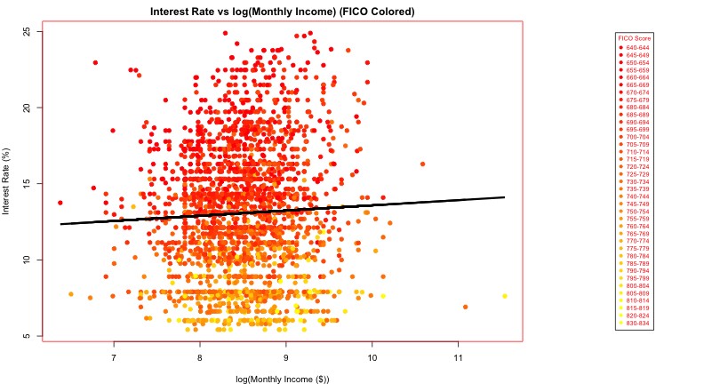 

### Plot Interest Rate vs FICO Range

```r
boxplot(loans$Interest.Rate ~ loans$FICO.Range, xlab = "FICO Range", ylab = "Interest Rate(%)", 
    main = "Plot Interest Rate vs FICO Range", las = 3, cex.axis = 0.6)
```

 

```r
lmIRFR <- lm(loans$Interest.Rate ~ loans$FICO.Range)
summary(lmIRFR)
```

```
## 
## Call:
## lm(formula = loans$Interest.Rate ~ loans$FICO.Range)
## 
## Residuals:
##    Min     1Q Median     3Q    Max 
## -8.147 -2.041 -0.492  1.666 10.403 
## 
## Coefficients:
##                         Estimate Std. Error t value Pr(>|t|)    
## (Intercept)              15.2120     1.2697   11.98  < 2e-16 ***
## loans$FICO.Range645-649  -0.3287     2.0734   -0.16  0.87406    
## loans$FICO.Range650-654  -0.0820     3.1101   -0.03  0.97897    
## loans$FICO.Range655-659  -0.2820     1.9045   -0.15  0.88230    
## loans$FICO.Range660-664   3.2805     1.2948    2.53  0.01135 *  
## loans$FICO.Range665-669   2.2361     1.2914    1.73  0.08348 .  
## loans$FICO.Range670-674   1.0365     1.2881    0.80  0.42110    
## loans$FICO.Range675-679   0.6427     1.2887    0.50  0.61801    
## loans$FICO.Range680-684  -0.0853     1.2897   -0.07  0.94727    
## loans$FICO.Range685-689  -0.5571     1.2925   -0.43  0.66646    
## loans$FICO.Range690-694  -0.4799     1.2922   -0.37  0.71036    
## loans$FICO.Range695-699  -1.0651     1.2903   -0.83  0.40915    
## loans$FICO.Range700-704  -1.8551     1.2937   -1.43  0.15170    
## loans$FICO.Range705-709  -2.5521     1.2931   -1.97  0.04854 *  
## loans$FICO.Range710-714  -2.7789     1.2977   -2.14  0.03234 *  
## loans$FICO.Range715-719  -4.0301     1.3034   -3.09  0.00201 ** 
## loans$FICO.Range720-724  -4.1762     1.2972   -3.22  0.00130 ** 
## loans$FICO.Range725-729  -4.5590     1.3030   -3.50  0.00048 ***
## loans$FICO.Range730-734  -5.2558     1.3030   -4.03  5.7e-05 ***
## loans$FICO.Range735-739  -5.5885     1.3176   -4.24  2.3e-05 ***
## loans$FICO.Range740-744  -5.6197     1.3282   -4.23  2.4e-05 ***
## loans$FICO.Range745-749  -5.3103     1.3272   -4.00  6.5e-05 ***
## loans$FICO.Range750-754  -6.7443     1.3207   -5.11  3.5e-07 ***
## loans$FICO.Range755-759  -6.2159     1.3369   -4.65  3.5e-06 ***
## loans$FICO.Range760-764  -6.5844     1.3369   -4.93  9.0e-07 ***
## loans$FICO.Range765-769  -7.4287     1.3550   -5.48  4.6e-08 ***
## loans$FICO.Range770-774  -8.4591     1.4444   -5.86  5.4e-09 ***
## loans$FICO.Range775-779  -6.4679     1.4066   -4.60  4.5e-06 ***
## loans$FICO.Range780-784  -7.6227     1.3784   -5.53  3.5e-08 ***
## loans$FICO.Range785-789  -6.7141     1.4270   -4.71  2.7e-06 ***
## loans$FICO.Range790-794  -7.6515     1.4195   -5.39  7.7e-08 ***
## loans$FICO.Range795-799  -6.8205     1.4940   -4.57  5.2e-06 ***
## loans$FICO.Range800-804  -7.5735     1.4940   -5.07  4.3e-07 ***
## loans$FICO.Range805-809  -7.7856     1.5313   -5.08  4.0e-07 ***
## loans$FICO.Range810-814  -6.9183     1.6185   -4.27  2.0e-05 ***
## loans$FICO.Range815-819  -8.2870     1.7192   -4.82  1.5e-06 ***
## loans$FICO.Range820-824  -7.3120     3.1101   -2.35  0.01880 *  
## loans$FICO.Range830-834  -7.5920     3.1101   -2.44  0.01471 *  
## ---
## Signif. codes:  0 '***' 0.001 '**' 0.01 '*' 0.05 '.' 0.1 ' ' 1 
## 
## Residual standard error: 2.84 on 2462 degrees of freedom
## Multiple R-squared: 0.545,	Adjusted R-squared: 0.538 
## F-statistic: 79.7 on 37 and 2462 DF,  p-value: <2e-16
```

### Plot Interest Rate vs Open Credit Lines

```r
boxplot(loans$Interest.Rate ~ loans$Open.CREDIT.Lines, xlab = "Open Credit Lines", 
    ylab = "Interest Rate(%)", main = "Plot Interest Rate vs Open Credit Lines", 
    las = 3, cex.axis = 0.6)
```

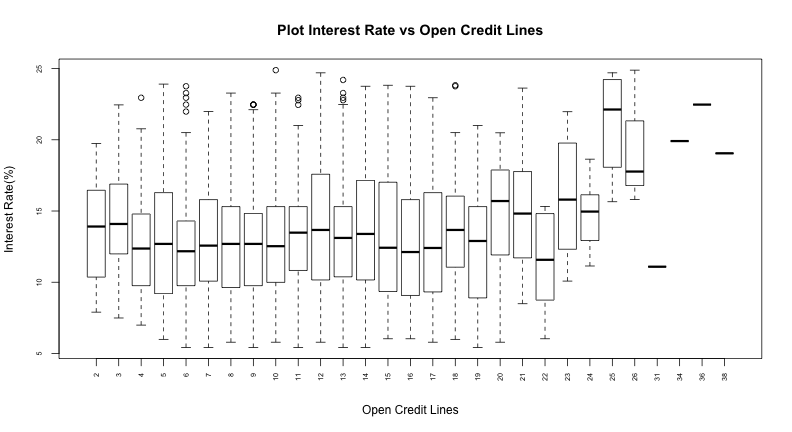 

```r
lmIROC <- lm(loans$Interest.Rate ~ loans$Open.CREDIT.Lines)
summary(lmIROC)
```

```
## 
## Call:
## lm(formula = loans$Interest.Rate ~ loans$Open.CREDIT.Lines)
## 
## Residuals:
##    Min     1Q Median     3Q    Max 
## -8.397 -3.033 -0.039  2.664 11.826 
## 
## Coefficients:
##                         Estimate Std. Error t value Pr(>|t|)    
## (Intercept)              12.2272     0.2039   59.97  < 2e-16 ***
## loans$Open.CREDIT.Lines   0.0837     0.0185    4.53  6.2e-06 ***
## ---
## Signif. codes:  0 '***' 0.001 '**' 0.01 '*' 0.05 '.' 0.1 ' ' 1 
## 
## Residual standard error: 4.16 on 2496 degrees of freedom
##   (2 observations deleted due to missingness)
## Multiple R-squared: 0.00816,	Adjusted R-squared: 0.00776 
## F-statistic: 20.5 on 1 and 2496 DF,  p-value: 6.17e-06
```

### Plot Interest Rate vs log(Revolving Credit Balance) (FICO Colored)

```r
par(mar = c(4, 4, 2, 0.5), col = palette(heat.colors(48)))
layout(matrix(c(1, 1, 2, 2), 2, 2, byrow = F), widths = c(3, 1))
plot(log(loans$Revolving.CREDIT.Balance + 1), loans$Interest.Rate, pch = 19, 
    col = loans$FICO.Range, ylab = "Interest Rate (%)", xlab = "log(Revolving Credit Balance($))", 
    main = "Interest Rate vs log(Revolving Credit Balance) (FICO Colored)")
lmIRRCB <- lm(loans$Interest.Rate ~ log(loans$Revolving.CREDIT.Balance + 1))
lines(log(loans[!is.na(loans$Revolving.CREDIT.Balance), "Revolving.CREDIT.Balance"] + 
    1), lmIRRCB$fitted, col = "black", lwd = 3)
plot.new()
legend("center", "groups", legend = sort(unique(loans$FICO.Range)), col = sort(unique(loans$FICO.Range)), 
    cex = 0.7, pch = 19, title = "FICO Score", ncol = 1)
summary(lmIRRCB)
```

```
## 
## Call:
## lm(formula = loans$Interest.Rate ~ log(loans$Revolving.CREDIT.Balance + 
##     1))
## 
## Residuals:
##    Min     1Q Median     3Q    Max 
## -8.161 -3.060 -0.077  2.686 12.302 
## 
## Coefficients:
##                                         Estimate Std. Error t value
## (Intercept)                                9.808      0.476   20.59
## log(loans$Revolving.CREDIT.Balance + 1)    0.361      0.052    6.95
##                                         Pr(>|t|)    
## (Intercept)                              < 2e-16 ***
## log(loans$Revolving.CREDIT.Balance + 1)  4.5e-12 ***
## ---
## Signif. codes:  0 '***' 0.001 '**' 0.01 '*' 0.05 '.' 0.1 ' ' 1 
## 
## Residual standard error: 4.14 on 2496 degrees of freedom
##   (2 observations deleted due to missingness)
## Multiple R-squared: 0.019,	Adjusted R-squared: 0.0186 
## F-statistic: 48.4 on 1 and 2496 DF,  p-value: 4.5e-12
```

 

### Plot Interest Rate vs Inquiries in the last 6 months

```r
boxplot(loans$Interest.Rate ~ loans$Inquiries.in.the.Last.6.Months, xlab = "Number of Inquiries in the last 6 months", 
    ylab = "Interest Rate(%)", main = "Plot Interest Rate vs Open Credit Lines", 
    las = 3, cex.axis = 0.6)
```

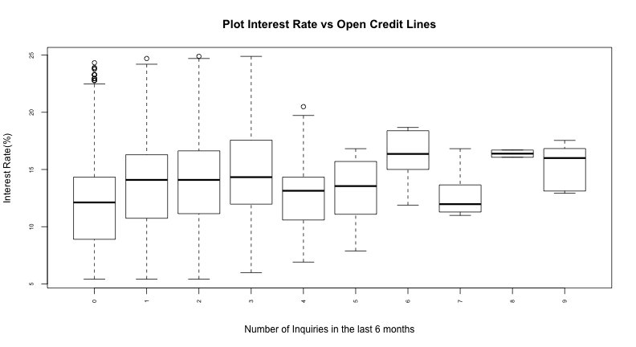 

```r
lmIRIL6M <- lm(loans$Interest.Rate ~ loans$Inquiries.in.the.Last.6.Months)
summary(lmIRIL6M)
```

```
## 
## Call:
## lm(formula = loans$Interest.Rate ~ loans$Inquiries.in.the.Last.6.Months)
## 
## Residuals:
##    Min     1Q Median     3Q    Max 
## -8.262 -2.941 -0.144  2.670 11.766 
## 
## Coefficients:
##                                      Estimate Std. Error t value Pr(>|t|)
## (Intercept)                            12.564      0.102  122.67   <2e-16
## loans$Inquiries.in.the.Last.6.Months    0.559      0.067    8.34   <2e-16
##                                         
## (Intercept)                          ***
## loans$Inquiries.in.the.Last.6.Months ***
## ---
## Signif. codes:  0 '***' 0.001 '**' 0.01 '*' 0.05 '.' 0.1 ' ' 1 
## 
## Residual standard error: 4.12 on 2496 degrees of freedom
##   (2 observations deleted due to missingness)
## Multiple R-squared: 0.0271,	Adjusted R-squared: 0.0267 
## F-statistic: 69.5 on 1 and 2496 DF,  p-value: <2e-16
```

### Plot Interest Rate vs Employment Length

```r
boxplot(loans$Interest.Rate ~ loans$Employment.Length, xlab = "Employment Length", 
    ylab = "Interest Rate(%)", main = "Plot Interest Rate vs Employment Length", 
    las = 3, cex.axis = 0.6)
```

 

```r
lmIREL <- lm(loans$Interest.Rate ~ loans$Employment.Length)
summary(lmIREL)
```

```
## 
## Call:
## lm(formula = loans$Interest.Rate ~ loans$Employment.Length)
## 
## Residuals:
##    Min     1Q Median     3Q    Max 
## -7.916 -3.010 -0.044  2.662 11.882 
## 
## Coefficients:
##                                  Estimate Std. Error t value Pr(>|t|)    
## (Intercept)                      12.85096    0.26427   48.63   <2e-16 ***
## loans$Employment.Length1 year    -0.36412    0.41046   -0.89     0.38    
## loans$Employment.Length10+ years  0.48527    0.31077    1.56     0.12    
## loans$Employment.Length2 years   -0.00403    0.37602   -0.01     0.99    
## loans$Employment.Length3 years   -0.08143    0.37965   -0.21     0.83    
## loans$Employment.Length4 years    0.28706    0.40097    0.72     0.47    
## loans$Employment.Length5 years    0.54854    0.39531    1.39     0.17    
## loans$Employment.Length6 years    0.44027    0.42066    1.05     0.30    
## loans$Employment.Length7 years    0.24526    0.45532    0.54     0.59    
## loans$Employment.Length8 years    0.15663    0.48115    0.33     0.74    
## loans$Employment.Length9 years    0.30321    0.55887    0.54     0.59    
## loans$Employment.Lengthn/a        0.00255    0.54460    0.00     1.00    
## ---
## Signif. codes:  0 '***' 0.001 '**' 0.01 '*' 0.05 '.' 0.1 ' ' 1 
## 
## Residual standard error: 4.18 on 2488 degrees of freedom
## Multiple R-squared: 0.00429,	Adjusted R-squared: -0.000111 
## F-statistic: 0.975 on 11 and 2488 DF,  p-value: 0.467
```

Looking for confounders variables
---------------------------------------------------------------

### Plot Interest Rate vs FICO Range (Amount Requested Colored)

```r
pcolor = cut(loans$Amount.Requested, 10)
par(mfrow = c(2, 1), mar = c(4, 4, 2, 0.5), col = palette(rainbow(10)))
plot(jitter(loans$FICO.Range.L, 2), loans$Interest.Rate, pch = 19, col = pcolor, 
    ylab = "Interest Rate (%)", xlab = "FICO Range", main = "Interest Rate vs FICO Range (Amount Requested Colored)", 
    cex = 0.7)
lmIRFR <- lm(loans$Interest.Rate ~ loans$FICO.Range.L)
lines(loans$FICO.Range.L, lmIRFR$fitted, col = "Black", lwd = 3)
plot(jitter(loans$FICO.Range.L, 2), lmIRFR$residuals, col = pcolor, pch = 19, 
    ylab = "No adjust Residuals", xlab = "FICO Range ($)", main = "Interest Rate vs FICO Range (Amount Requested Colored)", 
    cex = 0.7)
```

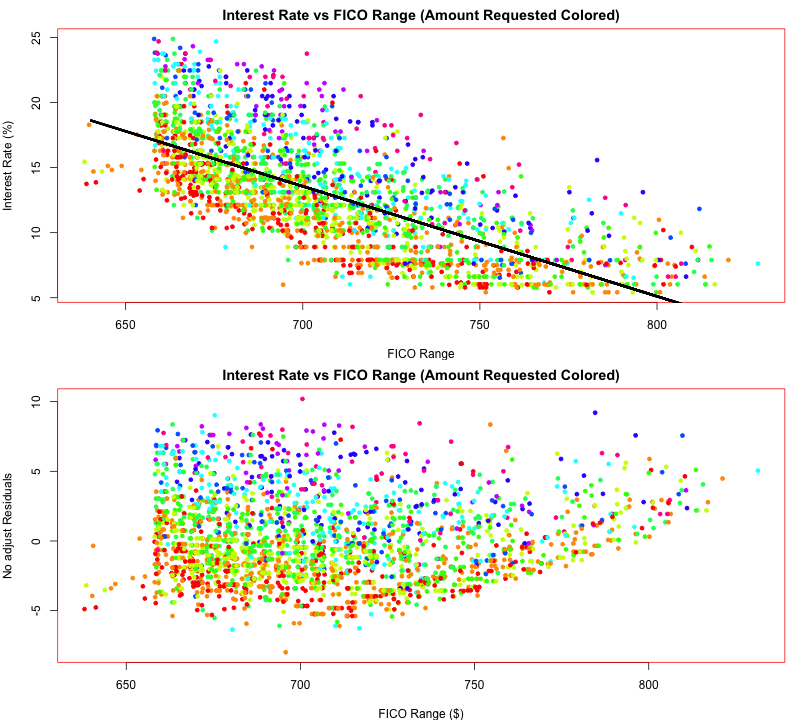 

```r
summary(lmIRFR)
```

```
## 
## Call:
## lm(formula = loans$Interest.Rate ~ loans$FICO.Range.L)
## 
## Residuals:
##    Min     1Q Median     3Q    Max 
## -7.988 -2.136 -0.455  1.837 10.195 
## 
## Coefficients:
##                    Estimate Std. Error t value Pr(>|t|)    
## (Intercept)        72.76547    1.18915    61.2   <2e-16 ***
## loans$FICO.Range.L -0.08457    0.00168   -50.3   <2e-16 ***
## ---
## Signif. codes:  0 '***' 0.001 '**' 0.01 '*' 0.05 '.' 0.1 ' ' 1 
## 
## Residual standard error: 2.95 on 2498 degrees of freedom
## Multiple R-squared: 0.503,	Adjusted R-squared: 0.503 
## F-statistic: 2.53e+03 on 1 and 2498 DF,  p-value: <2e-16
```


### Plot Interest Rate vs FICO Range (Amount Funded By Investor Colored)

```r

pcolor = cut(loans$Amount.Funded.By.Investors, 10)
par(mfrow = c(2, 1), mar = c(4, 4, 2, 0.5), col = palette(rainbow(10)))
plot(jitter(loans$FICO.Range.L, 2), loans$Interest.Rate, pch = 19, col = pcolor, 
    ylab = "Interest Rate (%)", xlab = "FICO Range", main = "Interest Rate vs FICO Range (Amount Funded By Investor Colored)", 
    cex = 0.7)
lmIRFR <- lm(loans$Interest.Rate ~ loans$FICO.Range.L)
lines(loans$FICO.Range.L, lmIRFR$fitted, col = "Black", lwd = 3)
plot(jitter(loans$FICO.Range.L, 2), lmIRFR$residuals, col = pcolor, pch = 19, 
    ylab = "No adjust Residuals", xlab = "FICO Range ($)", main = "Interest Rate vs FICO Range (Amount Funded By Investor Colored)", 
    cex = 0.7)
```

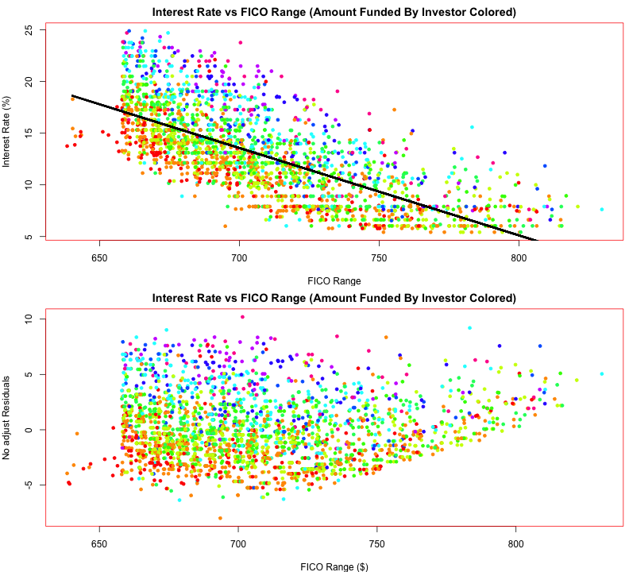 

```r
summary(lmIRFR)
```

```
## 
## Call:
## lm(formula = loans$Interest.Rate ~ loans$FICO.Range.L)
## 
## Residuals:
##    Min     1Q Median     3Q    Max 
## -7.988 -2.136 -0.455  1.837 10.195 
## 
## Coefficients:
##                    Estimate Std. Error t value Pr(>|t|)    
## (Intercept)        72.76547    1.18915    61.2   <2e-16 ***
## loans$FICO.Range.L -0.08457    0.00168   -50.3   <2e-16 ***
## ---
## Signif. codes:  0 '***' 0.001 '**' 0.01 '*' 0.05 '.' 0.1 ' ' 1 
## 
## Residual standard error: 2.95 on 2498 degrees of freedom
## Multiple R-squared: 0.503,	Adjusted R-squared: 0.503 
## F-statistic: 2.53e+03 on 1 and 2498 DF,  p-value: <2e-16
```


### Plot Interest Rate vs FICO Range (Debt to Income Ratio Colored)

```r

pcolor = cut(loans$Debt.To.Income.Ratio, 10)
par(mfrow = c(2, 1), mar = c(4, 4, 2, 0.5), col = palette(rainbow(10)))
plot(jitter(loans$FICO.Range.L, 2), loans$Interest.Rate, pch = 19, col = pcolor, 
    ylab = "Interest Rate (%)", xlab = "FICO Range", main = "Interest Rate vs FICO Range (Debt to Income Ratio Colored)", 
    cex = 0.7)
lmIRFR <- lm(loans$Interest.Rate ~ loans$FICO.Range.L)
lines(loans$FICO.Range.L, lmIRFR$fitted, col = "Black", lwd = 3)
plot(jitter(loans$FICO.Range.L, 2), lmIRFR$residuals, col = pcolor, pch = 19, 
    ylab = "No adjust Residuals", xlab = "FICO Range ($)", main = "Interest Rate vs FICO Range (Debt to Income Ratio Colored)", 
    cex = 0.7)
```

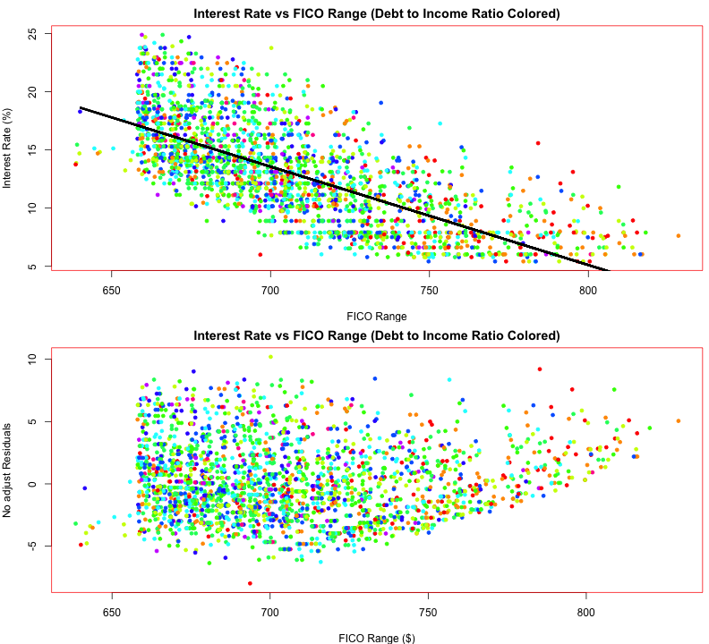 

```r
summary(lmIRFR)
```

```
## 
## Call:
## lm(formula = loans$Interest.Rate ~ loans$FICO.Range.L)
## 
## Residuals:
##    Min     1Q Median     3Q    Max 
## -7.988 -2.136 -0.455  1.837 10.195 
## 
## Coefficients:
##                    Estimate Std. Error t value Pr(>|t|)    
## (Intercept)        72.76547    1.18915    61.2   <2e-16 ***
## loans$FICO.Range.L -0.08457    0.00168   -50.3   <2e-16 ***
## ---
## Signif. codes:  0 '***' 0.001 '**' 0.01 '*' 0.05 '.' 0.1 ' ' 1 
## 
## Residual standard error: 2.95 on 2498 degrees of freedom
## Multiple R-squared: 0.503,	Adjusted R-squared: 0.503 
## F-statistic: 2.53e+03 on 1 and 2498 DF,  p-value: <2e-16
```

### Plot Interest Rate vs FICO Range (log(Monthly Income) Colored)

```r
pcolor = cut(log(loans$Monthly.Income), 10)
par(mfrow = c(2, 1), mar = c(4, 4, 2, 0.5), col = palette(rainbow(10)))
plot(jitter(loans$FICO.Range.L, 2), loans$Interest.Rate, pch = 19, col = pcolor, 
    ylab = "Interest Rate (%)", xlab = "FICO Range", main = "Interest Rate vs FICO Range (log(Monthly Income) Colored)", 
    cex = 0.7)
lmIRFR <- lm(loans$Interest.Rate ~ loans$FICO.Range.L)
lines(loans$FICO.Range.L, lmIRFR$fitted, col = "Black", lwd = 3)
plot(jitter(loans$FICO.Range.L, 2), lmIRFR$residuals, col = pcolor, pch = 19, 
    ylab = "No adjust Residuals", xlab = "FICO Range ($)", main = "Interest Rate vs FICO Range (log(Monthly Income) Colored)", 
    cex = 0.7)
```

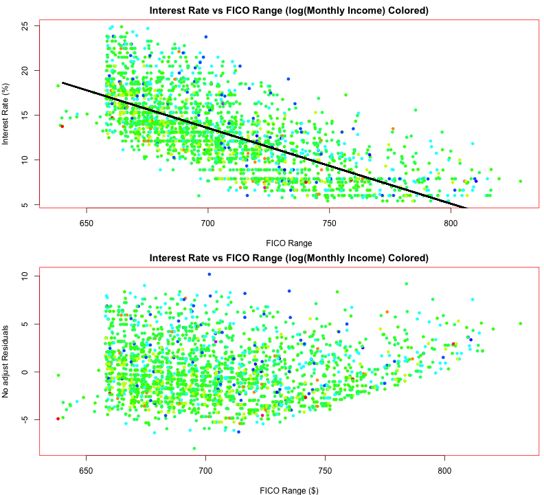 

```r
summary(lmIRFR)
```

```
## 
## Call:
## lm(formula = loans$Interest.Rate ~ loans$FICO.Range.L)
## 
## Residuals:
##    Min     1Q Median     3Q    Max 
## -7.988 -2.136 -0.455  1.837 10.195 
## 
## Coefficients:
##                    Estimate Std. Error t value Pr(>|t|)    
## (Intercept)        72.76547    1.18915    61.2   <2e-16 ***
## loans$FICO.Range.L -0.08457    0.00168   -50.3   <2e-16 ***
## ---
## Signif. codes:  0 '***' 0.001 '**' 0.01 '*' 0.05 '.' 0.1 ' ' 1 
## 
## Residual standard error: 2.95 on 2498 degrees of freedom
## Multiple R-squared: 0.503,	Adjusted R-squared: 0.503 
## F-statistic: 2.53e+03 on 1 and 2498 DF,  p-value: <2e-16
```


### Plot Interest Rate vs FICO Range (Open Credit Lines Colored)

```r
pcolor = cut(log(loans$Open.CREDIT.Lines + 1), 38)
par(mfrow = c(2, 1), mar = c(4, 4, 2, 0.5), col = palette(rainbow(38)))
plot(jitter(loans$FICO.Range.L, 2), loans$Interest.Rate, pch = 19, col = pcolor, 
    ylab = "Interest Rate (%)", xlab = "FICO Range", main = "Interest Rate vs FICO Range (Open Credit Lines Colored)", 
    cex = 0.7)
lmIRFR <- lm(loans$Interest.Rate ~ loans$FICO.Range.L)
lines(loans$FICO.Range.L, lmIRFR$fitted, col = "Black", lwd = 3)
plot(jitter(loans$FICO.Range.L, 2), lmIRFR$residuals, col = pcolor, pch = 19, 
    ylab = "No adjust Residuals", xlab = "FICO Range ($)", main = "Interest Rate vs FICO Range (Open Credit Lines Colored)", 
    cex = 0.7)
```

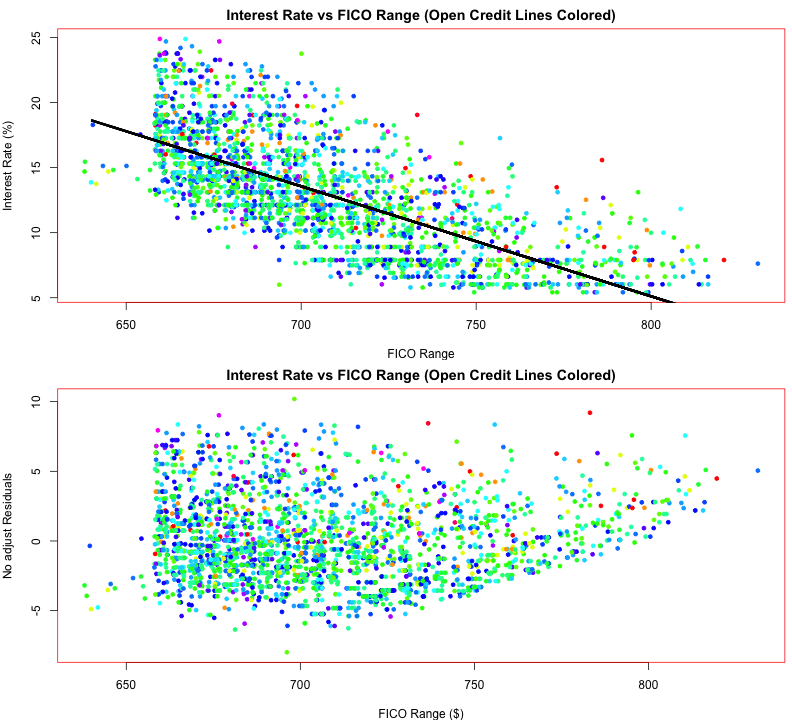 

```r
summary(lmIRFR)
```

```
## 
## Call:
## lm(formula = loans$Interest.Rate ~ loans$FICO.Range.L)
## 
## Residuals:
##    Min     1Q Median     3Q    Max 
## -7.988 -2.136 -0.455  1.837 10.195 
## 
## Coefficients:
##                    Estimate Std. Error t value Pr(>|t|)    
## (Intercept)        72.76547    1.18915    61.2   <2e-16 ***
## loans$FICO.Range.L -0.08457    0.00168   -50.3   <2e-16 ***
## ---
## Signif. codes:  0 '***' 0.001 '**' 0.01 '*' 0.05 '.' 0.1 ' ' 1 
## 
## Residual standard error: 2.95 on 2498 degrees of freedom
## Multiple R-squared: 0.503,	Adjusted R-squared: 0.503 
## F-statistic: 2.53e+03 on 1 and 2498 DF,  p-value: <2e-16
```


### Plot Interest Rate vs FICO Range (log(Revolving Credit Balance) Colored)

```r
pcolor = cut(log(loans$Revolving.CREDIT.Balance), 13)
```

```
## Error: 'from' must be finite
```

```r
par(mfrow = c(2, 1), mar = c(4, 4, 2, 0.5), col = palette(rainbow(13)))
plot(jitter(loans$FICO.Range.L, 2), loans$Interest.Rate, pch = 19, col = pcolor, 
    ylab = "Interest Rate (%)", xlab = "FICO Range", main = "Interest Rate vs FICO Range (log(Revolving Credit Balance) Colored)", 
    cex = 0.7)
lmIRFR <- lm(loans$Interest.Rate ~ loans$FICO.Range.L)
lines(loans$FICO.Range.L, lmIRFR$fitted, col = "Black", lwd = 3)
plot(jitter(loans$FICO.Range.L, 2), lmIRFR$residuals, col = pcolor, pch = 19, 
    ylab = "No adjust Residuals", xlab = "FICO Range ($)", main = "Interest Rate vs FICO Range (log(Revolving Credit Balance) Colored)", 
    cex = 0.7)
```

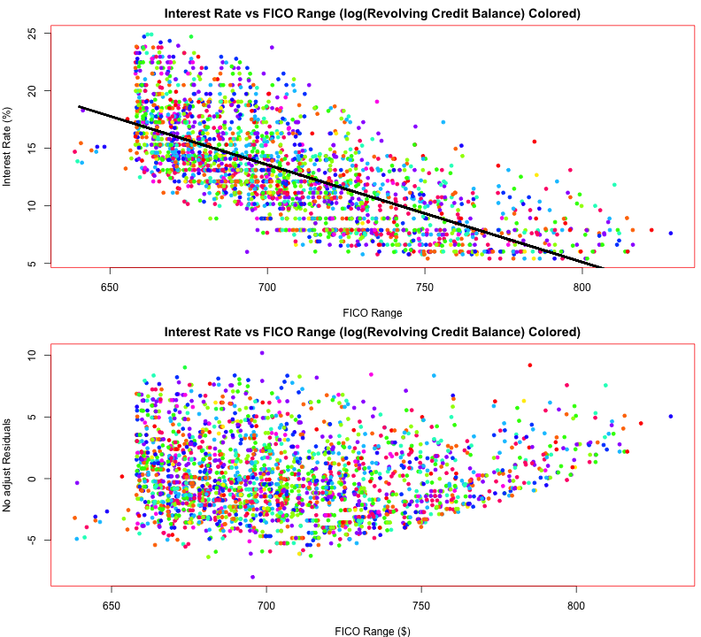 

```r
summary(lmIRFR)
```

```
## 
## Call:
## lm(formula = loans$Interest.Rate ~ loans$FICO.Range.L)
## 
## Residuals:
##    Min     1Q Median     3Q    Max 
## -7.988 -2.136 -0.455  1.837 10.195 
## 
## Coefficients:
##                    Estimate Std. Error t value Pr(>|t|)    
## (Intercept)        72.76547    1.18915    61.2   <2e-16 ***
## loans$FICO.Range.L -0.08457    0.00168   -50.3   <2e-16 ***
## ---
## Signif. codes:  0 '***' 0.001 '**' 0.01 '*' 0.05 '.' 0.1 ' ' 1 
## 
## Residual standard error: 2.95 on 2498 degrees of freedom
## Multiple R-squared: 0.503,	Adjusted R-squared: 0.503 
## F-statistic: 2.53e+03 on 1 and 2498 DF,  p-value: <2e-16
```


### Plot Interest Rate vs FICO Range (Employment Length Colored)

```r
pcolor = cut(as.factor(loans$Employment.Length), 13)
```

```
## Error: 'x' must be numeric
```

```r
par(mfrow = c(2, 1), mar = c(4, 4, 2, 0.5), col = palette(rainbow(13)))
plot(jitter(loans$FICO.Range.L, 2), loans$Interest.Rate, pch = 19, col = pcolor, 
    ylab = "Interest Rate (%)", xlab = "FICO Range", main = "Interest Rate vs FICO Range (Employment Length Colored)", 
    cex = 0.7)
lmIRFR <- lm(loans$Interest.Rate ~ loans$FICO.Range.L)
lines(loans$FICO.Range.L, lmIRFR$fitted, col = "Black", lwd = 3)
plot(jitter(loans$FICO.Range.L, 2), lmIRFR$residuals, col = pcolor, pch = 19, 
    ylab = "No adjust Residuals", xlab = "FICO Range ($)", main = "Interest Rate vs FICO Range (Employment Length Colored)", 
    cex = 0.7)
```

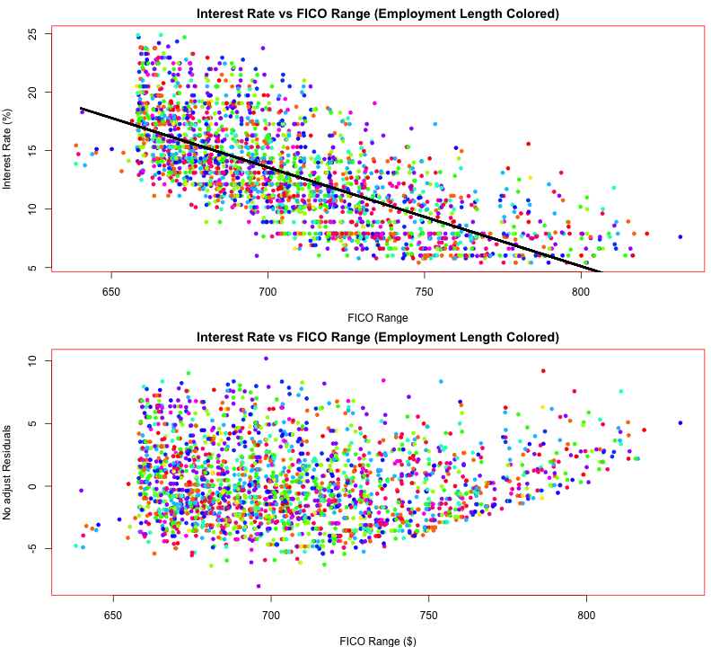 

```r
summary(lmIRFR)
```

```
## 
## Call:
## lm(formula = loans$Interest.Rate ~ loans$FICO.Range.L)
## 
## Residuals:
##    Min     1Q Median     3Q    Max 
## -7.988 -2.136 -0.455  1.837 10.195 
## 
## Coefficients:
##                    Estimate Std. Error t value Pr(>|t|)    
## (Intercept)        72.76547    1.18915    61.2   <2e-16 ***
## loans$FICO.Range.L -0.08457    0.00168   -50.3   <2e-16 ***
## ---
## Signif. codes:  0 '***' 0.001 '**' 0.01 '*' 0.05 '.' 0.1 ' ' 1 
## 
## Residual standard error: 2.95 on 2498 degrees of freedom
## Multiple R-squared: 0.503,	Adjusted R-squared: 0.503 
## F-statistic: 2.53e+03 on 1 and 2498 DF,  p-value: <2e-16
```


Modeling
--------------------------------------------------------------
### Fit a basic model relating Interest Rate to FICO Range

```r
lmIRFR <- lm(loans$Interest.Rate ~ log(loans$FICO.Range.L))
summary(lmIRFR)
```

```
## 
## Call:
## lm(formula = loans$Interest.Rate ~ log(loans$FICO.Range.L))
## 
## Residuals:
##    Min     1Q Median     3Q    Max 
## -7.944 -2.126 -0.457  1.785 10.254 
## 
## Coefficients:
##                         Estimate Std. Error t value Pr(>|t|)    
## (Intercept)               413.99       7.88    52.5   <2e-16 ***
## log(loans$FICO.Range.L)   -61.13       1.20   -50.9   <2e-16 ***
## ---
## Signif. codes:  0 '***' 0.001 '**' 0.01 '*' 0.05 '.' 0.1 ' ' 1 
## 
## Residual standard error: 2.93 on 2498 degrees of freedom
## Multiple R-squared: 0.509,	Adjusted R-squared: 0.509 
## F-statistic: 2.59e+03 on 1 and 2498 DF,  p-value: <2e-16
```


### Plot the observed ('back') and fitted ('red') points

```r
lmIRFR <- lm(loans$Interest.Rate ~ log(loans$FICO.Range.L))
plot(log(loans$FICO.Range.L), loans$Interest.Rate, pch = 19, col = "black")
points(log(loans$FICO.Range.L), lmIRFR$fitted, pch = 19, col = "red")
```

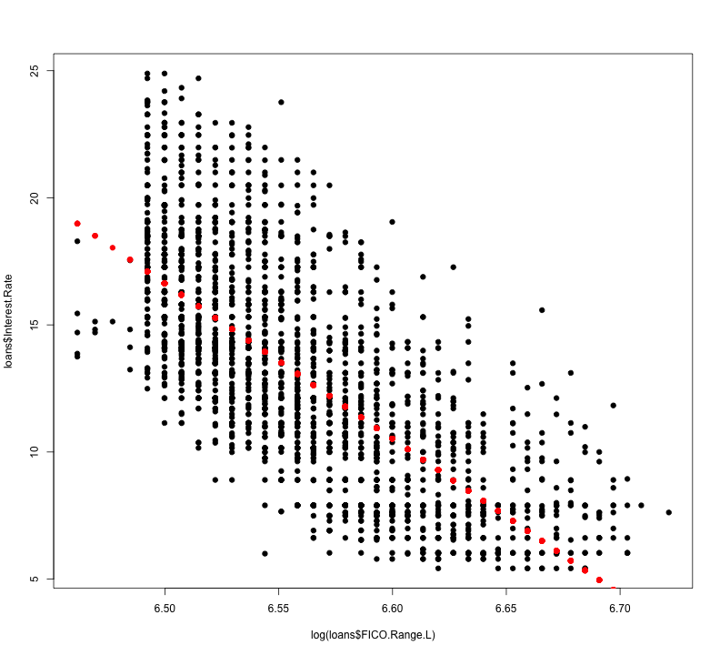 


### Look at residuals versus observations, residuals versus fitted values

```r
lmIRFR <- lm(loans$Interest.Rate ~ log(loans$FICO.Range.L))
par(mfrow = c(1, 2))
plot(log(loans$FICO.Range.L), lmIRFR$residuals, pch = 19)
plot(lmIRFR$fitted, lmIRFR$residuals, pch = 19)
```

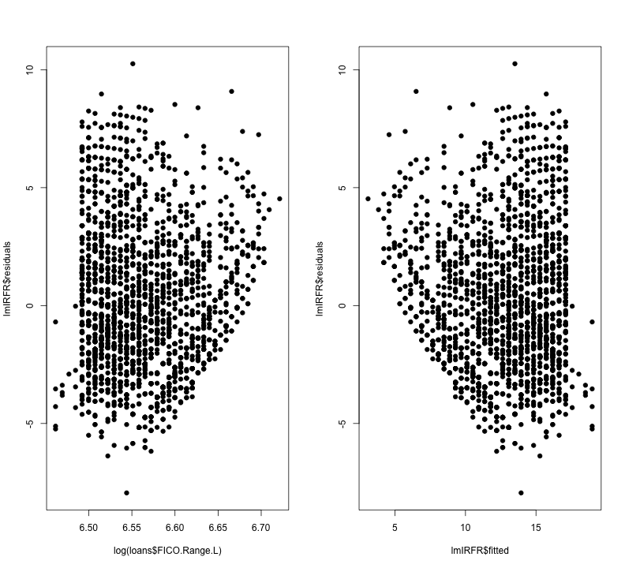 


### What if we color residuals by Amount Requested (see a pattern)

```r
cuts <- 5
lmIRFR <- lm(loans$Interest.Rate ~ log(loans$FICO.Range.L))
AmountRequestCut = cut(loans$Amount.Requested, cuts)
par(mfrow = c(1, 2), col = palette(rainbow(cuts)))
plot(log(loans$FICO.Range.L), lmIRFR$residuals, pch = 19, col = AmountRequestCut)
plot(lmIRFR$fitted, lmIRFR$residuals, pch = 19, col = AmountRequestCut)
```

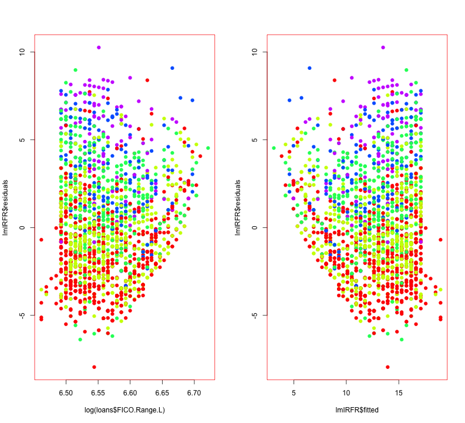 


### What if we color residuals by Amount Funded By Investor (see a pattern)

```r
lmIRFR <- lm(loans$Interest.Rate ~ log(loans$FICO.Range.L))
AmountFundedByInvestorCut = cut(loans$Amount.Funded.By.Investors, cuts)
par(mfrow = c(1, 2), col = palette(rainbow(cuts)))
plot(log(loans$FICO.Range.L), lmIRFR$residuals, pch = 19, col = AmountFundedByInvestorCut)
plot(lmIRFR$fitted, lmIRFR$residuals, pch = 19, col = AmountRequestCut)
```

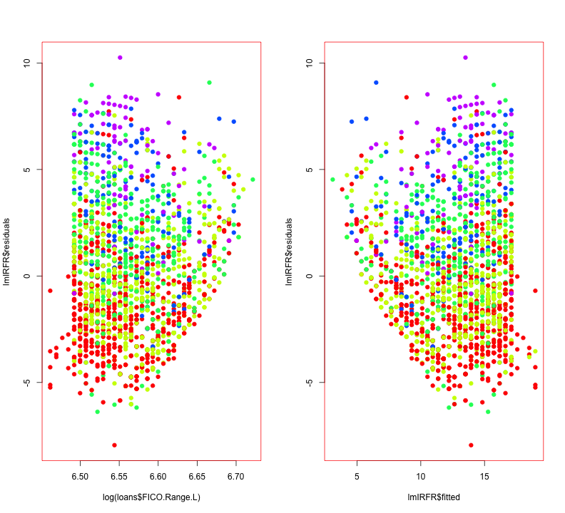 


### Now try fitting a new model with Amount Requested in there

```r
AmountRequestCut = cut(loans$Amount.Requested, cuts)
lmIRFRAR <- lm(loans$Interest.Rate ~ log(loans$FICO.Range.L) + AmountRequestCut)
par(mfrow = c(1, 2), col = palette(rainbow(cuts)))
plot(log(loans$FICO.Range.L), lmIRFRAR$residuals, pch = 19, col = AmountRequestCut)
plot(lmIRFRAR$fitted, lmIRFRAR$residuals, pch = 19, col = AmountRequestCut)
```

 


### Now try fitting a new model with Amount Requested Amount Funded By Investor & in there

```r
AmountRequestCut = cut(loans$Amount.Requested, cuts)
AmountFundedByInvestorCut = cut(loans$Amount.Funded.By.Investors, cuts)
lmIRFRARAFI <- lm(loans$Interest.Rate ~ log(loans$FICO.Range.L) + AmountRequestCut + 
    AmountFundedByInvestorCut)
par(mfrow = c(1, 2), col = palette(rainbow(cuts)))
plot(log(loans$FICO.Range.L), lmIRFRARAFI$residuals, pch = 19, col = AmountRequestCut)
plot(lmIRFRARAFI$fitted, lmIRFRARAFI$residuals, pch = 19, col = AmountRequestCut)
```

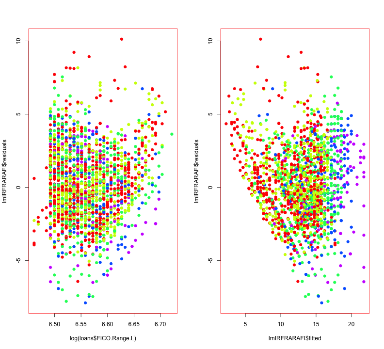 


### Let's use lmIRFRARAFI

```r
summary(lmIRFRARAFI)
```

```
## 
## Call:
## lm(formula = loans$Interest.Rate ~ log(loans$FICO.Range.L) + 
##     AmountRequestCut + AmountFundedByInvestorCut)
## 
## Residuals:
##    Min     1Q Median     3Q    Max 
## -7.888 -1.694 -0.238  1.544 10.122 
## 
## Coefficients:
##                                             Estimate Std. Error t value
## (Intercept)                                 429.4063     6.5472   65.59
## log(loans$FICO.Range.L)                     -63.7206     0.9988  -63.79
## AmountRequestCut(7.78e+03,1.46e+04]           0.0364     0.2175    0.17
## AmountRequestCut(1.46e+04,2.14e+04]           1.5839     0.3149    5.03
## AmountRequestCut(2.14e+04,2.82e+04]           2.8917     0.5188    5.57
## AmountRequestCut(2.82e+04,3.5e+04]            3.5990     0.8925    4.03
## AmountFundedByInvestorCut(6.98e+03,1.4e+04]   0.8513     0.2171    3.92
## AmountFundedByInvestorCut(1.4e+04,2.1e+04]    1.2864     0.3156    4.08
## AmountFundedByInvestorCut(2.1e+04,2.8e+04]    1.3825     0.5401    2.56
## AmountFundedByInvestorCut(2.8e+04,3.5e+04]    2.4394     0.9104    2.68
##                                             Pr(>|t|)    
## (Intercept)                                  < 2e-16 ***
## log(loans$FICO.Range.L)                      < 2e-16 ***
## AmountRequestCut(7.78e+03,1.46e+04]           0.8672    
## AmountRequestCut(1.46e+04,2.14e+04]          5.3e-07 ***
## AmountRequestCut(2.14e+04,2.82e+04]          2.8e-08 ***
## AmountRequestCut(2.82e+04,3.5e+04]           5.7e-05 ***
## AmountFundedByInvestorCut(6.98e+03,1.4e+04]  9.1e-05 ***
## AmountFundedByInvestorCut(1.4e+04,2.1e+04]   4.7e-05 ***
## AmountFundedByInvestorCut(2.1e+04,2.8e+04]    0.0105 *  
## AmountFundedByInvestorCut(2.8e+04,3.5e+04]    0.0074 ** 
## ---
## Signif. codes:  0 '***' 0.001 '**' 0.01 '*' 0.05 '.' 0.1 ' ' 1 
## 
## Residual standard error: 2.42 on 2490 degrees of freedom
## Multiple R-squared: 0.665,	Adjusted R-squared: 0.664 
## F-statistic:  550 on 9 and 2490 DF,  p-value: <2e-16
```

```r
confint(lmIRFRARAFI)
```

```
##                                                2.5 %   97.5 %
## (Intercept)                                 416.5678 442.2447
## log(loans$FICO.Range.L)                     -65.6793 -61.7620
## AmountRequestCut(7.78e+03,1.46e+04]          -0.3901   0.4628
## AmountRequestCut(1.46e+04,2.14e+04]           0.9663   2.2014
## AmountRequestCut(2.14e+04,2.82e+04]           1.8743   3.9091
## AmountRequestCut(2.82e+04,3.5e+04]            1.8488   5.3492
## AmountFundedByInvestorCut(6.98e+03,1.4e+04]   0.4255   1.2771
## AmountFundedByInvestorCut(1.4e+04,2.1e+04]    0.6675   1.9053
## AmountFundedByInvestorCut(2.1e+04,2.8e+04]    0.3234   2.4416
## AmountFundedByInvestorCut(2.8e+04,3.5e+04]    0.6541   4.2247
```

