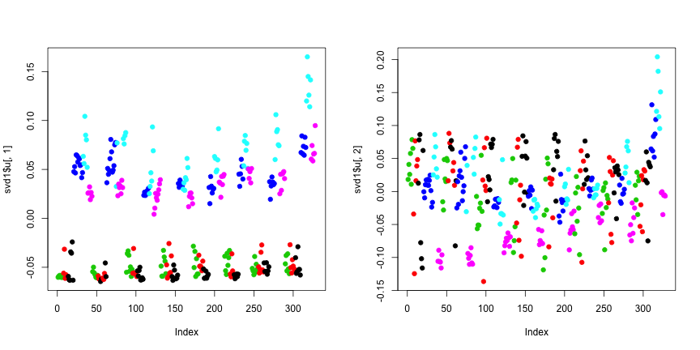
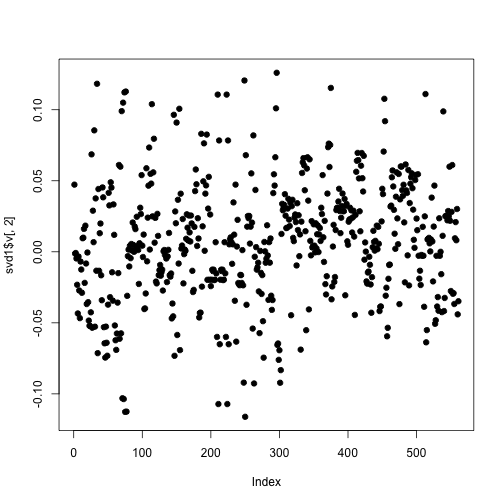
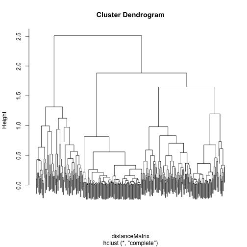
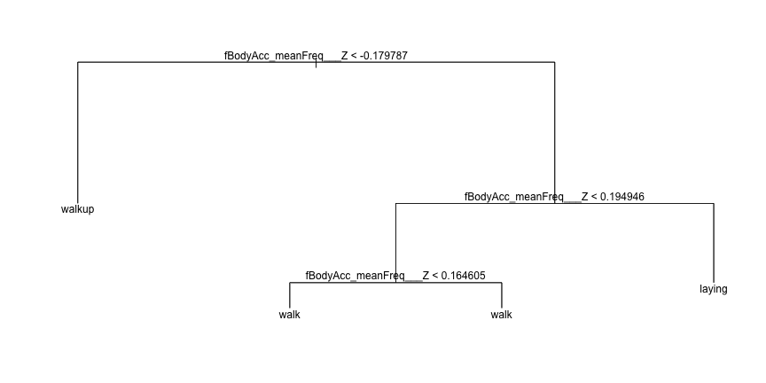
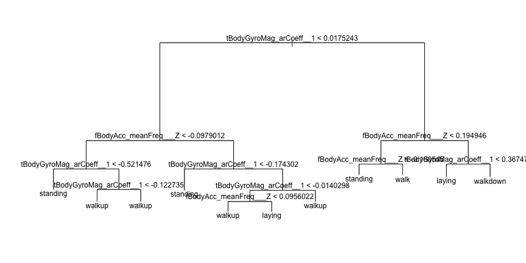
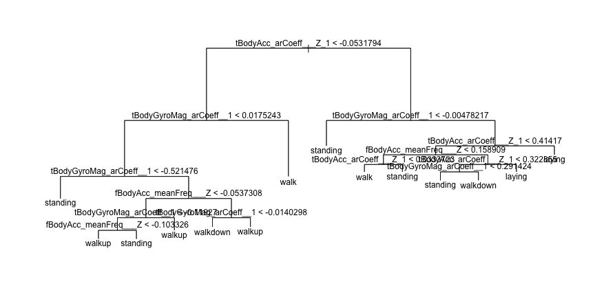
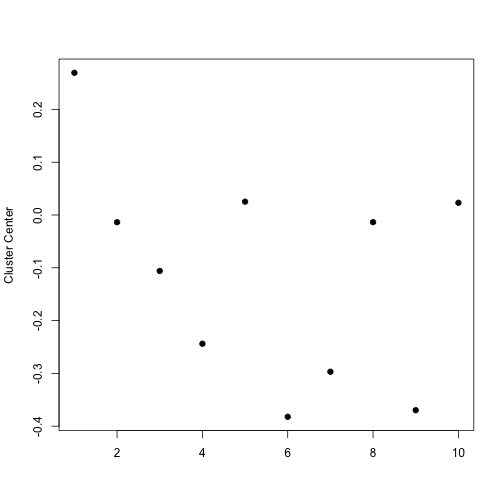
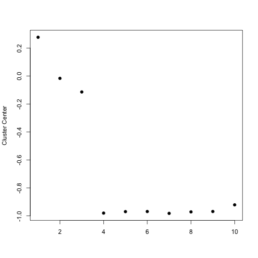

Samsung Analysis
========================================================

Load Library
--------------------------------------------------------


Processing
--------------------------------------------------------
Download the data & read the data in 


```r
setwd("/Users/Carlos/Dropbox/Courses/Data Analysis/Exercices/Data Analysis/Data Analysis 2/code/SamsungAnalysis/")
getwd()
```

```
## [1] "/Users/Carlos/Dropbox/Courses/Data Analysis/Exercices/Data Analysis/Data Analysis 2/code/SamsungAnalysis"
```

```r
if (!file.exists("../../data/samsungData.rda")) {
    download.file("https://spark-public.s3.amazonaws.com/dataanalysis/samsungData.rda", 
        destfile = "../../data/samsungData.rda", method = "curl")
    dateDownloaded <- date()
    dateDownloaded
}

load("../../data/samsungData.rda")
```

Munging Data
-------------------------------------------------------------


```r
library(stringr)
punct <- c("\\(", "\\)", "\\-", "\\,")
for (i in punct) {
    names(samsungData) <- str_replace_all(names(samsungData), i, "_")
}
samsungData$activity <- as.factor(samsungData$activity)
samsungData$activityNum <- as.numeric(samsungData$activity)
```

### Look at the data set

```r
# head(samsungData) summary(samsungData) sapply(samsungData[1, ], class)
table(samsungData$activity)
```

```
## 
##   laying  sitting standing     walk walkdown   walkup 
##     1407     1286     1374     1226      986     1073
```

```r
table(mapply(FUN = class, samsungData))
```

```
## 
##  factor integer numeric 
##       1       1     562
```


### Find out about missing values

```r
sum(is.na(samsungData))
```

```
## [1] 0
```


Prediction
---------------------------------------------------------------
### 1. Find the right data


### 2. Define your error rate 

### 3. Split data into

#### Training
For this analysis the training set must include the data from subjects 1, 3, 5, and 6

```r
trainingSet <- samsungData[samsungData$subject == c(1, 3, 5, 6), ]
```


#### Testing
The test set is the data from subjects 27, 28, 29, and 30

```r
testSet <- samsungData[samsungData$subject == c(27, 28, 29, 30), ]
```


#### Validation (optional)
For this prediction, we don't use validation set of data

### 4. On the training set pick features

#### Singular value decomposition:

```r
# numericActivity <- as.numeric(as.factor(trainingSet$activity)) Singular
# value decomposition
svd1 = svd(scale(trainingSet[, -c(562, 563, 564)]))
par(mfrow = c(1, 2))
plot(svd1$u[, 1], col = trainingSet$activityNum, pch = 19)
plot(svd1$u[, 2], col = trainingSet$activityNum, pch = 19)
```

 


Find maximum contributor:

```r
# Find maximum contributor
par(mfrow = c(1, 1))
plot(svd1$v[, 2], pch = 19)
```

 


New clustering with maximum contributer:

```r
source("http://dl.dropbox.com/u/7710864/courseraPublic/myplclust.R")
# New clustering with maximum contributer
maxContrib <- which.max(svd1$v[, 2])
distanceMatrix <- dist(trainingSet[, c(10:12, maxContrib)])
hclustering <- hclust(distanceMatrix)
myplclust(hclustering, lab.col = numericActivity)
```

```
## Error: objeto 'numericActivity' no encontrado
```

 

```r
names(trainingSet)[maxContrib]
```

```
## [1] "fBodyAcc_meanFreq___Z"
```

#### Pick features on the training set:
10 names of variables ordered by contribution to prediction


```r
features <- trainingSet[order(svd1$v[, 2], decreasing = TRUE)]
head(names(features), n = 20)
```

```
##  [1] "fBodyAcc_meanFreq___Z"       "tBodyGyroMag_arCoeff__1"    
##  [3] "tBodyAcc_arCoeff___Z_1"      "fBodyAccJerk_meanFreq___Z"  
##  [5] "tGravityAcc_arCoeff___Z_3"   "tGravityAcc_arCoeff___Z_1"  
##  [7] "fBodyAccMag_meanFreq__"      "tBodyAccMag_arCoeff__1"     
##  [9] "tGravityAccMag_arCoeff__1"   "fBodyGyro_meanFreq___Y"     
## [11] "tGravityAcc_arCoeff___Y_3"   "tBodyAccJerk_arCoeff___Z_1" 
## [13] "fBodyAcc_meanFreq___Y"       "tBodyGyro_arCoeff___Z_1"    
## [15] "tGravityAcc_arCoeff___Y_1"   "fBodyBodyGyroMag_meanFreq__"
## [17] "tBodyGyro_arCoeff___X_1"     "fBodyGyro_meanFreq___Z"     
## [19] "tBodyGyro_arCoeff___Y_1"     "tBodyAcc_arCoeff___Y_1"
```


#### Prediction Tree

Prediction Tree 1. 
* outcome: activity
* covariantes: 
  * fBodyAcc_meanFreq___Z

```r
library(tree)

tree1 <- tree(activity ~ fBodyAcc_meanFreq___Z, data = trainingSet)
summary(tree1)
```

```
## 
## Classification tree:
## tree(formula = activity ~ fBodyAcc_meanFreq___Z, data = trainingSet)
## Number of terminal nodes:  4 
## Residual mean deviance:  3.23 = 1050 / 324 
## Misclassification error rate: 0.674 = 221 / 328
```

```r
plot(tree1)
text(tree1)
```

 

```r

sum(testSet$activity == predict(tree1, testSet, type = "class"))/length(trainingSet)
```

```
## [1] 0.234
```


Prediction Tree. Formula= activity ~ fBodyAcc_meanFreq___Z + tBodyGyroMag_arCoeff__1


```r

tree1 <- tree(activity ~ fBodyAcc_meanFreq___Z + tBodyGyroMag_arCoeff__1, data = trainingSet)
summary(tree1)
```

```
## 
## Classification tree:
## tree(formula = activity ~ fBodyAcc_meanFreq___Z + tBodyGyroMag_arCoeff__1, 
##     data = trainingSet)
## Number of terminal nodes:  11 
## Residual mean deviance:  2.77 = 878 / 317 
## Misclassification error rate: 0.552 = 181 / 328
```

```r
plot(tree1)
text(tree1)
```

 

```r

sum(testSet$activity == predict(tree1, testSet, type = "class"))/length(trainingSet)
```

```
## [1] 0.1631
```


Prediction Tree. Formula= activity ~ fBodyAcc_meanFreq___Z + tBodyGyroMag_arCoeff__1 + tBodyAcc_arCoeff___Z_1


```r

tree1 <- tree(activity ~ fBodyAcc_meanFreq___Z + tBodyGyroMag_arCoeff__1 + tBodyAcc_arCoeff___Z_1, 
    data = trainingSet)
summary(tree1)
```

```
## 
## Classification tree:
## tree(formula = activity ~ fBodyAcc_meanFreq___Z + tBodyGyroMag_arCoeff__1 + 
##     tBodyAcc_arCoeff___Z_1, data = trainingSet)
## Number of terminal nodes:  14 
## Residual mean deviance:  2.36 = 742 / 314 
## Misclassification error rate: 0.503 = 165 / 328
```

```r
plot(tree1)
text(tree1)
```

 

```r

sum(testSet$activity == predict(tree1, testSet, type = "class"))/length(trainingSet)
```

```
## [1] 0.2323
```


### Poison Regression


```r
glm1 <- glm(activityNum ~ tBodyGyroMag_arCoeff__2, data = trainingSet)

sum(testSet$activityNum == predict(glm1, testSet))/length(trainingSet)
```

```
## [1] 0
```

```r


lm1 <- lm(as.numeric(activity) ~ tBodyGyroMag_arCoeff__2, data = trainingSet)

sum(testSet$activity == predict(lm1, testSet))/length(trainingSet)
```

```
## [1] 0
```

```r

```


#### K-means clustering

```r
kClust <- kmeans(trainingSet[, -c(562, 563)], centers = 6, nstart = 100)
table(kClust$cluster, trainingSet$activity)
```

```
##    
##     laying sitting standing walk walkdown walkup
##   1      0       0        0   55       17      0
##   2      5      13       17    0        0      0
##   3      0      37       40    0        0      0
##   4      0       0        0    9       31      5
##   5      0       0        0    0        1     48
##   6     50       0        0    0        0      0
```


Custer 1 Variable Centers(Laying)

```r
par(mfrow = c(1, 1))
plot(kClust$center[1, 1:10], pch = 19, ylab = "Cluster Center", xlab = "")
```

 


Custer 2 Variable Centers(Walkin)

```r
par(mfrow = c(1, 1))
plot(kClust$center[6, 1:10], pch = 19, ylab = "Cluster Center", xlab = "")
```

 


### 5. On the training set pick prediction function

### 6. On the training set cross-validate


### 7. If no validation - apply 1x to test set

### 8. If validation - apply to test set and refine 

### 9. If validation - apply 1x to validation
