Data Analysis - Week 6
========================================================

Prediction Study Design
--------------------------------------------------------
### Steps in building a prediction
1. Find the right data
2. Define your error rate 
3. Split data into:
  * Training
  * Testing
  * Validation (optional)
4. On the training set pick features
5. On the training set pick prediction function 
6. On the training set cross-validate
7. If no validation - apply 1x to test set
8. If validation - apply to test set and refine 
9. If validation - apply 1x to validation


Cross Validation
--------------------------------------------------------
### Overfitting

```r
set.seed(12345)
x <- rnorm(10)
y <- rnorm(10)
z <- rbinom(10, size = 1, prob = 0.5)
plot(x, y, pch = 19, col = (z + 3))
```

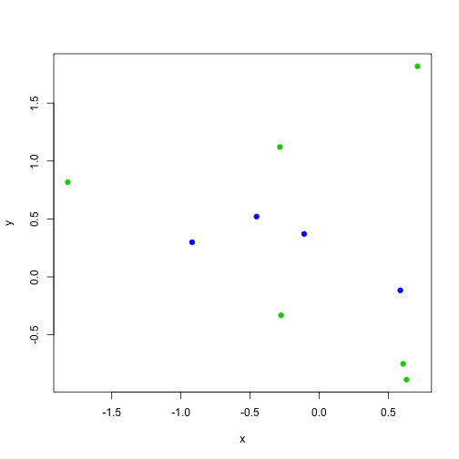 


### Classifier
Example predictor function: If -0.2 < y < 0.6 call blue, otherwise green


```r

par(mfrow = c(1, 2))
zhat <- (-0.2 < y) & (y < 0.6)
plot(x, y, pch = 19, col = (z + 3))
plot(x, y, pch = 19, col = (zhat + 3))
```

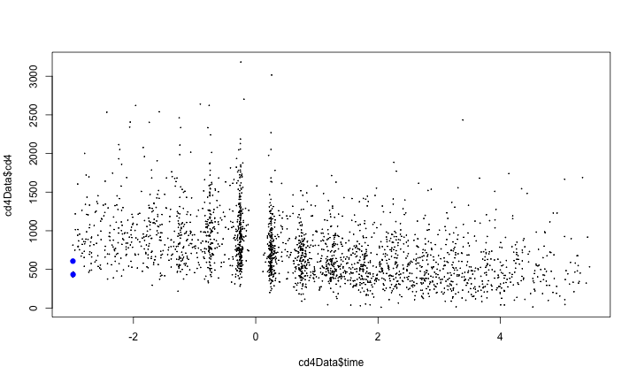 


### New Data
Example predictor function: If -0.2 < y < 0.6 call blue, otherwise green
It doesn't work with new data

```r
set.seed(1233)
xnew <- rnorm(10)
ynew <- rnorm(10)
znew <- rbinom(10, size = 1, prob = 0.5)
par(mfrow = c(1, 2))
zhatnew <- (-0.2 < ynew) & (ynew < 0.6)
plot(xnew, ynew, pch = 19, col = (z + 3))
plot(xnew, ynew, pch = 19, col = (zhatnew + 3))
```

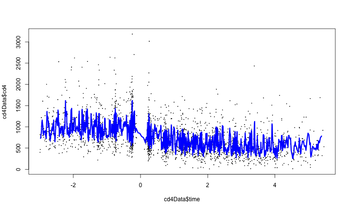 


### Subsampling example


```r
y1 <- y[1:5]
x1 <- x[1:5]
z1 <- z[1:5]
y2 <- y[6:10]
x2 <- x[6:10]
z2 <- z[6:10]
zhat2 <- (y2 < 1) & (y2 > -0.5)
par(mfrow = c(1, 3))
plot(x1, y1, col = (z1 + 3), pch = 19)
plot(x2, y2, col = (z2 + 3), pch = 19)
plot(x2, y2, col = (zhat2 + 3), pch = 19)
```

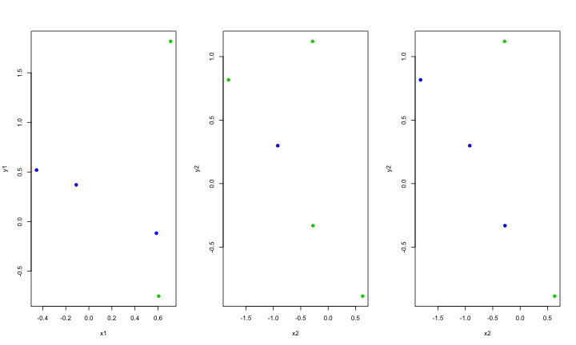 


Predicting with regression models
--------------------------------------------------------------

### Example: Old faithful eruptions

```r
data(faithful)
dim(faithful)
```

```
## [1] 272   2
```

```r
set.seed(333)
trainSamples <- sample(1:272, size = (272/2), replace = F)
trainFaith <- faithful[trainSamples, ]
testFaith <- faithful[-trainSamples, ]
head(trainFaith)
```

```
##     eruptions waiting
## 128     4.500      82
## 23      3.450      78
## 263     1.850      58
## 154     4.600      81
## 6       2.883      55
## 194     4.100      84
```


#### Eruption duration versus waiting time

```r
plot(trainFaith$waiting, trainFaith$eruptions, pch = 19, col = "blue", xlab = "Waiting", 
    ylab = "Duration")
```

 

#### Fit linear model
ED = b0 + b1 WT + e

```r
lm1 <- lm(eruptions ~ waiting, data = trainFaith)
summary(lm1)
```

```
## 
## Call:
## lm(formula = eruptions ~ waiting, data = trainFaith)
## 
## Residuals:
##     Min      1Q  Median      3Q     Max 
## -1.2969 -0.3543  0.0487  0.3310  1.0760 
## 
## Coefficients:
##             Estimate Std. Error t value Pr(>|t|)    
## (Intercept) -1.92491    0.22925    -8.4  5.8e-14 ***
## waiting      0.07639    0.00316    24.2  < 2e-16 ***
## ---
## Signif. codes:  0 '***' 0.001 '**' 0.01 '*' 0.05 '.' 0.1 ' ' 1 
## 
## Residual standard error: 0.494 on 134 degrees of freedom
## Multiple R-squared: 0.814,	Adjusted R-squared: 0.812 
## F-statistic:  585 on 1 and 134 DF,  p-value: <2e-16
```

#### Model Fit

```r
plot(trainFaith$waiting, trainFaith$eruptions, pch = 19, col = "blue", xlab = "Waiting", 
    ylab = "Duration")
lines(trainFaith$waiting, lm1$fitted, lwd = 3)
```

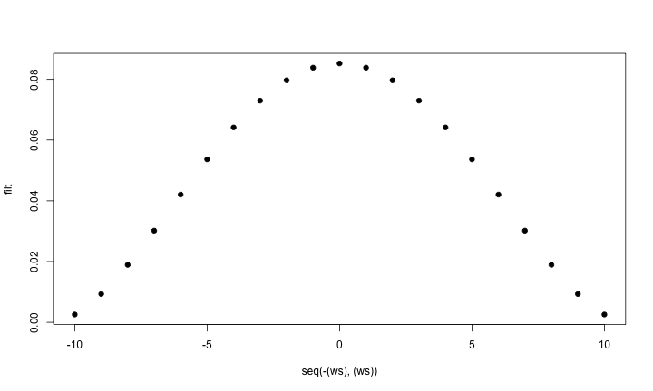 


#### Predict New Value


```r
coef(lm1)[1] + coef(lm1)[2] * 80
```

```
## (Intercept) 
##       4.186
```

```r

newdata <- data.frame(waiting = 80)
predict(lm1, newdata)
```

```
##     1 
## 4.186
```


#### Plot predictions - training and test


```r
par(mfrow = c(1, 2))
plot(trainFaith$waiting, trainFaith$eruptions, pch = 19, col = "blue", xlab = "Waiting", 
    ylab = "Duration")
lines(trainFaith$waiting, predict(lm1), lwd = 3)
plot(testFaith$waiting, testFaith$eruptions, pch = 19, col = "blue", xlab = "Waiting", 
    ylab = "Duration")
lines(testFaith$waiting, predict(lm1, newdata = testFaith), lwd = 3)
```

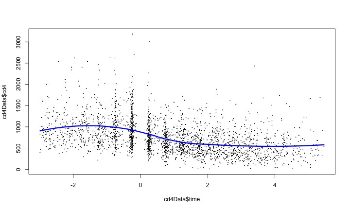 


### Get training set/test set errors

```r
# Calculate RMSE on training
sqrt(sum((lm1$fitted - trainFaith$eruptions)^2))
```

```
## [1] 5.713
```

```r

# Calculate RMSE on test
sqrt(sum((predict(lm1, newdata = testFaith) - testFaith$eruptions)^2))
```

```
## [1] 5.827
```


#### Prediction intervals

```r
pred1 <- predict(lm1, newdata = testFaith, interval = "prediction")
ord <- order(testFaith$waiting)
plot(testFaith$waiting, testFaith$eruptions, pch = 19, col = "blue")
matlines(testFaith$waiting[ord], pred1[ord, ], type = "l", , col = c(1, 2, 2), 
    lty = c(1, 1, 1), lwd = 3)
```

 


### Example with binary data: Baltimore Ravens

#### Ravens Data

```r
## download.file('https://dl.dropbox.com/u/7710864/data/ravensData.rda',
## destfile='./data/ravensData.rda',method='curl')
load("./data/ravensData.rda")
head(ravensData)
```

```
##   ravenWinNum ravenWin ravenScore opponentScore
## 1           1        W         24             9
## 2           1        W         38            35
## 3           1        W         28            13
## 4           1        W         34            31
## 5           1        W         44            13
## 6           0        L         23            24
```

#### Fit a logistic regresion
logit(E[RWi|RSi]) = b0 + b1RSi


```r
glm1 <- glm(ravenWinNum ~ ravenScore, family = "binomial", data = ravensData)
par(mfrow = c(1, 2))
boxplot(predict(glm1) ~ ravensData$ravenWinNum, col = "blue")
boxplot(predict(glm1, type = "response") ~ ravensData$ravenWinNum, col = "blue")
```

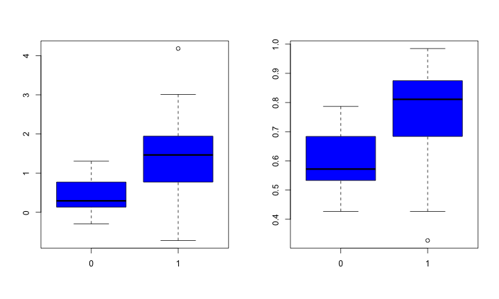 


#### Choosing a cutoff (re-substitution)

```r
par(mfrow = c(1, 1))
xx <- seq(0, 1, length = 10)
err <- rep(NA, 10)
for (i in 1:length(xx)) {
    err[i] <- sum((predict(glm1, type = "response") > xx[i]) != ravensData$ravenWinNum)
}
plot(xx, err, pch = 19, xlab = "Cutoff", ylab = "Error")
```

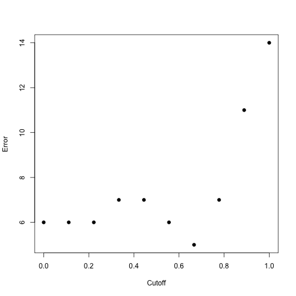 


#### Comparing models with cross validation

```r
library(boot)
cost <- function(win, pred = 0) mean(abs(win - pred) > 0.5)
glm1 <- glm(ravenWinNum ~ ravenScore, family = "binomial", data = ravensData)
glm2 <- glm(ravenWinNum ~ ravenScore, family = "gaussian", data = ravensData)
cv1 <- cv.glm(ravensData, glm1, cost, K = 3)
cv2 <- cv.glm(ravensData, glm2, cost, K = 3)
cv1$delta
```

```
## [1] 0.350 0.365
```

```r
cv2$delta
```

```
## [1] 0.40 0.42
```


Predicting with trees
---------------------------------------------------------------
### Key Ideas
* Iteratively split variables into groups
* Split where maximally predictive
* Evaluate "homogeneity" within each branch
* Fitting multiple trees often works better (forests)
Pros:
* Easy to implement
* Easy to interpret
* Better performance in nonlinear settings
Cons:
* Without pruning/cross-validation can lead to overfitting
* Harder to estimate uncertainty
* Results may be variable

### Basic algorithm
1. Start with all variables in one group
2. Find the variable/split that best separates the outcomes
3. Divide the data into two groups ("leaves") on that split ("node")
4. Within each split, find the best variable/split that separates the outcomes 
5. Continue until the groups are too small or sufficiently "pure"

### Example: Iris Data

```r
data(iris)
names(iris)
```

```
## [1] "Sepal.Length" "Sepal.Width"  "Petal.Length" "Petal.Width" 
## [5] "Species"
```

```r
table(iris$Species)
```

```
## 
##     setosa versicolor  virginica 
##         50         50         50
```


#### Iris petal widths/sepal width

```r
par(mfcol = c(1, 1))
plot(iris$Petal.Width, iris$Sepal.Width, pch = 19, col = as.numeric(iris$Species))
legend(1, 4.5, legend = unique(iris$Species), col = unique(as.numeric(iris$Species)), 
    pch = 19)
```

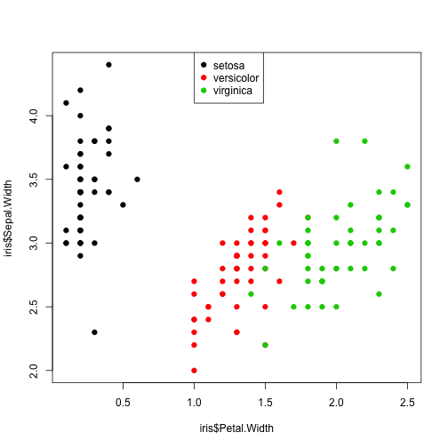 


#### Iris petal widths/sepal width

```r
# An alternative is library(rpart)
library(tree)
tree1 <- tree(Species ~ Sepal.Width + Petal.Width, data = iris)
summary(tree1)
```

```
## 
## Classification tree:
## tree(formula = Species ~ Sepal.Width + Petal.Width, data = iris)
## Number of terminal nodes:  5 
## Residual mean deviance:  0.204 = 29.6 / 145 
## Misclassification error rate: 0.0333 = 5 / 150
```


#### Plot tree

```r
plot(tree1)
text(tree1)
```

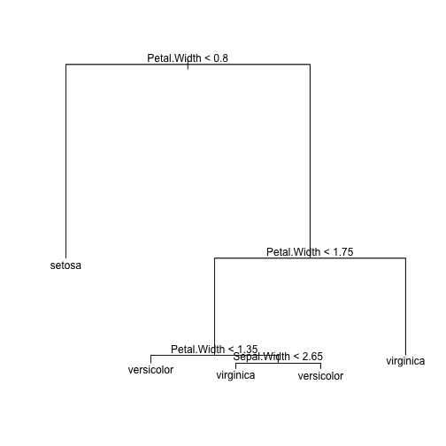 


#### Another way of looking at a CART model

```r
plot(iris$Petal.Width, iris$Sepal.Width, pch = 19, col = as.numeric(iris$Species))
partition.tree(tree1, label = "Species", add = TRUE)
legend(1.75, 4.5, legend = unique(iris$Species), col = unique(as.numeric(iris$Species)), 
    pch = 19)
```

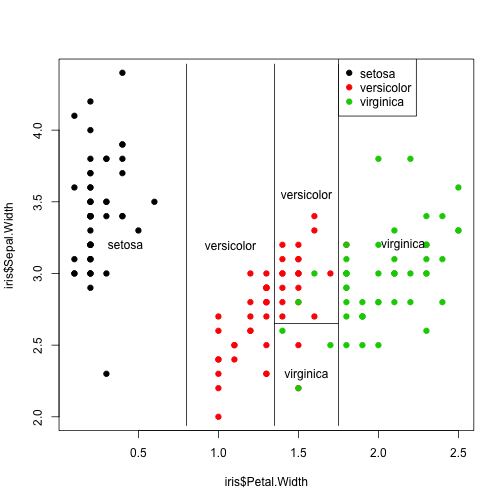 


#### Predicting new values

```r
set.seed(32313)
newdata <- data.frame(Petal.Width = runif(20, 0, 2.5), Sepal.Width = runif(20, 
    2, 4.5))
pred1 <- predict(tree1, newdata)
pred1
```

```
##    setosa versicolor virginica
## 1       0    0.02174   0.97826
## 2       0    0.02174   0.97826
## 3       1    0.00000   0.00000
## 4       0    1.00000   0.00000
## 5       0    0.02174   0.97826
## 6       0    0.02174   0.97826
## 7       0    0.02174   0.97826
## 8       0    0.90476   0.09524
## 9       0    1.00000   0.00000
## 10      0    0.02174   0.97826
## 11      0    1.00000   0.00000
## 12      1    0.00000   0.00000
## 13      1    0.00000   0.00000
## 14      1    0.00000   0.00000
## 15      0    0.02174   0.97826
## 16      0    0.02174   0.97826
## 17      0    1.00000   0.00000
## 18      1    0.00000   0.00000
## 19      0    1.00000   0.00000
## 20      0    1.00000   0.00000
```


#### Overlaying new values

```r
pred1 <- predict(tree1, newdata, type = "class")
plot(newdata$Petal.Width, newdata$Sepal.Width, col = as.numeric(pred1), pch = 19)
partition.tree(tree1, "Species", add = TRUE)
```

 


### Pruning trees example: Cars

```r
data(Cars93, package = "MASS")
head(Cars93)
```

```
##   Manufacturer   Model    Type Min.Price Price Max.Price MPG.city
## 1        Acura Integra   Small      12.9  15.9      18.8       25
## 2        Acura  Legend Midsize      29.2  33.9      38.7       18
## 3         Audi      90 Compact      25.9  29.1      32.3       20
## 4         Audi     100 Midsize      30.8  37.7      44.6       19
## 5          BMW    535i Midsize      23.7  30.0      36.2       22
## 6        Buick Century Midsize      14.2  15.7      17.3       22
##   MPG.highway            AirBags DriveTrain Cylinders EngineSize
## 1          31               None      Front         4        1.8
## 2          25 Driver & Passenger      Front         6        3.2
## 3          26        Driver only      Front         6        2.8
## 4          26 Driver & Passenger      Front         6        2.8
## 5          30        Driver only       Rear         4        3.5
## 6          31        Driver only      Front         4        2.2
##   Horsepower  RPM Rev.per.mile Man.trans.avail Fuel.tank.capacity
## 1        140 6300         2890             Yes               13.2
## 2        200 5500         2335             Yes               18.0
## 3        172 5500         2280             Yes               16.9
## 4        172 5500         2535             Yes               21.1
## 5        208 5700         2545             Yes               21.1
## 6        110 5200         2565              No               16.4
##   Passengers Length Wheelbase Width Turn.circle Rear.seat.room
## 1          5    177       102    68          37           26.5
## 2          5    195       115    71          38           30.0
## 3          5    180       102    67          37           28.0
## 4          6    193       106    70          37           31.0
## 5          4    186       109    69          39           27.0
## 6          6    189       105    69          41           28.0
##   Luggage.room Weight  Origin          Make
## 1           11   2705 non-USA Acura Integra
## 2           15   3560 non-USA  Acura Legend
## 3           14   3375 non-USA       Audi 90
## 4           17   3405 non-USA      Audi 100
## 5           13   3640 non-USA      BMW 535i
## 6           16   2880     USA Buick Century
```

#### Build a tree

```r
treeCars <- tree(DriveTrain ~ MPG.city + MPG.highway + AirBags + EngineSize + 
    Width + Length + Weight + Price + Cylinders + Horsepower + Wheelbase, data = Cars93)
plot(treeCars)
text(treeCars)
```

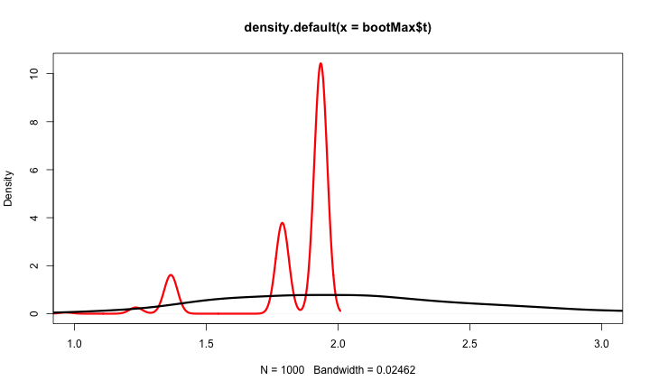 

#### Plot errors

```r
par(mfrow = c(1, 2))
plot(cv.tree(treeCars, FUN = prune.tree, method = "misclass"))
plot(cv.tree(treeCars))
```

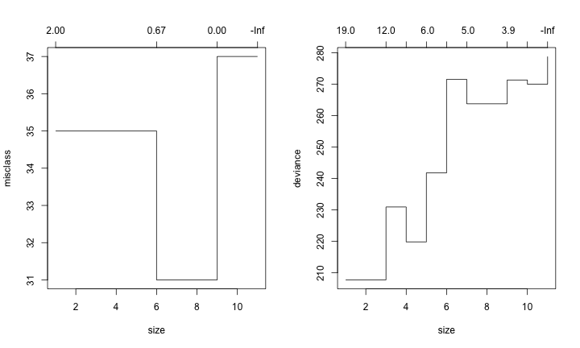 


#### Prune the tree

```r
par(mfrow = c(1, 1))
pruneTree <- prune.tree(treeCars, best = 4)
plot(pruneTree)
text(pruneTree)
```

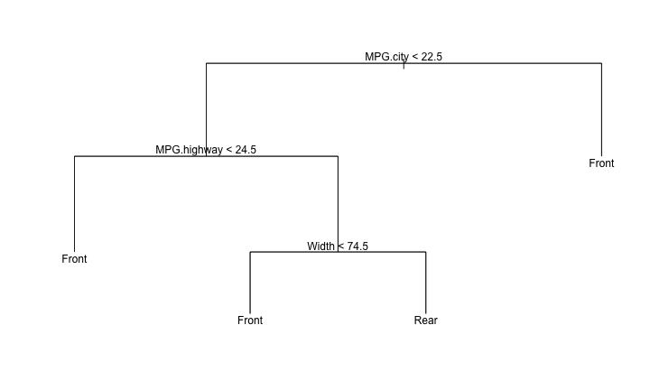 


#### Show resubstitution error ∗

```r
table(Cars93$DriveTrain, predict(pruneTree, type = "class"))
```

```
##        
##         4WD Front Rear
##   4WD     5     5    0
##   Front   1    66    0
##   Rear    1    10    5
```

```r
table(Cars93$DriveTrain, predict(treeCars, type = "class"))
```

```
##        
##         4WD Front Rear
##   4WD     5     5    0
##   Front   2    61    4
##   Rear    0     3   13
```

