Data Analysis - Week 7
========================================================

Smoothing
--------------------------------------------------------
### Key Ideas
1. Sometimes there are non-linear trends in data
2. We can use "smoothing" to try to capture these
3. Still a risk of overfitting
4. Often hard to interpretFind the right data


### CD4 Data

```r
setwd("~/Dropbox/Courses/Data Analysis/Exercices/Data Analysis")
#
# download.file('https://spark-public.s3.amazonaws.com/dataanalysis/cd4.data',
# destfile='./data/cd4.data',method='curl')
cd4Data <- read.table("./data/cd4.data", col.names = c("time", "cd4", "age", 
    "packs", "drugs", "sex", "cesd", "id"))
cd4Data <- cd4Data[order(cd4Data$time), ]
head(cd4Data)
```

```
##        time  cd4   age packs drugs sex cesd    id
## 1279 -2.990  814  6.17     3     1   5   -3 30183
## 2190 -2.990  400 -6.02     0     0   3   -4 41406
## 1167 -2.984  467 13.94     0     1   1    0 30046
## 1427 -2.957  749 -4.54     0     1  -1   -7 30498
## 2032 -2.951 1218  5.57     3     1   5    3 41032
## 1813 -2.949 1015 -9.15     2     1   0   -7 40375
```

```r
plot(cd4Data$time, cd4Data$cd4, pch = 19, cex = 0.1)
```

 


### Average first 2 points and third points

```r
plot(cd4Data$time, cd4Data$cd4, pch = 19, cex = 0.1)
points(mean(cd4Data$time[1:2]), mean(cd4Data$cd4[1:2]), col = "blue", pch = 19)
points(mean(cd4Data$time[2:3]), mean(cd4Data$cd4[2:3]), col = "blue", pch = 19)
```

 


### A moving average

```r
plot(cd4Data$time, cd4Data$cd4, pch = 19, cex = 0.1)
aveTime <- aveCd4 <- rep(NA, length(3:(dim(cd4Data)[1] - 2)))
for (i in 3:(dim(cd4Data)[1] - 2)) {
    aveTime[i] <- mean(cd4Data$time[(i - 2):(i + 2)])
    aveCd4[i] <- mean(cd4Data$cd4[(i - 2):(i + 2)])
}
lines(aveTime, aveCd4, col = "blue", lwd = 3)
```

 


### Average more points

```r
plot(cd4Data$time, cd4Data$cd4, pch = 19, cex = 0.1)
aveTime <- aveCd4 <- rep(NA, length(11:(dim(cd4Data)[1] - 10)))
for (i in 11:(dim(cd4Data)[1] - 2)) {
    aveTime[i] <- mean(cd4Data$time[(i - 10):(i + 10)])
    aveCd4[i] <- mean(cd4Data$cd4[(i - 10):(i + 10)])
}
lines(aveTime, aveCd4, col = "blue", lwd = 3)
```

 


### Average many more

```r
plot(cd4Data$time, cd4Data$cd4, pch = 19, cex = 0.1)
aveTime <- aveCd4 <- rep(NA, length(201:(dim(cd4Data)[1] - 200)))
for (i in 201:(dim(cd4Data)[1] - 2)) {
    aveTime[i] <- mean(cd4Data$time[(i - 200):(i + 200)])
    aveCd4[i] <- mean(cd4Data$cd4[(i - 200):(i + 200)])
}
lines(aveTime, aveCd4, col = "blue", lwd = 3)
```

 


### A faster way

```r
filtTime <- as.vector(filter(cd4Data$time, filter = rep(1, 200))/200)
filtCd4 <- as.vector(filter(cd4Data$cd4, filter = rep(1, 200))/200)
plot(cd4Data$time, cd4Data$cd4, pch = 19, cex = 0.1)
lines(filtTime, filtCd4, col = "blue", lwd = 3)
```

 


### Averging = weighted sums

```r
filtCd4 <- as.vector(filter(cd4Data$cd4, filter = rep(1, 4))/4)
filtCd4[2]
```

```
## [1] 607.5
```

```r
sum(cd4Data$cd4[1:4] * rep(1/4, 4))
```

```
## [1] 607.5
```


### Other weights -> should sum to one

```r
ws = 10
tukey = function(x) pmax(1 - x^2, 0)^2
filt = tukey(seq(-ws, ws)/(ws + 1))
filt = filt/sum(filt)
plot(seq(-(ws), (ws)), filt, pch = 19)
```

 


### Other weights -> should sum to one

```r
ws = 100
tukey = function(x) pmax(1 - x^2, 0)^2
filt = tukey(seq(-ws, ws)/(ws + 1))
filt = filt/sum(filt)
filtTime <- as.vector(filter(cd4Data$time, filter = filt))
filtCd4 <- as.vector(filter(cd4Data$cd4, filter = filt))
plot(cd4Data$time, cd4Data$cd4, pch = 19, cex = 0.1)
lines(filtTime, filtCd4, col = "blue", lwd = 3)
```

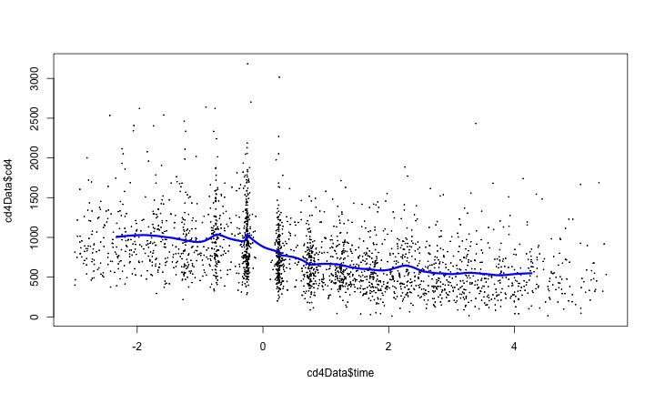 


### Lowess (loess)

```r
lw1 <- loess(cd4 ~ time, data = cd4Data)
plot(cd4Data$time, cd4Data$cd4, pch = 19, cex = 0.1)
lines(cd4Data$time, lw1$fitted, col = "blue", lwd = 3)
```

 


### Span

```r
plot(cd4Data$time, cd4Data$cd4, pch = 19, cex = 0.1, ylim = c(500, 1500))
lines(cd4Data$time, loess(cd4 ~ time, data = cd4Data, span = 0.1)$fitted, col = "blue", 
    lwd = 3)
lines(cd4Data$time, loess(cd4 ~ time, data = cd4Data, span = 0.25)$fitted, col = "red", 
    lwd = 3)
lines(cd4Data$time, loess(cd4 ~ time, data = cd4Data, span = 0.76)$fitted, col = "green", 
    lwd = 3)
```

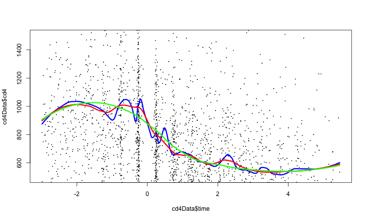 


### Predicting with loess

```r
tme <- seq(-2, 5, length = 100)
pred1 = predict(lw1, newdata = data.frame(time = tme), se = TRUE)
plot(tme, pred1$fit, col = "blue", lwd = 3, type = "l", ylim = c(0, 2500))
lines(tme, pred1$fit + 1.96 * pred1$se.fit, col = "red", lwd = 3)
lines(tme, pred1$fit - 1.96 * pred1$se.fit, col = "red", lwd = 3)
points(cd4Data$time, cd4Data$cd4, pch = 19, cex = 0.1)
```

 


### Splines 

```r
library(splines)
ns1 <- ns(cd4Data$time, df = 3)
par(mfrow = c(1, 3))
plot(cd4Data$time, ns1[, 1])
plot(cd4Data$time, ns1[, 2])
plot(cd4Data$time, ns1[, 3])
```

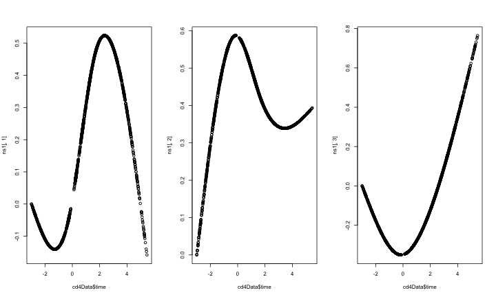 


### Regression with splines

```r
lm1 <- lm(cd4Data$cd4 ~ ns1)
summary(lm1)
```

```
## 
## Call:
## lm(formula = cd4Data$cd4 ~ ns1)
## 
## Residuals:
##    Min     1Q Median     3Q    Max 
## -780.0 -242.4  -61.3  169.5 2263.7 
## 
## Coefficients:
##             Estimate Std. Error t value Pr(>|t|)    
## (Intercept)    982.0       33.9   29.01  < 2e-16 ***
## ns11          -611.3       32.6  -18.78  < 2e-16 ***
## ns12          -373.7       79.4   -4.71  2.6e-06 ***
## ns13          -374.8       41.2   -9.09  < 2e-16 ***
## ---
## Signif. codes:  0 '***' 0.001 '**' 0.01 '*' 0.05 '.' 0.1 ' ' 1 
## 
## Residual standard error: 357 on 2372 degrees of freedom
## Multiple R-squared: 0.203,	Adjusted R-squared: 0.202 
## F-statistic:  202 on 3 and 2372 DF,  p-value: <2e-16
```


### Fitted values

```r
par(mfrow = c(1, 1))
plot(cd4Data$time, cd4Data$cd4, pch = 19, cex = 0.1)
points(cd4Data$time, lm1$fitted, col = "blue", pch = 19, cex = 0.5)
```

 


The bootstrap
---------------------------------------------------------------------

### Key Ideas
* Treat the sample as if it were the population 

What it is good for:
* Calculating standard errors
* Forming confidence intervals
* Performing hypothesis tests
* Improving predictors

### The bootstrap (Example)

```r
set.seed(333)
x <- rnorm(30)
bootMean <- rep(NA, 1000)
sampledMean <- rep(NA, 1000)
for (i in 1:1000) {
    bootMean[i] <- mean(sample(x, replace = TRUE))
}
for (i in 1:1000) {
    sampledMean[i] <- mean(rnorm(30))
}
plot(density(bootMean))
lines(density(sampledMean), col = "red")
```

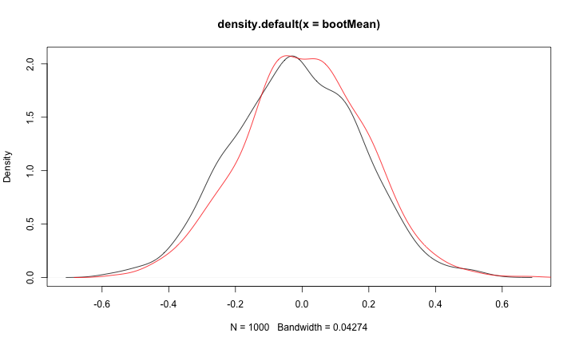 


### Example with boot package

```r
library("boot")
set.seed(333)
x <- rnorm(30)
sampledMean <- rep(NA, 1000)
for (i in 1:1000) {
    sampledMean[i] <- mean(rnorm(30))
}
meanFunc <- function(x, i) {
    mean(x[i])
}
bootMean <- boot(x, meanFunc, 1000)
bootMean
```

```
## 
## ORDINARY NONPARAMETRIC BOOTSTRAP
## 
## 
## Call:
## boot(data = x, statistic = meanFunc, R = 1000)
## 
## 
## Bootstrap Statistics :
##     original    bias    std. error
## t1* -0.01942 0.0006377       0.175
```

```r
plot(density(bootMean$t))
lines(density(sampledMean), col = "red")
```

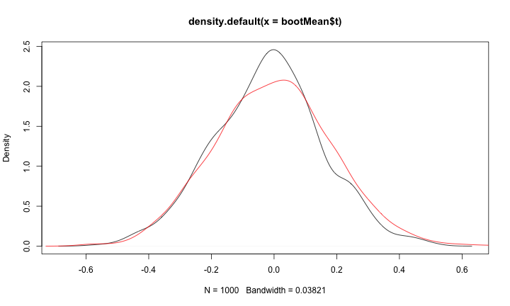 


### Nuclear Post

```r
library(boot)
data(nuclear)
nuke.lm <- lm(log(cost) ~ date, data = nuclear)
plot(nuclear$date, log(nuclear$cost), pch = 19)
abline(nuke.lm, col = "red", lwd = 3)
```

 


### Nuclear Post (subsamples)

```r
par(mfrow = c(1, 3))
for (i in 1:3) {
    nuclear0 <- nuclear[sample(1:dim(nuclear)[1], replace = TRUE), ]
    nuke.lm0 <- lm(log(cost) ~ date, data = nuclear0)
    plot(nuclear0$date, log(nuclear0$cost), pch = 19)
    abline(nuke.lm0, col = "red", lwd = 3)
}
```

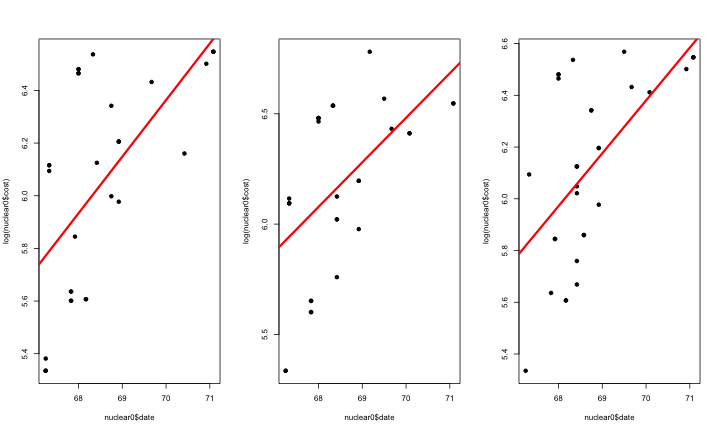 


### Bootstrap distribution

```r
bs <- function(data, indices, formula) {
    d <- data[indices, ]
    fit <- lm(formula, data = d)
    return(coef(fit))
}
results <- boot(data = nuclear, statistic = bs, R = 1000, formula = log(cost) ~ 
    date)
plot(density(results$t[, 2]), col = "red", lwd = 3)
lines(rep(nuke.lm$coeff[2], 10), seq(0, 8, length = 10), col = "blue", lwd = 3)
```

 


### Bootstrap confidence intervals

```r
boot.ci(results)
```

```
## BOOTSTRAP CONFIDENCE INTERVAL CALCULATIONS
## Based on 1000 bootstrap replicates
## 
## CALL : 
## boot.ci(boot.out = results)
## 
## Intervals : 
## Level      Normal              Basic             Studentized     
## 95%   (-16.481,  -3.130 )   (-15.746,  -2.553 )   (-17.153,  -3.842 )  
## 
## Level     Percentile            BCa          
## 95%   (-17.435,  -4.242 )   (-17.475,  -4.249 )  
## Calculations and Intervals on Original Scale
```


### Bootstrapping from a model

```r
par(mfrow = c(1, 1))
resid <- rstudent(nuke.lm)
fit0 <- fitted(lm(log(cost) ~ 1, data = nuclear))
newNuc <- cbind(nuclear, resid = resid, fit0 = fit0)
bs <- function(data, indices) {
    return(coef(glm(data$fit0 + data$resid[indices] ~ data$date, data = data)))
}
results <- boot(data = newNuc, statistic = bs, R = 1000)
plot(density(results$t[, 2]), lwd = 3, col = "blue")
lines(rep(coef(nuke.lm)[2], 10), seq(0, 3, length = 10), col = "red", lwd = 3)
```

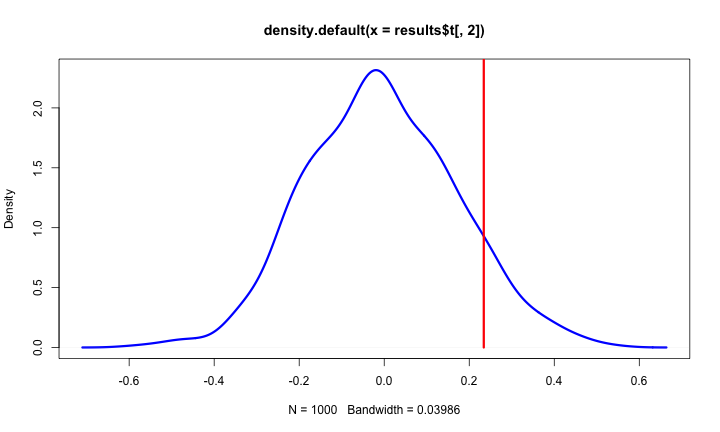 


### An  empirical p-value


```r
B <- dim(results$t)[1]
(1 + sum((abs(results$t[, 2]) > abs(coef(nuke.lm)[2]))))/(B + 1)
```

```
## [1] 0.1838
```


### Bootstrapping non-linear statistics


```r
set.seed(555)
x <- rnorm(30)
sampledMed <- rep(NA, 1000)
for (i in 1:1000) {
    sampledMed[i] <- median(rnorm(30))
}
medFunc <- function(x, i) {
    median(x[i])
}
bootMed <- boot(x, medFunc, 1000)
plot(density(bootMed$t), col = "red", lwd = 3)
lines(density(sampledMed), lwd = 3)
```

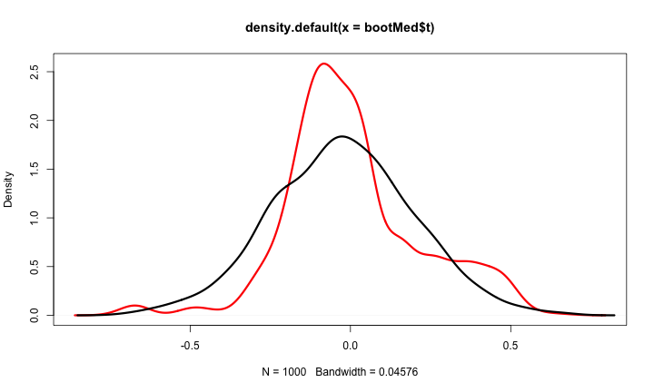 


### Things you can't bootstrap (max)


```r
set.seed(333)
x <- rnorm(30)
sampledMax <- rep(NA, 1000)
for (i in 1:1000) {
    sampledMax[i] <- max(rnorm(30))
}
maxFunc <- function(x, i) {
    max(x[i])
}
bootMax <- boot(x, maxFunc, 1000)
plot(density(bootMax$t), col = "red", lwd = 3, xlim = c(1, 3))
lines(density(sampledMax), lwd = 3)
```

 


Bootstrapping for prediction
---------------------------------------------------------------------
### Key ideas
Bootstrapping can be used for
* Cross-validation type error rates
* Prediction errors in regression models 
* Improving prediction


### Bootstrapping prediction errors


```r
library(boot)
data(nuclear)
nuke.lm <- lm(log(cost) ~ date, data = nuclear)
plot(nuclear$date, log(nuclear$cost), pch = 19)
abline(nuke.lm, col = "red", lwd = 3)
```

 


### Bootstrapping prediction errors


```r
newdata <- data.frame(date = seq(65, 72, length = 100))
nuclear <- cbind(nuclear, resid = rstudent(nuke.lm), fit = fitted(nuke.lm))
nuke.fun <- function(data, inds, newdata) {
    lm.b <- lm(fit + resid[inds] ~ date, data = data)
    pred.b <- predict(lm.b, newdata)
    return(pred.b)
}
nuke.boot <- boot(nuclear, nuke.fun, R = 1000, newdata = newdata)
head(nuke.boot$t)
```

```
##       [,1]  [,2]  [,3]  [,4]  [,5]  [,6]  [,7]  [,8]  [,9] [,10] [,11]
## [1,] 4.126 4.161 4.196 4.231 4.266 4.301 4.336 4.371 4.406 4.441 4.476
## [2,] 5.463 5.481 5.498 5.516 5.534 5.551 5.569 5.587 5.604 5.622 5.640
## [3,] 5.022 5.046 5.069 5.093 5.117 5.141 5.165 5.189 5.212 5.236 5.260
## [4,] 5.540 5.548 5.557 5.565 5.573 5.581 5.589 5.597 5.605 5.613 5.621
## [5,] 4.696 4.722 4.748 4.774 4.801 4.827 4.853 4.879 4.905 4.932 4.958
## [6,] 5.968 5.969 5.970 5.971 5.972 5.973 5.974 5.975 5.976 5.977 5.979
##      [,12] [,13] [,14] [,15] [,16] [,17] [,18] [,19] [,20] [,21] [,22]
## [1,] 4.511 4.546 4.581 4.616 4.651 4.686 4.721 4.756 4.791 4.826 4.861
## [2,] 5.658 5.675 5.693 5.711 5.728 5.746 5.764 5.781 5.799 5.817 5.835
## [3,] 5.284 5.308 5.332 5.355 5.379 5.403 5.427 5.451 5.474 5.498 5.522
## [4,] 5.629 5.637 5.645 5.653 5.661 5.669 5.677 5.685 5.693 5.701 5.709
## [5,] 4.984 5.010 5.036 5.062 5.089 5.115 5.141 5.167 5.193 5.220 5.246
## [6,] 5.980 5.981 5.982 5.983 5.984 5.985 5.986 5.987 5.989 5.990 5.991
##      [,23] [,24] [,25] [,26] [,27] [,28] [,29] [,30] [,31] [,32] [,33]
## [1,] 4.896 4.931 4.966 5.001 5.036 5.071 5.106 5.141 5.176 5.211 5.246
## [2,] 5.852 5.870 5.888 5.905 5.923 5.941 5.958 5.976 5.994 6.012 6.029
## [3,] 5.546 5.570 5.594 5.617 5.641 5.665 5.689 5.713 5.737 5.760 5.784
## [4,] 5.717 5.725 5.733 5.741 5.749 5.757 5.765 5.773 5.781 5.789 5.797
## [5,] 5.272 5.298 5.324 5.350 5.377 5.403 5.429 5.455 5.481 5.508 5.534
## [6,] 5.992 5.993 5.994 5.995 5.996 5.997 5.998 6.000 6.001 6.002 6.003
##      [,34] [,35] [,36] [,37] [,38] [,39] [,40] [,41] [,42] [,43] [,44]
## [1,] 5.281 5.316 5.351 5.386 5.421 5.456 5.491 5.526 5.561 5.596 5.631
## [2,] 6.047 6.065 6.082 6.100 6.118 6.135 6.153 6.171 6.189 6.206 6.224
## [3,] 5.808 5.832 5.856 5.880 5.903 5.927 5.951 5.975 5.999 6.023 6.046
## [4,] 5.805 5.813 5.821 5.829 5.837 5.845 5.853 5.862 5.870 5.878 5.886
## [5,] 5.560 5.586 5.612 5.638 5.665 5.691 5.717 5.743 5.769 5.796 5.822
## [6,] 6.004 6.005 6.006 6.007 6.008 6.010 6.011 6.012 6.013 6.014 6.015
##      [,45] [,46] [,47] [,48] [,49] [,50] [,51] [,52] [,53] [,54] [,55]
## [1,] 5.666 5.701 5.736 5.771 5.806 5.841 5.876 5.911 5.946 5.981 6.016
## [2,] 6.242 6.259 6.277 6.295 6.312 6.330 6.348 6.366 6.383 6.401 6.419
## [3,] 6.070 6.094 6.118 6.142 6.166 6.189 6.213 6.237 6.261 6.285 6.308
## [4,] 5.894 5.902 5.910 5.918 5.926 5.934 5.942 5.950 5.958 5.966 5.974
## [5,] 5.848 5.874 5.900 5.926 5.953 5.979 6.005 6.031 6.057 6.084 6.110
## [6,] 6.016 6.017 6.018 6.019 6.021 6.022 6.023 6.024 6.025 6.026 6.027
##      [,56] [,57] [,58] [,59] [,60] [,61] [,62] [,63] [,64] [,65] [,66]
## [1,] 6.051 6.086 6.121 6.156 6.192 6.227 6.262 6.297 6.332 6.367 6.402
## [2,] 6.436 6.454 6.472 6.489 6.507 6.525 6.543 6.560 6.578 6.596 6.613
## [3,] 6.332 6.356 6.380 6.404 6.428 6.451 6.475 6.499 6.523 6.547 6.571
## [4,] 5.982 5.990 5.998 6.006 6.014 6.022 6.030 6.038 6.046 6.054 6.062
## [5,] 6.136 6.162 6.188 6.214 6.241 6.267 6.293 6.319 6.345 6.372 6.398
## [6,] 6.028 6.029 6.030 6.032 6.033 6.034 6.035 6.036 6.037 6.038 6.039
##      [,67] [,68] [,69] [,70] [,71] [,72] [,73] [,74] [,75] [,76] [,77]
## [1,] 6.437 6.472 6.507 6.542 6.577 6.612 6.647 6.682 6.717 6.752 6.787
## [2,] 6.631 6.649 6.666 6.684 6.702 6.720 6.737 6.755 6.773 6.790 6.808
## [3,] 6.594 6.618 6.642 6.666 6.690 6.714 6.737 6.761 6.785 6.809 6.833
## [4,] 6.070 6.078 6.086 6.094 6.102 6.110 6.118 6.126 6.134 6.142 6.150
## [5,] 6.424 6.450 6.476 6.503 6.529 6.555 6.581 6.607 6.633 6.660 6.686
## [6,] 6.040 6.042 6.043 6.044 6.045 6.046 6.047 6.048 6.049 6.050 6.051
##      [,78] [,79] [,80] [,81] [,82] [,83] [,84] [,85] [,86] [,87] [,88]
## [1,] 6.822 6.857 6.892 6.927 6.962 6.997 7.032 7.067 7.102 7.137 7.172
## [2,] 6.826 6.843 6.861 6.879 6.897 6.914 6.932 6.950 6.967 6.985 7.003
## [3,] 6.857 6.880 6.904 6.928 6.952 6.976 7.000 7.023 7.047 7.071 7.095
## [4,] 6.158 6.167 6.175 6.183 6.191 6.199 6.207 6.215 6.223 6.231 6.239
## [5,] 6.712 6.738 6.764 6.791 6.817 6.843 6.869 6.895 6.921 6.948 6.974
## [6,] 6.053 6.054 6.055 6.056 6.057 6.058 6.059 6.060 6.061 6.063 6.064
##      [,89] [,90] [,91] [,92] [,93] [,94] [,95] [,96] [,97] [,98] [,99]
## [1,] 7.207 7.242 7.277 7.312 7.347 7.382 7.417 7.452 7.487 7.522 7.557
## [2,] 7.020 7.038 7.056 7.074 7.091 7.109 7.127 7.144 7.162 7.180 7.197
## [3,] 7.119 7.142 7.166 7.190 7.214 7.238 7.262 7.285 7.309 7.333 7.357
## [4,] 6.247 6.255 6.263 6.271 6.279 6.287 6.295 6.303 6.311 6.319 6.327
## [5,] 7.000 7.026 7.052 7.079 7.105 7.131 7.157 7.183 7.209 7.236 7.262
## [6,] 6.065 6.066 6.067 6.068 6.069 6.070 6.071 6.072 6.074 6.075 6.076
##      [,100]
## [1,]  7.592
## [2,]  7.215
## [3,]  7.381
## [4,]  6.335
## [5,]  7.288
## [6,]  6.077
```

```r

pred <- predict(nuke.lm, newdata)
predSds <- apply(nuke.boot$t, 2, sd)
plot(newdata$date, pred, col = "black", type = "l", lwd = 3, ylim = c(0, 10))
lines(newdata$date, pred + 1.96 * predSds, col = "red", lwd = 3)
lines(newdata$date, pred - 1.96 * predSds, col = "red", lwd = 3)
```

 


### Bootstrapping aggregating (bagging)
* Basic idea:
  1. Resample cases and recalculate predictions
  2. Average or majority vote 

* Notes:
  * Similar bias
  * Reduced variance
  * More useful for non-linear functions

### Bagged loess

```r
library(ElemStatLearn)
data(ozone, package = "ElemStatLearn")
ozone <- ozone[order(ozone$ozone), ]
head(ozone)
```

```
##     ozone radiation temperature wind
## 17      1         8          59  9.7
## 19      4        25          61  9.7
## 14      6        78          57 18.4
## 45      7        48          80 14.3
## 106     7        49          69 10.3
## 7       8        19          61 20.1
```

```r
ll <- matrix(NA, nrow = 10, ncol = 155)
for (i in 1:10) {
    ss <- sample(1:dim(ozone)[1], replace = T)
    ozone0 <- ozone[ss, ]
    ozone0 <- ozone0[order(ozone0$ozone), ]
    loess0 <- loess(temperature ~ ozone, data = ozone0, span = 0.2)
    ll[i, ] <- predict(loess0, newdata = data.frame(ozone = 1:155))
}
```

```
## Warning: pseudoinverse used at 14
```

```
## Warning: neighborhood radius 2
```

```
## Warning: reciprocal condition number 3.6626e-17
```

```r

plot(ozone$ozone, ozone$temperature, pch = 19, cex = 0.5)
for (i in 1:10) {
    lines(1:155, ll[i, ], col = "grey", lwd = 2)
}
lines(1:155, apply(ll, 2, mean), col = "red", lwd = 2)
```

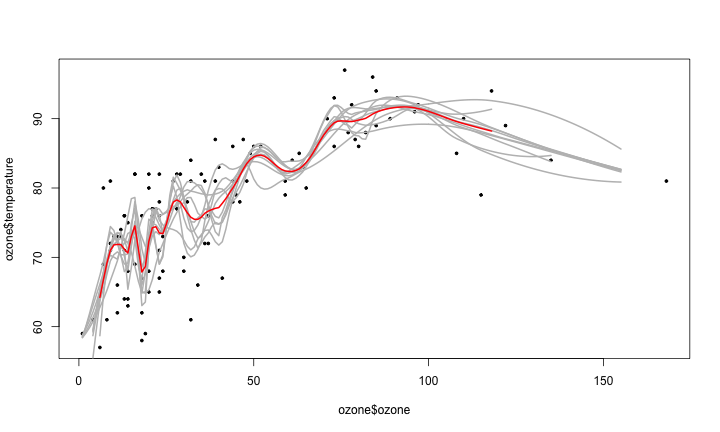 


### Bagged trees
Basic idea:
  1. Resample data
  2. Recalculate tree
  3. Average/mode) of predictors
  
Notes:
  1. More stable
  2. May not be as good as random forests

### Bagging a Tree

```r
data(iris)
head(iris)
```

```
##   Sepal.Length Sepal.Width Petal.Length Petal.Width Species
## 1          5.1         3.5          1.4         0.2  setosa
## 2          4.9         3.0          1.4         0.2  setosa
## 3          4.7         3.2          1.3         0.2  setosa
## 4          4.6         3.1          1.5         0.2  setosa
## 5          5.0         3.6          1.4         0.2  setosa
## 6          5.4         3.9          1.7         0.4  setosa
```

```r
library(ipred)
```

```
## Loading required package: rpart
```

```
## Loading required package: MASS
```

```
## Loading required package: survival
```

```
## Attaching package: 'survival'
```

```
## The following object(s) are masked from 'package:boot':
## 
## aml
```

```
## Loading required package: nnet
```

```
## Loading required package: class
```

```
## Loading required package: prodlim
```

```
## KernSmooth 2.23 loaded Copyright M. P. Wand 1997-2009
```

```r
bagTree <- bagging(Species ~ ., data = iris, coob = TRUE)
print(bagTree)
```

```
## 
## Bagging classification trees with 25 bootstrap replications 
## 
## Call: bagging.data.frame(formula = Species ~ ., data = iris, coob = TRUE)
## 
## Out-of-bag estimate of misclassification error:  0.0533
```


### Looking at bagged tree one


```r
bagTree$mtrees[[1]]$btree
```

```
## n= 150 
## 
## node), split, n, loss, yval, (yprob)
##       * denotes terminal node
## 
##   1) root 150 91 setosa (0.39333 0.32000 0.28667)  
##     2) Petal.Length< 2.35 59  0 setosa (1.00000 0.00000 0.00000) *
##     3) Petal.Length>=2.35 91 43 versicolor (0.00000 0.52747 0.47253)  
##       6) Petal.Width< 1.65 48  2 versicolor (0.00000 0.95833 0.04167)  
##        12) Sepal.Length< 7.1 47  1 versicolor (0.00000 0.97872 0.02128)  
##          24) Sepal.Width>=2.25 45  0 versicolor (0.00000 1.00000 0.00000) *
##          25) Sepal.Width< 2.25 2  1 versicolor (0.00000 0.50000 0.50000)  
##            50) Petal.Length< 4.5 1  0 versicolor (0.00000 1.00000 0.00000) *
##            51) Petal.Length>=4.5 1  0 virginica (0.00000 0.00000 1.00000) *
##        13) Sepal.Length>=7.1 1  0 virginica (0.00000 0.00000 1.00000) *
##       7) Petal.Width>=1.65 43  2 virginica (0.00000 0.04651 0.95349)  
##        14) Petal.Length< 5.05 9  2 virginica (0.00000 0.22222 0.77778)  
##          28) Sepal.Width>=2.85 3  1 versicolor (0.00000 0.66667 0.33333)  
##            56) Sepal.Length< 6 1  0 versicolor (0.00000 1.00000 0.00000) *
##            57) Sepal.Length>=6 2  1 versicolor (0.00000 0.50000 0.50000)  
##             114) Sepal.Length>=6.4 1  0 versicolor (0.00000 1.00000 0.00000) *
##             115) Sepal.Length< 6.4 1  0 virginica (0.00000 0.00000 1.00000) *
##          29) Sepal.Width< 2.85 6  0 virginica (0.00000 0.00000 1.00000) *
##        15) Petal.Length>=5.05 34  0 virginica (0.00000 0.00000 1.00000) *
```


### Looking at bagged tree two


```r
bagTree$mtrees[[2]]$btree
```

```
## n= 150 
## 
## node), split, n, loss, yval, (yprob)
##       * denotes terminal node
## 
##  1) root 150 95 setosa (0.36667 0.31333 0.32000)  
##    2) Petal.Length< 2.5 55  0 setosa (1.00000 0.00000 0.00000) *
##    3) Petal.Length>=2.5 95 47 virginica (0.00000 0.49474 0.50526)  
##      6) Petal.Width< 1.75 49  2 versicolor (0.00000 0.95918 0.04082)  
##       12) Petal.Length< 4.95 44  0 versicolor (0.00000 1.00000 0.00000) *
##       13) Petal.Length>=4.95 5  2 versicolor (0.00000 0.60000 0.40000)  
##         26) Petal.Width>=1.55 3  0 versicolor (0.00000 1.00000 0.00000) *
##         27) Petal.Width< 1.55 2  0 virginica (0.00000 0.00000 1.00000) *
##      7) Petal.Width>=1.75 46  0 virginica (0.00000 0.00000 1.00000) *
```


### Random forests

1. Bootstrap samples
2. At each split, bootstrap variables 
3. Grow multiple trees and vote

Pros:
  1. Accuracy

Cons:
  1. Speed
  2. Interpretability 3. Overfitting


```r
library(randomForest)
```

```
## randomForest 4.6-7
```

```
## Type rfNews() to see new features/changes/bug fixes.
```

```r
forestIris <- randomForest(Species ~ Petal.Width + Petal.Length, data = iris, 
    prox = TRUE)
forestIris
```

```
## 
## Call:
##  randomForest(formula = Species ~ Petal.Width + Petal.Length,      data = iris, prox = TRUE) 
##                Type of random forest: classification
##                      Number of trees: 500
## No. of variables tried at each split: 1
## 
##         OOB estimate of  error rate: 3.33%
## Confusion matrix:
##            setosa versicolor virginica class.error
## setosa         50          0         0        0.00
## versicolor      0         47         3        0.06
## virginica       0          2        48        0.04
```

```r
getTree(forestIris, k = 2)
```

```
##    left daughter right daughter split var split point status prediction
## 1              2              3         1        0.80      1          0
## 2              0              0         0        0.00     -1          1
## 3              4              5         1        1.70      1          0
## 4              6              7         1        1.35      1          0
## 5              8              9         1        1.85      1          0
## 6              0              0         0        0.00     -1          2
## 7             10             11         2        4.95      1          0
## 8             12             13         2        4.85      1          0
## 9              0              0         0        0.00     -1          3
## 10             0              0         0        0.00     -1          2
## 11            14             15         2        5.35      1          0
## 12             0              0         0        0.00     -1          2
## 13             0              0         0        0.00     -1          3
## 14            16             17         1        1.55      1          0
## 15             0              0         0        0.00     -1          3
## 16             0              0         0        0.00     -1          3
## 17             0              0         0        0.00     -1          2
```

```r

```


### Class Centers


```r
iris.p <- classCenter(iris[, c(3, 4)], iris$Species, forestIris$prox)
plot(iris[, 3], iris[, 4], pch = 21, xlab = names(iris)[3], ylab = names(iris)[4], 
    bg = c("red", "blue", "green")[as.numeric(factor(iris$Species))], main = "Iris Data with Prototypes")
points(iris.p[, 1], iris.p[, 2], pch = 21, cex = 2, bg = c("red", "blue", "green"))
```

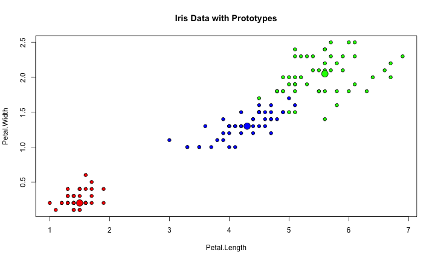 


### Combining random forests


```r
forestIris1 <- randomForest(Species ~ Petal.Width + Petal.Length, data = iris, 
    prox = TRUE, ntree = 50)
forestIris2 <- randomForest(Species ~ Petal.Width + Petal.Length, data = iris, 
    prox = TRUE, ntree = 50)
forestIris3 <- randomForest(Species ~ Petal.Width + Petal.Length, data = iris, 
    prox = TRUE, nrtee = 50)
combine(forestIris1, forestIris2, forestIris3)
```

```
## 
## Call:
##  randomForest(formula = Species ~ Petal.Width + Petal.Length,      data = iris, prox = TRUE, ntree = 50) 
##                Type of random forest: classification
##                      Number of trees: 600
## No. of variables tried at each split: 1
```


### Predicting new values


```r
newdata <- data.frame(Sepal.Length <- rnorm(1000, mean(iris$Sepal.Length), sd(iris$Sepal.Length)), 
    Sepal.Width <- rnorm(1000, mean(iris$Sepal.Width), sd(iris$Sepal.Width)), 
    Petal.Width <- rnorm(1000, mean(iris$Petal.Width), sd(iris$Petal.Width)), 
    Petal.Length <- rnorm(1000, mean(iris$Petal.Length), sd(iris$Petal.Length)))
pred <- predict(forestIris, newdata)

plot(newdata[, 4], newdata[, 3], pch = 21, xlab = "Petal.Length", ylab = "Petal.Width", 
    bg = c("red", "blue", "green")[as.numeric(pred)], main = "newdata Predictions")
```

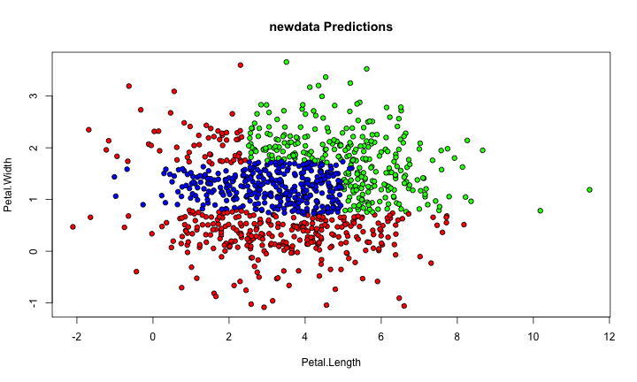 


Combining predictors
---------------------------------------------------------------------
Key ideas
* You can combine classifiers by averaging/voting
* Combining classifiers improves accuracy
* Combining classifiers reduces interpretability

### Basic Model


```r
# install.packages('devtools')
library(devtools)
# install_github('medley','mewo2')
library(medley)
set.seed(453234)
y <- rnorm(1000)
x1 <- (y > 0)
x2 <- y * rnorm(1000)
x3 <- rnorm(1000, mean = y, sd = 1)
x4 <- (y > 0) & (y < 3)
x5 <- rbinom(1000, size = 4, prob = exp(y)/(1 + exp(y)))
x6 <- (y < -2) | (y > 2)
data <- data.frame(y = y, x1 = x1, x2 = x2, x3 = x3, x4 = x4, x5 = x5, x6 = x6)
train <- sample(1:1000, size = 500)
trainData <- data[train, ]
testData <- data[-train, ]

# Basic Model
library(tree)
lm1 <- lm(y ~ ., data = trainData)
rmse(predict(lm1, data = testData), testData$y)
```

```
## [1] 1.294
```

```r

tree1 <- tree(y ~ ., data = trainData)
rmse(predict(tree1, data = testData), testData$y)
```

```
## [1] 1.299
```

```r

tree2 <- tree(y ~ ., data = trainData[sample(1:dim(trainData)[1]), ])
```


### Combining models


```r
combine1 <- predict(lm1, data = testData)/2 + predict(tree1, data = testData)/2
rmse(combine1, testData$y)
```

```
## [1] 1.281
```

```r

combine2 <- (predict(lm1, data = testData)/3 + predict(tree1, data = testData)/3 + 
    predict(tree2, data = testData)/3)
rmse(combine2, testData$y)
```

```
## [1] 1.175
```


### Medley package


```r
# library(devtools) install_github('medley','mewo2')
library(medley)
library(e1071)
library(randomForest)
x <- trainData[, -1]
y <- trainData$y
newx <- testData[, -1]
```


### Blending Models


```r
m <- create.medley(x, y, errfunc = rmse)
for (g in 1:10) {
    m <- add.medley(m, svm, list(gamma = 0.001 * g))
}
```

```
##  CV model 1 svm (gamma = 0.001) time: 0.412 error: 0.5557 
##  CV model 2 svm (gamma = 0.002) time: 0.406 error: 0.5367 
##  CV model 3 svm (gamma = 0.003) time: 0.398 error: 0.5345 
##  CV model 4 svm (gamma = 0.004) time: 0.474 error: 0.5333 
##  CV model 5 svm (gamma = 0.005) time: 0.399 error: 0.5301 
##  CV model 6 svm (gamma = 0.006) time: 0.405 error: 0.5265 
##  CV model 7 svm (gamma = 0.007) time: 0.477 error: 0.5197 
##  CV model 8 svm (gamma = 0.008) time: 0.471 error: 0.5115 
##  CV model 9 svm (gamma = 0.009) time: 0.408 error: 0.5026 
##  CV model 10 svm (gamma = 0.01) time: 0.48 error: 0.4946
```

```r

for (mt in 1:2) {
    m <- add.medley(m, randomForest, list(mtry = mt))
}
```

```
##  CV model 11 randomForest (mtry = 1) time: 3.034 error: 0.4662 
##  CV model 12 randomForest (mtry = 2) time: 4.044 error: 0.4142
```

```r

m <- prune.medley(m, 0.8)
rmse(predict(m, newx), testData$y)
```

```
## Sampled... 96.00 %:  1 randomForest (mtry = 2) 
## 1.00 %:  2 randomForest (mtry = 1) 
## 1.00 %:  4 svm (gamma = 0.009) 
## 1.00 %:  5 svm (gamma = 0.008) 
## 1.00 %:  7 svm (gamma = 0.006) 
## CV error: 0.4159
```

```
## [1] 0.4118
```


