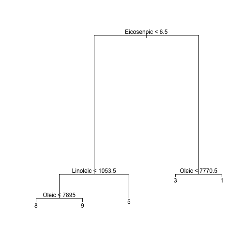

Weekly Quiz 6
========================================================

### Question 3

Load the South Africa Heart Disease Data and create training and test sets with the following code:

```
library(ElemStatLearn)
data(SAheart)
set.seed(8484)
train = sample(1:dim(SAheart)[1],size=dim(SAheart)[1]/2,replace=F)
trainSA = SAheart[train,]
testSA = SAheart[-train,]
```
 
Then fit a logistic regression model with Coronary Heart Disease (chd) as the outcome and age at onset, current alcohol consumption, obesity levels, cumulative tabacco, type-A behavior, and low density lipoprotein cholesterol as predictors. Calculate the misclassification rate for your model using this function and a prediction on the "response" scale:

```
missClass = function(values,prediction){sum(((prediction > 0.5)*1) != values)/length(values)}
```

What is the misclassification rate on the training set? What is the misclassification rate on the test set?

1. Training set misclassification: 1    
  Test set misclassification:0.3117

2. Training set misclassification: 0.3117    
  Test set misclassification: 0.2727

3. Training set misclassification: 0.2597    
  Test set misclassification: 0.2944

4. Training set misclassification: 0.2727   ✔ 
  Test set misclassification: 0.3117        ✔


✘✔


```r
library(ElemStatLearn)
library(boot)
data(SAheart)
set.seed(8484)
train = sample(1:dim(SAheart)[1], size = dim(SAheart)[1]/2, replace = F)
trainSA = SAheart[train, ]
testSA = SAheart[-train, ]
attach(trainSA)
glm1 <- glm(chd ~ age + alcohol + obesity + tobacco + typea + ldl, family = "binomial", 
    data = trainSA)
detach(trainSA)
missClass = function(values, prediction) {
    sum(((prediction > 0.5) * 1) != values)/length(values)
}
```

Training set misclassification: 


```r
missClass(trainSA$chd, predict(glm1, type = "response"))
```

```
## [1] 0.2727
```

       
Test set misclassification:

```r
missClass(testSA$chd, predict(glm1, newdata = testSA, type = "response"))
```

```
## [1] 0.3117
```


### Question 4
Load the olive oil data using the commands:
```
library(pgmm)
data(olive)
olive = olive[,-1]
```
These data contain information on 572 different Italian olive oils from multiple regions in Italy. Fit a classification tree where Area is the outcome variable. Then predict the value of area for the following data frame using the tree command with all defaults
```
newdata = as.data.frame(t(colMeans(olive)))
```
What is the resulting prediction? Is the resulting prediction strange? Why or why not?

1. 5.336735. The result is strange because most of the Area variables take on values of 2 or 3 so we would expect a smaller value.
2. 0.005291005 0 0.994709 0 0 0 0 0 0. There is no reason why the result is strange.
3. 2.875. It is strange because Region should be a qualitative variable - but tree is reporting the average value of Region as a numeric variable in the leaf predicted for newdata. ✔
4. 4.59965. There is no reason why the result is strange.
✘✔

```r
# install.packages('pgmm')
library(pgmm)
data(olive)
olive = olive[, -1]
newdata = as.data.frame(t(colMeans(olive)))

library(tree)
tree1 <- tree(olive$Area ~ ., data = olive)
predict(tree1, newdata)
```

```
##     1 
## 2.875
```


### Question 5

Load the olive oil data using the commands:
```
library(pgmm)
data(olive)
olive = olive[,-1]
```

Suppose that I fit and prune a tree to get the following diagram. What area would I predict for a new value of:
```
newData = data.frame(Palmitic = 1200, Palmitoleic = 120, Stearic=200,Oleic=7000,Linoleic = 900, Linolenic = 32, Arachidic=60,Eicosenoic=6)
```
1. Area 9
2. Area 2
3. Area 6
4. Area 8  ✔


```r
library(pgmm)
data(olive)
olive = olive[, -1]
newData = data.frame(Palmitic = 1200, Palmitoleic = 120, Stearic = 200, Oleic = 7000, 
    Linoleic = 900, Linolenic = 32, Arachidic = 60, Eicosenoic = 6)
tree1 <- tree(olive$Area ~ ., data = olive)
predict(tree1, newdata)
```

```
##     1 
## 2.875
```

```r

pruneTree <- prune.tree(tree1, best = 8)
```

```
## Warning: best is bigger than tree size
```

```r
plot(pruneTree)
text(pruneTree)
```

 


